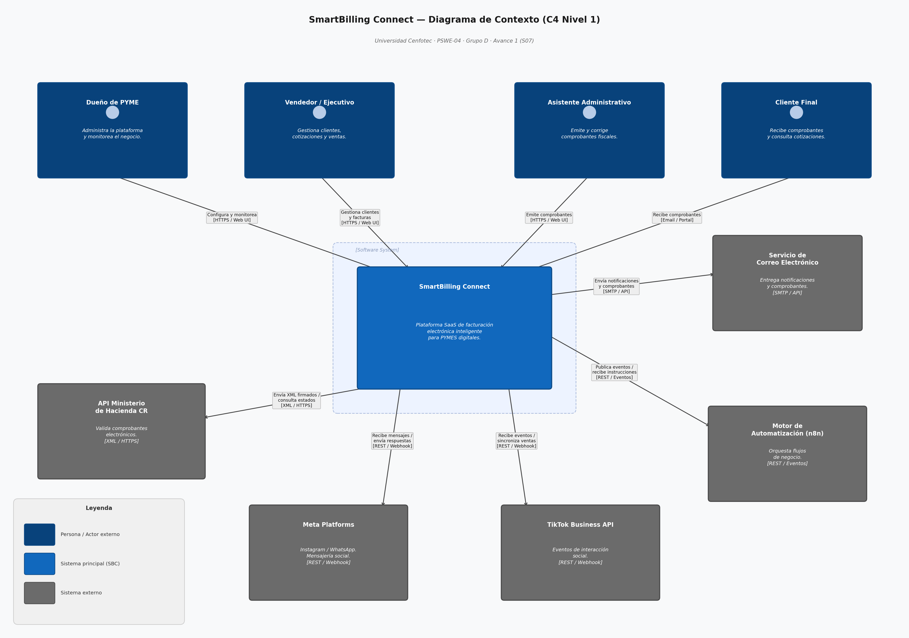
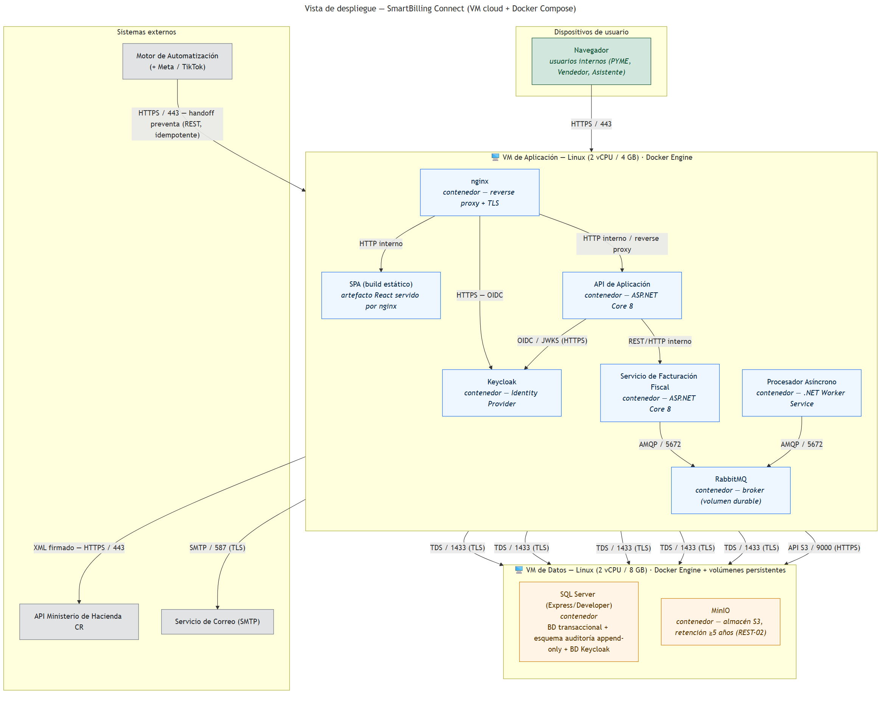

# SmartBilling Connect
> Documento de Diseño de Software — PSWE-04  
> Universidad Cenfotec · Maestría Profesional en Ingeniería del Software

---

| Campo | Detalle |
|---|---|
| **Nombre del sistema** | SmartBilling Connect |
| **Grupo** | D |
| **Integrantes** | Edgar Jacob — 117660514, Brandon Garita — 207180701, Alejandro Mora — 111890536 |
| **URL del repositorio** | https://github.com/amoramongeCenfo/PSWE-04-Dise-o-de-Sistemas-de-Software/tree/main |
| **Docente** | Juan Mauricio Leandro Jiménez |
| **Cuatrimestre** | 2026 — 02 |
| **Versión del documento** | 0.2 — Avance 1 (en curso) |
| **Fecha de última actualización** | 2026-06-09 |

---

## Historial de versiones

| Versión | Fecha | Hito | Cambios principales | Autor(es) |
|---|---|---|---|---|
| 0.1 | 2026-05-23 | Propuesta (S03) | Creación del documento inicial | Edgar Jacob, Brandon Garita, Alejandro Mora |
| 0.2 | [fecha] | Avance 1 (S07) | [descripción] | [nombres] |
| 0.3 | [fecha] | Avance 2 (S11) | [descripción] | [nombres] |
| 1.0 | [fecha] | Entrega final (S14) | Documento completo | [nombres] |

---

## Tabla de contenidos

1. [Descripción del sistema y alcance](#1-descripción-del-sistema-y-alcance)
2. [Stakeholders](#2-stakeholders)
3. [Drivers arquitectónicos](#3-drivers-arquitectónicos)
4. [Requerimientos de calidad — Escenarios](#4-requerimientos-de-calidad--escenarios)
5. [Restricciones](#5-restricciones)
6. [Principios de diseño adoptados](#6-principios-de-diseño-adoptados)
7. [Vistas arquitectónicas](#7-vistas-arquitectónicas)
   - 7.1 [Vista de contexto](#71-vista-de-contexto)
   - 7.2 [Vista de estructura interna](#72-vista-de-estructura-interna)
   - 7.3 [Vista de comportamiento](#73-vista-de-comportamiento)
   - 7.4 [Vista de despliegue](#74-vista-de-despliegue)
   - 7.5 [Vista de concurrencia](#75-vista-de-concurrencia-opcional) *(si aplica)*
8. [Estilo arquitectónico](#8-estilo-arquitectónico)
9. [Registro de decisiones — ADRs](#9-registro-de-decisiones--adrs)
10. [Diseño detallado de componentes](#10-diseño-detallado-de-componentes)
11. [Patrones de diseño aplicados](#11-patrones-de-diseño-aplicados)
12. [Principios y técnicas habilitadoras — evidencia](#12-principios-y-técnicas-habilitadoras--evidencia)
13. [Análisis de calidad del diseño](#13-análisis-de-calidad-del-diseño)
14. [Secciones específicas por tipo de sistema](#14-secciones-específicas-por-tipo-de-sistema) *(si aplica)*
15. [Tendencias y evolución del diseño](#15-tendencias-y-evolución-del-diseño)
16. [Glosario](#16-glosario)
17. [Referencias](#17-referencias)

---

# BLOQUE 1 — CONTEXTO Y PROBLEMA
*Hito: Propuesta (S03) y Avance 1 (S07)*

---

## 1. Descripción del sistema y alcance

### 1.1 Descripción general
El sistema propuesto, **SmartBilling Connect**, consiste en una plataforma de facturación electrónica inteligente orientada a pequeñas y medianas empresas (PYMES) que comercializan productos y servicios mediante redes sociales y canales digitales. Su propósito principal es centralizar y simplificar la gestión comercial y administrativa de negocios que actualmente manejan sus ventas de forma manual, utilizando múltiples herramientas desconectadas entre sí. La plataforma permitirá administrar clientes, registrar ventas y gestionar comprobantes electrónicos, brindando trazabilidad y control sobre el proceso comercial.

Actualmente, muchas PYMES utilizan redes sociales como principal canal de ventas, especialmente plataformas de mensajería y comercio digital. Sin embargo, estos negocios enfrentan problemas relacionados con la duplicidad de información, pérdida de seguimiento de clientes, errores en la generación de facturas y procesos operativos poco eficientes. En muchos casos, las conversaciones con clientes ocurren en redes sociales mientras la facturación se realiza manualmente en otros sistemas, generando retrasos, inconsistencias y una alta dependencia de tareas repetitivas realizadas por el personal administrativo.

El sistema busca resolver este problema mediante una solución integrada que permita conectar la actividad comercial con los procesos de facturación electrónica y seguimiento de clientes. El valor principal de la plataforma radica en reducir la carga operativa, mejorar la eficiencia administrativa y aumentar la trazabilidad de las ventas realizadas por medios digitales. Además, permitirá a los negocios responder con mayor rapidez a sus clientes, disminuir errores humanos y cumplir con las obligaciones fiscales de forma más ordenada y automatizada.

### 1.2 Contexto del negocio o dominio
El sistema se desarrolla dentro del dominio de comercio digital y facturación electrónica para pequeñas y medianas empresas (PYMES). En Costa Rica y otros países de la región, una gran cantidad de negocios utilizan redes sociales como principal canal de ventas y atención al cliente, especialmente mediante plataformas de mensajería y comercio social. Muchos emprendimientos realizan cotizaciones, coordinan pedidos y concretan ventas directamente desde aplicaciones como Instagram, Facebook o WhatsApp, mientras que la facturación y el control administrativo se gestionan posteriormente de forma manual o mediante herramientas independientes.

Este modelo operativo genera múltiples problemas de negocio: duplicidad de información, errores de digitación, falta de trazabilidad entre conversaciones y ventas, dificultad para monitorear clientes potenciales y dependencia excesiva de procesos manuales. Además, conforme aumenta el volumen de ventas, las empresas enfrentan dificultades para mantener consistencia en la información fiscal y brindar tiempos de respuesta rápidos a sus clientes. El sistema propuesto busca soportar y optimizar estos procesos mediante la integración de la gestión comercial con la facturación electrónica y automatización de flujos operativos.

Dentro del dominio existen regulaciones relevantes asociadas principalmente al cumplimiento tributario. En Costa Rica, la emisión de comprobantes electrónicos debe cumplir con los lineamientos definidos por el Ministerio de Hacienda, incluyendo validación fiscal, almacenamiento de documentos electrónicos y manejo adecuado de información tributaria. Esto implica requisitos relacionados con seguridad, integridad de datos, auditoría y trazabilidad de transacciones. El sistema deberá garantizar que las facturas emitidas sean válidas conforme a la normativa vigente y que exista un historial verificable de las operaciones realizadas.

El sistema también se relaciona con procesos comerciales y de atención al cliente. Entre los procesos soportados se encuentran: registro y administración de clientes, generación de cotizaciones, emisión de comprobantes electrónicos, seguimiento de ventas, automatización de respuestas y sincronización de información proveniente de redes sociales. Parte importante del dominio es la automatización de tareas repetitivas, permitiendo que eventos generados en plataformas externas activen flujos de negocio relacionados con ventas o facturación.

Desde una perspectiva arquitectónica, el dominio presenta retos relevantes relacionados con integración de sistemas externos, manejo seguro de información fiscal, tolerancia a fallos en procesos de facturación y coordinación de eventos provenientes de múltiples canales digitales. También existe una tensión importante entre rapidez de respuesta en la atención comercial y consistencia de la información transaccional, especialmente cuando varios usuarios o integraciones interactúan simultáneamente con los mismos datos comerciales y fiscales.

### 1.3 Alcance del sistema

**Dentro del alcance**

#### 1.3.1 Gestión de usuarios y acceso

El sistema permite el registro, autenticación y administración de usuarios con roles diferenciados, incluyendo administrador, vendedor y asistente administrativo, cada uno con permisos específicos según sus responsabilidades.

#### 1.3.2 Administración de clientes

El sistema permite registrar, consultar y actualizar información de clientes, incluyendo datos fiscales, información de contacto e historial de compras y facturación.

#### 1.3.3 Emisión de facturación electrónica

El sistema permite generar, emitir, almacenar y consultar comprobantes electrónicos conforme a la normativa tributaria vigente.

#### 1.3.4 Gestión de cotizaciones

El sistema permite generar cotizaciones comerciales y convertirlas posteriormente en facturas electrónicas manteniendo trazabilidad entre ambos procesos.

#### 1.3.5 Integración con redes sociales

El sistema permite recibir y relacionar eventos o interacciones provenientes de redes sociales y canales digitales con procesos comerciales internos.

#### 1.3.6 Monitoreo de comprobantes electrónicos

El sistema permite consultar y monitorear el estado de documentos electrónicos enviados a la administración tributaria.

#### 1.3.7 Gestión de productos y servicios

El sistema permite administrar catálogos básicos de productos y servicios utilizados en cotizaciones y facturación.

#### 1.3.8 Consulta y trazabilidad comercial

El sistema permite consultar historial de ventas, facturación e interacciones comerciales mediante filtros y búsquedas avanzadas.

#### 1.3.9 Gestión de permisos y auditoría

El sistema permite controlar accesos según roles y registrar auditoría de acciones realizadas por usuarios y automatizaciones externas.

#### 1.3.10 Notificaciones y comunicación

El sistema permite enviar comprobantes electrónicos y notificaciones a clientes mediante correo electrónico u otros canales configurados.

**Fuera del alcance**

#### 1.3.11 ERP financiero y contabilidad avanzada

El sistema no implementa funcionalidades completas de ERP financiero o contable, como contabilidad general, conciliaciones bancarias, cuentas por pagar o generación de estados financieros.

#### 1.3.12 Gestión avanzada de inventarios

El sistema no administra procesos avanzados de inventario, tales como manejo multi-bodega, trazabilidad física, logística de distribución o planificación de abastecimiento.

#### 1.3.13 Procesamiento directo de pagos

El sistema no procesa pagos electrónicos directamente ni funciona como pasarela de pago financiera. Las transacciones monetarias dependerán de servicios externos especializados.

#### 1.3.14 CRM empresarial avanzado

El sistema no reemplaza plataformas completas de CRM empresarial; únicamente administra información comercial relacionada con ventas, clientes y facturación.

#### 1.3.15 Marketing digital y publicidad

El sistema no realiza campañas de marketing digital, segmentación publicitaria ni administración de anuncios pagados en redes sociales.

#### 1.3.16 Almacenamiento completo de conversaciones

El sistema no almacena conversaciones completas provenientes de redes sociales de forma indefinida, excepto la información necesaria para trazabilidad comercial y automatización de procesos.

#### 1.3.17 Gestión de recursos humanos

El sistema no incluye funcionalidades relacionadas con nómina, control de personal, recursos humanos o administración de empleados.

#### 1.3.18 Inteligencia artificial conversacional avanzada

El sistema no implementa asistentes inteligentes avanzados ni reemplaza completamente la atención humana al cliente; únicamente soporta automatizaciones configuradas.

#### 1.3.19 Disponibilidad de servicios externos

El sistema no garantiza disponibilidad continua de APIs externas, plataformas tributarias, servicios de redes sociales o herramientas de automatización integradas.

#### 1.3.20 Soporte multinacional

El sistema no contempla inicialmente adaptación automática a regulaciones fiscales de múltiples países; el alcance se limita al contexto tributario costarricense.

#### 1.3.21 Business Intelligence avanzado

El sistema no incluye funcionalidades avanzadas de analítica empresarial, minería de datos o procesamiento masivo orientado a Business Intelligence.

#### 1.3.22 Plataforma completa de comercio electrónico

El sistema no implementa una tienda virtual pública, marketplace o carrito de compras completo para comercio electrónico.

### 1.4 Usuarios y casos de uso principales
| Tipo de usuario | Casos de uso principales |
|---|---|
| Administrador del sistema | Configurar parámetros fiscales y de integración, administrar usuarios y permisos, monitorear automatizaciones, auditar actividades del sistema, consultar métricas operativas |
| Vendedor / Ejecutivo comercial | Registrar clientes, generar cotizaciones, convertir cotizaciones en facturas electrónicas, consultar historial comercial, gestionar seguimiento de ventas provenientes de redes sociales |
| Asistente administrativo | Emitir facturas electrónicas, validar información fiscal de clientes, reenviar comprobantes electrónicos, consultar estados tributarios, corregir errores operativos de facturación |
| Cliente final | Recibir comprobantes electrónicos, consultar cotizaciones enviadas, confirmar pedidos o servicios, recibir notificaciones comerciales, interactuar mediante canales digitales |
| Plataforma de automatización (p. ej. n8n) | Ejecutar flujos automáticos, recibir eventos comerciales, disparar procesos de facturación, sincronizar información entre sistemas, generar notificaciones automáticas |
| Servicios externos tributarios | Validar comprobantes electrónicos, recibir documentos fiscales, retornar estados de aceptación o rechazo, verificar cumplimiento tributario |

---
# 2. Stakeholders
 
**Plataforma de Facturación Electrónica Inteligente con Automatización Comercial y Redes Sociales**
 
Un stakeholder es cualquier persona, grupo u organización que tiene interés en el sistema, no solo los usuarios directos. Esta sección incluye desarrolladores, operadores, reguladores, áreas de negocio y proveedores externos. Para cada uno se identifica qué quieren del sistema y qué les preocupa. Esta tabla es la base de los drivers arquitectónicos de la sección 3.
 
---
 
## STK-01: Dueños de PYMES
 
**Rol:** Propietarios y tomadores de decisiones de pequeñas y medianas empresas que venden a través de redes sociales.
 
| Intereses principales | Preocupaciones o restricciones |
|---|---|
| Reducir la carga operativa en facturación y gestión de ventas. | Costo de adopción: la solución debe ser asequible para una PYME. |
| Centralizar ventas, mensajería y facturación en una sola plataforma. | Curva de aprendizaje: no tienen equipo técnico dedicado. |
| Convertir interacciones en redes sociales en ventas registradas y facturadas. | Continuidad: el sistema no puede fallar en horas de venta. |
| Obtener visibilidad sobre el estado comercial del negocio. | Cumplimiento fiscal sin complejidad adicional. |
---
 
## STK-02: Personal administrativo
 
**Rol:** Empleados que operan el sistema día a día: emiten facturas, gestionan clientes y procesan cotizaciones.
 
| Intereses principales | Preocupaciones o restricciones |
|---|---|
| Rapidez en la emisión de comprobantes electrónicos. | Interfaces complejas que ralenticen el trabajo. |
| Reducción de errores por ingreso manual de datos. | Pérdida de datos por fallos del sistema. |
| Flujos de trabajo claros y predecibles. | Doble digitación entre sistemas desconectados. |
| Acceso a historial de transacciones por cliente. | Falta de soporte ante errores de facturación. |
 
---
 
## STK-03: Clientes finales
 
**Rol:** Personas o empresas que compran productos/servicios de las PYMES y reciben los comprobantes electrónicos.
 
| Intereses principales | Preocupaciones o restricciones |
|---|---|
| Respuestas rápidas a consultas realizadas por redes sociales. | Tiempos de espera excesivos en la atención automatizada. |
| Recibir comprobantes electrónicos válidos de forma oportuna. | Recibir comprobantes con errores o inválidos ante Hacienda. |
| Transparencia en precios y condiciones de venta. | Privacidad de sus datos personales y fiscales. |
 
---
 
## STK-04: Administradores del sistema
 
**Rol:** Personal técnico o funcional responsable de configurar, monitorear y mantener la plataforma en operación.
 
| Intereses principales | Preocupaciones o restricciones |
|---|---|
| Control centralizado sobre configuración de tenants y usuarios. | Fallos silenciosos en integraciones con APIs externas. |
| Monitoreo en tiempo real del estado de integraciones externas. | Escalabilidad ante crecimiento de clientes (multi-tenant). |
| Capacidad de auditoría sobre todas las transacciones. | Gestión de certificados de firma digital y su renovación. |
| Herramientas de diagnóstico ante fallos. | Seguridad: accesos no autorizados, exfiltración de datos fiscales. |
 
---
 
## STK-05: Entidades tributarias (Ministerio de Hacienda)
 
**Rol:** Ente regulador que define los requisitos legales y técnicos para la facturación electrónica en Costa Rica.
 
| Intereses principales | Preocupaciones o restricciones |
|---|---|
| Que los comprobantes emitidos cumplan el esquema XML vigente. | Emisión de comprobantes fraudulentos o manipulados. |
| Que los documentos tengan firma digital válida (XADES-EPES). | Incumplimiento del formato o protocolo de comunicación. |
| Que exista trazabilidad fiscal completa y auditable. | Imposibilidad de fiscalizar por falta de registros. |
| Que los comprobantes se conserven por el plazo legal (5 años). | |
 
---
 
## STK-06: Equipo de desarrollo
 
**Rol:** Desarrolladores e ingenieros responsables de construir, evolucionar y mantener la plataforma.
 
| Intereses principales | Preocupaciones o restricciones |
|---|---|
| Arquitectura clara con subsistemas desacoplados. | Deuda técnica acumulada por decisiones apresuradas. |
| Stack tecnológico accesible y bien documentado. | Complejidad excesiva al integrar múltiples APIs externas. |
| Facilidad para agregar nuevas integraciones o adaptar las existentes. | Dependencia de herramientas cuya viabilidad a largo plazo es incierta (ej. decisión pendiente sobre n8n). |
| Procesos de despliegue y pruebas automatizados. | Mantenimiento de compatibilidad ante cambios de Hacienda o de redes sociales. |
 
---
 
## STK-07: Proveedores de APIs externas (Meta, TikTok)
 
**Rol:** Plataformas de redes sociales cuyos servicios se integran al sistema mediante APIs públicas.
 
| Intereses principales | Preocupaciones o restricciones |
|---|---|
| Que el consumo de sus APIs respete los términos de servicio. | Uso indebido de datos de usuarios obtenidos a través de sus APIs. |
| Que los flujos OAuth cumplan sus especificaciones de seguridad. | Abuso de cuotas de API o scraping no autorizado. |
| Que el volumen de llamadas se mantenga dentro de los rate limits. | Impacto reputacional si la integración genera spam o mala experiencia al usuario final. |
 
---
 
## Tabla resumen
 
| ID | Stakeholder | Tipo | Influencia | Drivers asociados |
|---|---|---|---|---|
| STK-01 | Dueños de PYMES | Usuario / Negocio | **Alta** | RF-01, RF-02, RF-03, QA-02, REST-03 |
| STK-02 | Personal administrativo | Usuario operativo | **Media** | RF-03, RF-04, QA-04 |
| STK-03 | Clientes finales | Usuario externo | **Baja** | RF-02, QA-02, QA-04 |
| STK-04 | Administradores del sistema | Operador / Técnico | **Alta** | RF-04, RF-05, QA-01, QA-03, QA-05, REST-05 |
| STK-05 | Entidades tributarias | Regulador | **Alta** | RF-01, RF-05, QA-01, REST-01, REST-02 |
| STK-06 | Equipo de desarrollo | Constructor | **Alta** | QA-03, QA-05, REST-05, REST-06 |
| STK-07 | Proveedores APIs (Meta, TikTok) | Proveedor externo | **Media** | RF-02, QA-03, REST-04 |
## 3. Drivers Arquitectónicos

Plataforma de Facturación Electrónica Inteligente con Automatización Comercial y Redes Sociales

Los drivers arquitectónicos son los factores que moldean de forma determinante la arquitectura del sistema. No representan la totalidad de requerimientos, sino aquellos cuya omisión provocaría un fallo sistémico o un diseño fundamentalmente inadecuado (SWEBOK v3, Cap. 2 -- Software Design). A continuación se clasifican en tres categorías: requerimientos funcionales clave, atributos de calidad prioritarios y restricciones que actúan como drivers.

### 3.1 Requerimientos funcionales clave

Se incluyen únicamente los requerimientos funcionales con impacto arquitectónico directo: aquellos que obligan a tomar decisiones de estructura, componentes o integración, no de implementación interna.

| **ID** | **Requerimiento** | **Stakeholder** | **Por qué es un driver** |
|---|---|---|---|
| **RF-01** | Emisión de comprobantes electrónicos (factura, nota de crédito, nota de débito) cumpliendo el esquema XML del Ministerio de Hacienda de Costa Rica. | Dueños de PYMES, Entidades tributarias | Define el subsistema central del dominio. Obliga a un motor de facturación con generación XML, firma digital, envío al API de Hacienda y manejo de estados (aceptado/rechazado). Impone estructura de colas y reintentos. |
| **RF-02** | Integración bidireccional con APIs de redes sociales (Meta Platforms, TikTok) para capturar mensajes, consultas y convertirlos en oportunidades de venta. | Dueños de PYMES, Clientes finales | Introduce un subsistema de integración social con sus propias fronteras, protocolos de autenticación OAuth y manejo de webhooks. Requiere un bus de eventos o intermediario para desacoplar la mensajería social del core de facturación. |
| **RF-03** | Orquestación de flujos automatizados (cotización automática, respuesta a consultas, conversión de conversación a factura) mediante motor de workflows. | Dueños de PYMES, Personal administrativo | Obliga a incorporar un motor de automatización como componente arquitectónico separado. Define la necesidad de una capa de orquestación con triggers, acciones y conectores, además del patrón de comunicación con el rest del sistema. |
| **RF-04** | Gestión multiusuario con roles diferenciados (administrador, vendedor, auditor) y permisos granulares por operación. | Administradores del sistema, Personal administrativo | Obliga a un subsistema transversal de autenticación y autorización (Identity Provider). Afecta cada punto de entrada del sistema y requiere decisiones sobre protocolos (JWT, OAuth2) y almacenamiento de sesiones. |
| **RF-05** | Registro de auditoría completo e inmutable de todas las transacciones fiscales y acciones de usuarios. | Entidades tributarias, Administradores del sistema | Impone un log de auditoría append-only separado del almacenamiento transaccional. Afecta la estrategia de persistencia y puede requerir un almacén de eventos o base de datos dedicada para trazabilidad fiscal. |

### 3.2 Atributos de calidad prioritarios

Se priorizan los cinco atributos de calidad más críticos para este sistema. La selección responde al contexto específico del dominio: un sistema fiscal con integración a servicios externos y automatización en tiempo real. Si todo es prioridad, nada lo es — por eso se limita a cinco.

| **ID** | **Atributo** | **Importancia** | **Stakeholder** | **Justificación** |
|---|---|---|---|---|
| **QA-01** | Seguridad | **Alta** | Entidades tributarias, Administradores | El sistema maneja información fiscal legalmente vinculante y datos sensibles de clientes (NIF, direcciones, montos). Una brecha comprometería la validez legal de los comprobantes y expondría a sanciones. Requiere firma digital, cifrado en tránsito/reposo y control de acceso estricto. |
| **QA-02** | Disponibilidad | **Alta** | Dueños de PYMES, Clientes finales | Las PYMES dependen del sistema para facturar en tiempo real. Una caída durante horas pico significa pérdida directa de ventas. La integración con redes sociales exige que el sistema esté disponible cuando llegan mensajes (24/7). Objetivo mínimo: 99.5% uptime mensual. |
| **QA-03** | Interoperabilidad | **Alta** | Dueños de PYMES, Administradores | El sistema debe comunicarse con al menos tres ecosistemas externos: API de Hacienda (XML/SOAP), APIs de redes sociales (REST/webhooks) y motor de automatización. Si la interoperabilidad falla, el valor diferenciador de la plataforma desaparece. |
| **QA-04** | Rendimiento | **Media-Alta** | Personal administrativo, Clientes finales | Las respuestas automáticas a consultas en redes sociales deben procesarse en segundos para no perder oportunidades comerciales. La emisión de facturas debe completarse en menos de 5 segundos incluyendo la respuesta de Hacienda. Tiempos mayores degradan la experiencia y generan doble envío. |
| **QA-05** | Modificabilidad | **Media** | Administradores, Dueños de PYMES | Las regulaciones fiscales cambian periódicamente (nuevos campos, versiones de XML, tarifas impositivas). Las APIs de redes sociales actualizan sus contratos con frecuencia. El sistema debe absorber estos cambios sin rediseño arquitectónico, lo que exige bajo acoplamiento entre subsistemas. |

### 3.3 Restricciones que actúan como drivers

Las siguientes restricciones no son negociables y condicionan directamente las decisiones arquitectónicas. Se clasifican por tipo según su origen.

| **ID** | **Restricción** | **Tipo** | **Impacto en el diseño** |
|---|---|---|---|
| **REST-01** | Los comprobantes electrónicos deben cumplir el formato XML y el protocolo de firma digital establecidos por el Ministerio de Hacienda de Costa Rica. | Regulatoria | Fuerza el uso de librerías de firma digital (XADES-EPES), certificados específicos (Firma Digital CR) y un módulo dedicado a construir y validar el XML fiscal. No hay margen de negociación sobre el formato. |
| **REST-02** | Los documentos fiscales emitidos deben conservarse por un mínimo de 5 años con integridad demostrable. | Regulatoria | Obliga a una estrategia de almacenamiento de largo plazo con respaldos, checksums de integridad y posible almacenamiento en frío. Afecta la selección de base de datos y la política de retención. |
| **REST-03** | La plataforma debe operar como servicio multi-tenant orientado a PYMES con modelo de suscripción (SaaS). | Negocio | Impone aislamiento de datos entre tenants, gestión de suscripciones/licencias y una arquitectura que permita escalar por número de clientes. Condiciona el modelo de datos (tenant_id en cada tabla o esquemas separados). |
| **REST-04** | El sistema debe integrarse con APIs externas de Meta Platforms y TikTok, sujetas a sus términos de servicio, procesos de aprobación y límites de tasa. | Técnica | Las APIs de terceros imponen rate limiting, flujos OAuth específicos y revisiones de app. Obliga a implementar circuit breakers, colas de reintento, almacenamiento local de tokens y manejo de degradación cuando las APIs no están disponibles. |
| **REST-05** | El motor de automatización es un componente arquitectónico a definir; n8n es candidato pero la decisión está pendiente del análisis arquitectónico. | Técnica | La arquitectura debe diseñarse con una interfaz abstracta para el motor de workflows, de modo que la selección final (n8n, Temporal, solución propia) no impacte los demás subsistemas. Obliga a definir contratos claros (API/eventos) entre la orquestación y el resto del sistema. |
| **REST-06** | El presupuesto y equipo corresponden a un proyecto académico/startup con recursos limitados. | Negocio | Restringe el uso de servicios cloud costosos, licencias comerciales y tecnologías que requieran expertise especializado escaso. Favorece stack open-source, servicios gestionados con capa gratuita y arquitectura que pueda operarse con un equipo pequeño. |

---

> **Nota metodológica:** *Esta clasificación sigue los lineamientos del SWEBOK v3 (Capítulo 2 -- Software Design), que establece que los drivers arquitectónicos comprenden los requerimientos funcionales significativos, los atributos de calidad que el sistema debe satisfacer y las restricciones del entorno de desarrollo y operación. Los stakeholders referenciados corresponden a la sección 2 del documento de arquitectura.*

> **Nota sobre n8n:** *Dado que la selección del motor de automatización está sujeta al análisis arquitectónico, REST-05 refleja esta incertidumbre como restricción técnica. La arquitectura debe diseñarse de forma que el componente de orquestación sea intercambiable, independientemente de si la decisión final es n8n, otra herramienta, o un desarrollo propio.*
---

# BLOQUE 2 — REQUERIMIENTOS DE CALIDAD
*Hito: Avance 1 (S07)*

---

## 4. Requerimientos de calidad — Escenarios 

> **Instrucciones:** Un escenario de calidad es una descripción concreta y medible de cómo el sistema debe responder ante un estímulo específico. No son deseos generales ("el sistema debe ser rápido") — son compromisos verificables. Usá el formato ISO/IEEE de 6 elementos. Se requieren **mínimo 4 escenarios**, cubriendo al menos 3 atributos de calidad distintos. Asegurate de que algunos atributos entren en tensión entre sí — eso evidencia decisiones arquitectónicas reales.
>
> **Formato de los 6 elementos:**
> - **Fuente del estímulo:** quién o qué genera el evento (usuario, sistema externo, atacante, tiempo, operador)
> - **Estímulo:** el evento concreto que ocurre
> - **Entorno:** las condiciones en que ocurre (carga normal, peak, falla de red, etc.)
> - **Artefacto:** qué parte del sistema recibe el estímulo
> - **Respuesta:** qué hace el sistema ante ese estímulo
> - **Medida de respuesta:** cómo sabemos que la respuesta es aceptable (número concreto, no "rápido" o "disponible")

### Escenario QS-01 — [Nombre del atributo: ej. Rendimiento]

| Elemento | Descripción |
|---|---|
| **Fuente del estímulo** | [ej. 500 usuarios concurrentes] |
| **Estímulo** | [ej. Consultan el dashboard principal simultáneamente] |
| **Entorno** | [ej. Operación normal en horario pico, lunes 8am] |
| **Artefacto** | [ej. Servicio de reportes y base de datos analítica] |
| **Respuesta** | [ej. El sistema retorna el dashboard con datos actualizados] |
| **Medida de respuesta** | [ej. Tiempo de respuesta ≤ 2 segundos en el percentil 95] |

*Tensión con:* [indicar si este escenario entra en conflicto con otro — ej. "tensiona con QS-03 (Consistencia) porque el caché que permite la velocidad puede servir datos desactualizados"]

---

### Escenario QS-02 — [Nombre del atributo]

| Elemento | Descripción |
|---|---|
| **Fuente del estímulo** | |
| **Estímulo** | |
| **Entorno** | |
| **Artefacto** | |
| **Respuesta** | |
| **Medida de respuesta** | |

*Tensión con:* [o "Sin tensión identificada con otros escenarios"]

---

### Escenario QS-03 — [Nombre del atributo]
*(Repetir la tabla para cada escenario adicional)*
| Elemento | Descripción |
|---|---|
| **Fuente del estímulo** | |
| **Estímulo** | |
| **Entorno** | |
| **Artefacto** | |
| **Respuesta** | |
| **Medida de respuesta** | |

*Tensión con:* [o "Sin tensión identificada con otros escenarios"]

### Escenario QS-04 — [Nombre del atributo]

| Elemento | Descripción |
|---|---|
| **Fuente del estímulo** | |
| **Estímulo** | |
| **Entorno** | |
| **Artefacto** | |
| **Respuesta** | |
| **Medida de respuesta** | |

*Tensión con:* [o "Sin tensión identificada con otros escenarios"]

## 5. Restricciones

> **Instrucciones:** Las restricciones son decisiones que ya fueron tomadas antes de que el grupo empiece a diseñar — no son negociables. Pueden ser tecnológicas (el cliente ya tiene Oracle), de negocio (el sistema debe estar listo en 6 meses), regulatorias (cumplimiento de la Ley 8968 en Costa Rica) o de equipo (el grupo solo conoce Java). Sé honesto — las restricciones reales ayudan a justificar decisiones de diseño que de otra forma parecerían arbitrarias.

| ID | Restricción | Tipo | Origen | Impacto en el diseño |
|---|---|---|---|---|
| REST-01 | [Descripción precisa] | Técnica / Negocio / Regulatoria / Equipo | [Quién la impone] | [Cómo limita o guía el diseño] |
| REST-02 | | | | |

---

## 6. Principios de diseño adoptados

> **Instrucciones:** Listá los principios que el grupo se compromete a respetar durante todo el diseño. No los listés todos — elegí los que son más relevantes para este sistema y explicá por qué cada uno importa en este contexto. En la sección 12 vas a demostrar con evidencia concreta que los respetaste.

| Principio | Justificación para este sistema |
|---|---|
| [ej. Separación de responsabilidades] | [Por qué este principio es especialmente importante dado el tipo de sistema] |
| [ej. Diseño para el cambio] | |
| [ej. Defensa en profundidad] | |
| [Agregar los que apliquen: SOLID, DRY, KISS, PoLA, etc.] | |

---

# BLOQUE 3 — VISTAS ARQUITECTÓNICAS
*Hito: Avance 1 (S07) — sección 7.1 / Avance 2 (S11) — secciones 7.2 a 7.5*

> **Nota sobre notación:** Este documento usa **C4 como notación por defecto** para las vistas arquitectónicas porque es la notación del texto base del curso (Brown, 2014). Si para alguna vista específica C4 no es la notación más adecuada dado el tipo de sistema, el grupo puede usar la notación UML equivalente (diagrama de componentes, despliegue, estado o actividad), pero debe justificar explícitamente en esa sección por qué C4 no aplica y qué notación alternativa usa. Una justificación insuficiente se evalúa como si no hubiera diagrama.

---

## 7. Vistas arquitectónicas

### 7.1 Vista de contexto
*Hito: Avance 1 (S07)*

> **Qué muestra:** El sistema como una caja negra en su entorno. Las personas y sistemas externos que interactúan con él. Las relaciones entre ellos. **No muestra** lo que hay dentro del sistema.
>
> **Notación:** C4 nivel 1 (Context Diagram). Aplica a todos los tipos de sistema — un sistema embebido, un pipeline de datos, un monolito y una plataforma SaaS todos tienen contexto externo.
>
> **Instrucciones:** Incluí el diagrama (imagen exportada o código PlantUML/Mermaid en `/diagramas/c4-contexto.puml`). Debajo del diagrama, describí cada elemento: el sistema central, cada actor externo (persona o rol) y cada sistema externo, con una oración que explique la naturaleza de la relación.

*Figura 1 — Vista de contexto del sistema [Nombre]*

| Elemento | Tipo | Descripción de la relación |
|---|---|---|
| [Nombre del sistema] | Sistema principal | [Descripción breve] |
| [Actor externo 1] | Persona / Rol | [Qué hace con el sistema y cómo] |
| [Sistema externo 1] | Sistema externo | [Qué datos o servicios intercambia y con qué protocolo] |

---

### 7.2 Vista de estructura interna
*Hito: Avance 2 (S11)*

> **Qué muestra:** Las piezas principales que componen el sistema, cómo están organizadas y cómo se comunican entre sí. Esta vista es la base del diseño detallado.
>
> **Notación por defecto — C4 nivel 2 (Container Diagram):** Usá esta notación si tu sistema tiene unidades desplegables separadas — APIs, aplicaciones web, bases de datos, servicios de mensajería, apps móviles, procesos batch, etc. "Contenedor" en C4 no es Docker — es cualquier unidad de ejecución o almacenamiento con una frontera propia.
>
> **Alternativa justificada:** Si el sistema es un monolito, un firmware, un sistema embebido o un pipeline de datos sin unidades desplegables separadas, podés usar un **diagrama de componentes UML** o un **diagrama de módulos**. Justificá en la subsección 7.2.1 por qué C4 contenedores no es la representación más honesta para tu sistema.
>
> **Instrucciones:** Para cada contenedor o componente principal, describí: su responsabilidad, la tecnología usada, las interfaces que expone y las dependencias que tiene. Las relaciones entre contenedores deben indicar el protocolo o mecanismo de comunicación (REST, gRPC, eventos, SQL, etc.).

#### 7.2.1 Justificación de notación
> Si usás C4 contenedores, escribí "Se usa C4 nivel 2 porque el sistema tiene N unidades desplegables separadas: [listá]. Si usás una alternativa: "No se usa C4 nivel 2 porque [razón]. En su lugar se usa [notación] porque [justificación]."

[Completar]

#### 7.2.2 Diagrama

*Figura 2 — Vista de estructura interna del sistema [Nombre]*

#### 7.2.3 Descripción de elementos

| Elemento | Tipo | Responsabilidad | Tecnología | Interfaces expuestas | Dependencias |
|---|---|---|---|---|---|
| [Nombre] | Contenedor / Componente / Módulo | [Qué hace] | [Stack tecnológico] | [API REST en /api/v1, cola SQS, etc.] | [Qué otros elementos necesita] |

---

### 7.3 Vista de comportamiento
*Hito: Avance 2 (S11) — al menos 2 flujos; Entrega final (S14) — flujos completos*

> **Qué muestra:** Cómo fluye la información y el control a través del sistema para los casos de uso más importantes. Complementa la vista estática de la sección 7.2.
>
> **Notación:** Diagramas de secuencia UML. **Esta sección es obligatoria para todos los tipos de sistema.**
>
> **Instrucciones:** Incluí un diagrama de secuencia por cada flujo crítico. Para el Avance 2, incluí al menos los 2 flujos más importantes. Para la Entrega final, cubrí el camino feliz Y al menos un camino de error o excepción por flujo. Cada diagrama debe tener título, los participantes claramente identificados y las llamadas etiquetadas con el método o mensaje.

#### Flujo 1 — [Nombre del flujo, ej. "Autenticación de usuario"]

*Figura 3 — [Nombre del flujo]*

**Descripción:** [Párrafo que narra el flujo, los actores involucrados, las decisiones que se toman y cómo se maneja el caso de error]

**Escenarios de calidad que este flujo valida:** [Referencias a QS-XX de la sección 4]

---

#### Flujo 2 — [Nombre del flujo]

*(Repetir estructura para cada flujo adicional)*

---

### 7.4 Vista de despliegue
*Hito: Entrega final (S14)*

> **Qué muestra:** Dónde y cómo se despliega el sistema físicamente — servidores, contenedores Docker, servicios cloud, dispositivos edge, bases de datos, balanceadores, etc.
>
> **Notación:** C4 Deployment Diagram o diagrama de despliegue UML. Obligatorio si el sistema tiene componentes distribuidos en múltiples nodos. Opcional pero recomendado para sistemas monolíticos desplegados en cloud.
>
> **Instrucciones:** Mostrá los nodos de infraestructura, qué artefactos de software corren en cada nodo, y las conexiones de red entre ellos con el protocolo indicado. Si usás servicios cloud, nombralos específicamente (ej. AWS RDS, Google Cloud Run, Azure Service Bus).

*Figura N — Vista de despliegue del sistema [Nombre]*

| Nodo | Descripción | Artefactos desplegados | Conectividad |
|---|---|---|---|
| [Nombre del nodo] | [ej. Servidor de aplicación en AWS EC2 t3.medium] | [ej. API REST — Java 21 / Spring Boot] | [ej. HTTPS/443 hacia clientes, JDBC/5432 hacia BD] |

---

### 7.5 Vista de concurrencia *(sección opcional)*
*Hito: Entrega final (S14) — obligatoria si el sistema maneja concurrencia*

> **Cuándo incluirla:** Si tu sistema tiene múltiples procesos o hilos ejecutándose simultáneamente, maneja eventos asincrónicos, tiene condiciones de carrera posibles, o requiere sincronización entre componentes. Si el sistema es completamente secuencial y single-threaded, omití esta sección y justificá por qué no aplica.
>
> **Notación:** Diagrama de estado UML o diagrama de actividad UML con swimlanes.
>
> **Instrucciones:** Describí el modelo de concurrencia del sistema: qué procesos o hilos existen, cómo se sincronizan, qué recursos comparten, y cómo se evitan condiciones de carrera o deadlocks. Referenciá los escenarios de calidad de la sección 4 que este modelo satisface.

**¿Aplica esta sección?** [Sí / No — y justificación]

*(Si aplica, completar con diagrama y descripción)*

---

# BLOQUE 4 — DECISIONES ARQUITECTÓNICAS
*Hito: Avance 2 (S11)*

---

## 8. Estilo arquitectónico

> **Instrucciones:** Documentá el estilo o los estilos arquitectónicos que usás en el sistema (capas, microservicios, event-driven, pipe-and-filter, CQRS, hexagonal, etc.). Un sistema puede combinar estilos — documentá cómo. Para cada estilo, explicá: por qué es el más adecuado para este sistema, cuáles son sus trade-offs en este contexto específico, y qué alternativas consideraron y rechazaron. La justificación debe conectar directamente con los drivers de la sección 3 y los escenarios de calidad de la sección 4.

### 8.1 Estilo(s) adoptado(s)

| Estilo | Aplicación en el sistema | Justificación |
|---|---|---|
| [Nombre del estilo] | [Dónde y cómo se aplica] | [Por qué este estilo responde a los drivers del sistema] |

### 8.2 Alternativas consideradas y rechazadas

| Alternativa | Por qué se consideró | Por qué se rechazó |
|---|---|---|
| [Estilo alternativo 1] | [Qué ventajas ofrecía] | [Qué desventaja o incompatibilidad con los drivers la descartó] |
| [Estilo alternativo 2] | | |

### 8.3 Análisis de trade-offs del estilo elegido

> **Instrucciones:** Todo estilo arquitectónico tiene compromisos. Documentá los trade-offs del estilo elegido en el contexto específico de este sistema. Conectá cada trade-off con un escenario de calidad de la sección 4.

| Trade-off | Qué se gana | Qué se sacrifica | Escenario afectado |
|---|---|---|---|
| [Descripción del trade-off] | [Beneficio concreto] | [Costo concreto] | [QS-XX] |

---

## 9. Registro de decisiones — ADRs

> **Instrucciones:** Un ADR documenta una decisión arquitectónica significativa — una que, si se toma mal o se cambia después, tiene consecuencias costosas. No todas las decisiones merecen un ADR — solo las que involucran trade-offs, alternativas reales y consecuencias duraderas. Ejemplos: elección de base de datos, protocolo de comunicación entre servicios, mecanismo de autenticación, estrategia de manejo de errores, modelo de datos principal. Se requieren **mínimo 3 ADRs**. Cada ADR vive en un archivo separado en `/decisiones/ADR-XXX-titulo.md` y se referencia desde aquí.
>
> **Estado posible:** Propuesta | Aceptada | Superada | Deprecada

---

### ADR-001 — [Título de la decisión]

| Campo | Detalle |
|---|---|
| **Estado** | [Aceptada] |
| **Fecha** | [YYYY-MM-DD] |
| **Autores** | [Nombres] |

**Contexto**
> Describí la situación que requirió tomar esta decisión. ¿Qué problema estabas resolviendo? ¿Qué constraints existían? ¿Qué sabías y qué no sabías en el momento de decidir?

[Completar]

**Decisión**
> La decisión tomada, enunciada de forma clara y directa. "Decidimos usar X porque Y."

[Completar]

**Alternativas consideradas**

| Alternativa | Ventajas | Desventajas | Por qué se descartó |
|---|---|---|---|
| [Opción A] | | | |
| [Opción B] | | | |

**Consecuencias positivas**
- [Qué mejora o se habilita con esta decisión]
- [Qué drivers o escenarios de calidad satisface]

**Consecuencias negativas**
- [Qué se complica o qué deuda introduce]
- [Qué escenarios de calidad se ven afectados negativamente]

**Revisión requerida si:** [Condición que haría que esta decisión deba revisarse — ej. "Si el volumen de transacciones supera 10k/día, esta decisión debe reevaluarse"]

---

### ADR-002 — [Título de la decisión]

*(Repetir estructura)*

---

### ADR-003 — [Título de la decisión]

*(Repetir estructura. Agregar ADR-004, ADR-005, etc. según las decisiones del proyecto)*

---

# BLOQUE 5 — DISEÑO DETALLADO
*Hito: Entrega final (S14)*

---

## 10. Diseño detallado de componentes

> **Instrucciones:** Seleccioná los **3 componentes más críticos** del sistema — los que implementan la lógica más importante, los que tienen mayor impacto en los atributos de calidad, o los que toman las decisiones de diseño más interesantes. Para cada componente, producí los cuatro artefactos de diseño siguientes. La trazabilidad desde los casos de uso hasta el diseño es obligatoria — cada componente debe poder rastrearse hasta al menos un caso de uso de la sección 1.4.

---

### Componente 1 — [Nombre del componente]

**Responsabilidad:** [Una oración que describe qué hace este componente y por qué es crítico para el sistema]

**Trazabilidad:** [Referencia a los casos de uso de la sección 1.4 que este componente soporta] → [Referencia al elemento en la vista de estructura interna, sección 7.2]

#### 10.1.1 Diagrama de clases de diseño

> **Instrucciones:** Este no es un diagrama de clases de análisis ni un modelo de dominio. Es el diseño: incluí métodos con firmas completas (nombre, parámetros, tipo de retorno), modificadores de acceso, relaciones de dependencia reales y las interfaces que el componente expone y consume. Mostrá cómo se aplican los patrones de diseño (sección 11) dentro de este componente.

*Figura N — Diagrama de clases de diseño: [Nombre del componente]*

#### 10.1.2 Contratos de interfaz

> **Instrucciones:** Para cada método o endpoint público del componente, documentá su contrato formal. Un contrato no es solo la firma — es la especificación de qué garantiza el método y qué exige de quien lo llama.

| Método / Endpoint | Precondición | Postcondición | Excepciones |
|---|---|---|---|
| `[firma del método]` | [Qué debe ser verdad antes de llamarlo] | [Qué garantiza que será verdad después] | [Qué errores puede lanzar y bajo qué condición] |

#### 10.1.3 Análisis de robustez

> **Instrucciones:** Usá el análisis de robustez para verificar que el diseño del componente cubre correctamente la interacción entre la interfaz externa (boundary), la lógica de control (control) y los datos (entity). Identificá los objetos de cada tipo que participan en los flujos principales de este componente.

| Objeto | Tipo (Boundary / Control / Entity) | Responsabilidad |
|---|---|---|
| [Nombre] | | |

#### 10.1.4 Diagrama de secuencia — flujo principal

> **Instrucciones:** Mostrá el flujo de mensajes entre los objetos identificados en el análisis de robustez para el caso de uso principal que este componente soporta. Incluí el camino feliz y al menos un camino de error significativo.

*Figura N — Secuencia: [Nombre del flujo principal de Componente 1]*

*Figura N — Secuencia: [Nombre del camino de error de Componente 1]*

---

### Componente 2 — [Nombre del componente]

*(Repetir la estructura 10.1.1 a 10.1.4)*

---

### Componente 3 — [Nombre del componente]

*(Repetir la estructura 10.1.1 a 10.1.4)*

---

## 11. Patrones de diseño aplicados

> **Instrucciones:** Documentá los patrones de diseño que aplicaste en el sistema. Se requieren **mínimo 3 patrones**. Para cada patrón, no describas el patrón en general — describí cómo lo aplicaste en este sistema específico. La justificación debe responder: ¿qué problema concreto de este sistema resuelve este patrón?, ¿qué alternativa consideraste y por qué el patrón fue mejor? El diagrama debe mostrar la aplicación real, no el diagrama genérico del libro.

---

### Patrón 1 — [Nombre del patrón, ej. "Strategy"]

| Campo | Detalle |
|---|---|
| **Categoría** | Creacional / Estructural / Comportamiento |
| **Ubicación en el sistema** | [En qué componente o capa se aplica — referencia a sección 10] |
| **Problema que resuelve** | [Descripción del problema concreto en este sistema que motivó el uso del patrón] |
| **Alternativa considerada** | [Qué otra solución se evaluó] |
| **Por qué el patrón y no la alternativa** | [Justificación técnica, no "porque es buena práctica"] |

![Aplicación del patrón Strategy en [Componente]](../diagramas/patron-strategy.png)
*Figura N — Aplicación del patrón [Nombre] en [Componente/contexto]*

---

### Patrón 2 — [Nombre del patrón]

*(Repetir estructura)*

---

### Patrón 3 — [Nombre del patrón]

*(Repetir estructura. Agregar Patrón 4, 5, etc. según aplique)*

---

## 12. Principios y técnicas habilitadoras — evidencia

> **Instrucciones:** En la sección 6 declararon los principios que adoptarían. Aquí demostrás con evidencia concreta que los respetaron. Para cada principio, señalá dónde en el diseño se puede ver su aplicación — referencia específica a una clase, una interfaz, una decisión en un ADR, o un diagrama. Si hubo tensión entre principios (situación frecuente), documentá cómo la resolviste.

| Principio | Evidencia en el diseño | Referencia | Tensión con otro principio |
|---|---|---|---|
| [ej. Responsabilidad única] | [ej. La clase OrderProcessor solo gestiona el flujo de la orden — la validación está en OrderValidator y la persistencia en OrderRepository] | [Sección 10.1.1, diagrama de clases] | [ej. Tensiona con YAGNI cuando se separan clases para casos futuros no confirmados] |
| [Principio 2] | | | |

---

# BLOQUE 6 — CALIDAD Y TRAZABILIDAD
*Hito: Entrega final (S14)*

---

## 13. Análisis de calidad del diseño

### 13.1 Validación de escenarios de calidad

> **Instrucciones:** Volvé a los escenarios de calidad de la sección 4. Para cada uno, argumentá cómo el diseño (vistas, componentes, patrones, ADRs) satisface el escenario. Esta es la trazabilidad vertical del documento — conecta los requerimientos de calidad con las decisiones de diseño concretas. Si un escenario no está completamente satisfecho, documentalo honestamente con el riesgo residual.

| Escenario | Medida requerida | Cómo el diseño la satisface | Decisiones que lo habilitan | Riesgo residual |
|---|---|---|---|---|
| QS-01 — [Nombre] | [Medida de la sección 4] | [Explicación de por qué el diseño cumple] | [ADR-XX, Patrón Y, Componente Z] | [Qué sigue siendo un riesgo] |
| QS-02 | | | | |
| QS-03 | | | | |
| QS-04 | | | | |

### 13.2 Análisis de trade-offs entre atributos de calidad

> **Instrucciones:** Identificá los conflictos entre atributos de calidad que surgieron durante el diseño y documentá cómo los resolviste. Un conflicto real (ej. rendimiento vs. consistencia) con una resolución razonada demuestra pensamiento arquitectónico maduro. Si no encontraste ningún conflicto, es señal de que el análisis no fue suficientemente profundo.

| Conflicto | Atributo favorecido | Atributo sacrificado | Decisión que lo resolvió | Justificación |
|---|---|---|---|---|
| [ej. Velocidad de respuesta vs. consistencia de datos] | [Rendimiento] | [Consistencia eventual] | [ADR-002: uso de caché distribuida] | [El dominio tolera datos con hasta 5 segundos de desfase] |

### 13.3 Métricas de diseño — estimación

> **Instrucciones:** Para los componentes diseñados en la sección 10, estimá o calculá las métricas de cohesión y acoplamiento. No necesitás herramientas especializadas — podés hacer la estimación razonada: ¿cuántas responsabilidades tiene esta clase?, ¿de cuántos otros módulos depende?. Lo que se evalúa es que el grupo reflexionó sobre la calidad estructural del diseño, no la precisión del número.

| Componente | Cohesión estimada | Acoplamiento estimado | Observación |
|---|---|---|---|
| [Componente 1] | Alta / Media / Baja | Alto / Medio / Bajo | [Justificación y qué se puede mejorar] |
| [Componente 2] | | | |
| [Componente 3] | | | |

---

# BLOQUE 7 — SECCIONES ESPECÍFICAS POR TIPO DE SISTEMA
*Hito: Entrega final (S14) — incluir solo las que aplican al sistema*

> **Instrucciones:** Incluí solo las secciones que corresponden al tipo de sistema que diseñaste. Si tu sistema no es distribuido, no incluís la sección 14.1. Si no tiene componentes de IA, no incluís la 14.4. Justificá al inicio de este bloque cuáles secciones incluís y por qué.

**Secciones incluidas en este proyecto:** [Listá las que aplican con una oración de justificación]

---

## 14.1 Sistemas distribuidos / cloud *(si aplica)*

> **Instrucciones:** Documentá las decisiones de diseño específicas para la distribución. Incluí la estrategia de consistencia (fuerte, eventual, causal), el modelo CAP aplicado, la estrategia de tolerancia a particiones y el modelo de despliegue en nube con los servicios específicos usados.

### Estrategia de consistencia
[Completar — qué modelo de consistencia usa el sistema y por qué es el adecuado para el dominio]

### Modelo CAP aplicado
[Completar — entre CP y AP, cuál favorece el sistema y bajo qué condiciones. Justificar con los escenarios de calidad]

### Manejo de fallos y resiliencia
[Completar — circuit breakers, retries, timeouts, fallbacks. Para cada mecanismo: dónde aplica y por qué]

---

## 14.2 Sistemas concurrentes / tiempo real *(si aplica)*

> **Instrucciones:** Documentá el modelo de concurrencia del sistema. Identificá los recursos compartidos, los mecanismos de sincronización y cómo se evitan condiciones de carrera y deadlocks.

### Modelo de concurrencia
[Completar — hilos, procesos, actores, eventos asincrónicos — qué modelo usa el sistema]

### Recursos compartidos y sincronización
| Recurso compartido | Mecanismo de sincronización | Riesgo de condición de carrera | Mitigación |
|---|---|---|---|
| [Recurso] | [Mutex, semáforo, lock, etc.] | [Sí/No — descripción] | [Cómo se previene] |

---

## 14.3 Sistemas IoT / edge *(si aplica)*

> **Instrucciones:** Documentá el diseño del flujo de datos desde los dispositivos hasta la nube o el sistema central. Incluí el protocolo de comunicación, la estrategia ante conectividad intermitente y el modelo de procesamiento en edge vs. nube.

### Topología edge-cloud
[Completar con diagrama de despliegue físico si no está cubierto en 7.4]

### Estrategia ante conectividad intermitente
[Completar — qué hace el dispositivo cuando pierde conectividad, cómo sincroniza cuando la recupera, qué datos se pierden y cuáles no]

### Protocolo de comunicación
[Completar — MQTT, CoAP, AMQP, HTTP/REST — justificación de la elección]

---

## 14.4 Sistemas con IA Generativa / Agentes *(si aplica)*

> **Instrucciones:** El diseño de sistemas con IA generativa o agentes tiene desafíos específicos que no aparecen en sistemas tradicionales. Documentá las decisiones de diseño para cada uno de los siguientes aspectos. La IA no puede ser una API call sin diseño — se evalúa que el grupo pensó en la arquitectura del sistema de IA, no solo en su uso.

### Diseño del orquestador
[Completar — cómo se coordinan los agentes o llamadas al modelo, qué decide el orquestador y qué los agentes individuales]

### Gestión de contexto y memoria
[Completar — cómo se mantiene el contexto entre interacciones, qué se persiste, qué se descarta, con qué estrategia de windowing]

### Estrategia de fallback
[Completar — qué hace el sistema cuando el modelo falla, produce respuestas inaceptables o supera el límite de latencia]

### Trazabilidad de decisiones del modelo
[Completar — cómo el sistema registra qué decisión tomó el modelo, con qué contexto y con qué resultado, para auditoría y mejora]

### Evaluación de calidad de respuestas
[Completar — cómo el sistema detecta alucinaciones, respuestas fuera de dominio o respuestas de baja calidad, y qué hace al respecto]

---

## 14.5 Sistemas con seguridad crítica *(si aplica)*

> **Instrucciones:** Si el sistema maneja datos sensibles, tiene requerimientos regulatorios o es un objetivo de ataque probable, documentá el modelo de seguridad desde el diseño.

### Modelo de amenazas (STRIDE simplificado)
| Amenaza | Componente en riesgo | Mitigación en el diseño |
|---|---|---|
| Spoofing | | |
| Tampering | | |
| Repudiation | | |
| Information Disclosure | | |
| Denial of Service | | |
| Elevation of Privilege | | |

### Controles por capa
[Completar — qué controles de seguridad existen en cada capa del sistema]

---

# BLOQUE 8 — TENDENCIAS Y EVOLUCIÓN
*Hito: Entrega final (S14)*

---

## 15. Tendencias y evolución del diseño

> **Instrucciones:** Este bloque no es una sección teórica sobre tendencias — es una reflexión fundamentada sobre cómo el diseño actual se posiciona frente a las tendencias estudiadas en el curso. Para cada tendencia relevante, documentá una decisión consciente: adoptaron elementos de ella, la consideraron y la rechazaron, o la dejaron como punto de extensión futuro. Cada postura debe estar justificada con criterios de diseño, no con preferencias personales.

### 15.1 Postura frente a tendencias relevantes

| Tendencia | Postura del diseño | Justificación |
|---|---|---|
| Microservicios | Adoptada / Parcialmente adoptada / Rechazada / Punto de extensión | [Por qué — conectado con los drivers y trade-offs del sistema] |
| Cloud-native / 12-factor | | |
| Diseño dirigido por el dominio (DDD) | | |
| IA Generativa / Agentes | | |
| [Otras tendencias relevantes para el dominio] | | |

### 15.2 Puntos de extensión del diseño

> **Instrucciones:** Identificá las partes del diseño que están preparadas para crecer o cambiar sin romper el sistema. Un buen diseño anticipa el cambio sin sobrediseñar. Para cada punto de extensión, indicá qué cambio habilitaría y qué decisión de diseño lo hace posible.

| Punto de extensión | Cambio que habilita | Decisión de diseño que lo soporta |
|---|---|---|
| [ej. Interfaz INotificationService desacoplada de la implementación] | [Agregar un nuevo canal de notificación sin modificar la lógica de negocio] | [ADR-003: abstracción de notificaciones detrás de interfaz] |

---

# APÉNDICES

---

## 16. Glosario

> **Instrucciones:** Definí los términos del dominio y los términos técnicos específicos de este sistema que un lector externo podría no conocer. El glosario es el "ubiquitous language" del proyecto — si el equipo usa términos del dominio de forma consistente en todo el documento, este glosario los define.

| Término | Definición |
|---|---|
| [Término] | [Definición en el contexto de este sistema] |

---

## 17. Referencias

> **Instrucciones:** Listá todas las fuentes usadas en el documento — libros del curso, artículos, documentación técnica, estándares. Usá formato APA o IEEE de forma consistente.

- Brown, S. (2014). *Software Architecture for Developers*. Leanpub.
- Budgen, D. (2003). *Software Design* (2.ª ed.). Addison-Wesley.
- Gomaa, H. (2011). *Software Modeling and Design*. Cambridge University Press.
- Gamma, E., Helm, R., Johnson, R., & Vlissides, J. (1995). *Design Patterns*. Addison-Wesley.
- [Agregar referencias adicionales usadas en el proyecto]

---

*Documento generado bajo el template estándar PSWE-04 — Universidad Cenfotec — Maestría Profesional en Ingeniería del Software*
