# SmartBilling Connect
> Documento de Diseño de Software — PSWE-04  
> Universidad Cenfotec · Maestría Profesional en Ingeniería del Software

---

| Campo | Detalle |
|---|---|
| **Nombre del sistema** | SmartBilling Connect |
| **Grupo** | D |
| **Integrantes** | Edgar Jacob — 117660514, Brandon Garita — 207180701, Alejandro Mora — 111890536 |
| **URL del repositorio** | https://github.com/amoramongeCenfo/PSWE-04-Dise-o-de-Sistemas-de-Software/tree/main |
| **Docente** | Juan Mauricio Leandro Jiménez |
| **Cuatrimestre** | 2026 — 02 |
| **Versión del documento** | 1.0 — Entrega final |
| **Fecha de última actualización** | 2026-08-01 |

---

## Historial de versiones

| Versión | Fecha | Hito | Cambios principales | Autor(es) |
|---|---|---|---|---|
| 0.1 | 2026-05-23 | Propuesta (S03) | Creación del documento inicial | Edgar Jacob, Brandon Garita, Alejandro Mora |
| 0.2 | 2026-06-12 | Avance 1 (S07) | Descripción del sistema, alcance, stakeholders, drivers arquitectónicos, escenarios de calidad y Vista de Contexto C4 | Edgar Jacob, Brandon Garita, Alejandro Mora |
| 0.3 | 2026-07-11 | Avance 2 (S11) | Vista de estructura interna C4 nivel 2 (contenedores) con justificación de notación, diagrama y tabla descriptiva, y definición del stack tecnológico (.NET 8 / ASP.NET Core, SQL Server, Keycloak, RabbitMQ, MinIO); vista de comportamiento con diagramas de secuencia de los flujos críticos; estilo(s) arquitectónico(s) adoptado(s) con alternativas y análisis de trade-offs; registro de decisiones (ADRs); y primer componente con diseño detallado. | Edgar Jacob, Brandon Garita, Alejandro Mora |
| 1.0 | 2026-08-11 | Entrega final (S14) | Refinamiento de las vistas de contexto (7.1) y contenedores (7.2) para consolidar su consistencia mutua; **vista de componentes C4 nivel 3** de dos subsistemas —Servicio de Facturación Fiscal y Procesador Asíncrono— (7.2.4); **vista de comportamiento completa** con cinco flujos y sus caminos de error (7.3); **vista de despliegue** sobre VM cloud + Docker Compose con nodos, artefactos y conectividad (7.4); **vista de concurrencia** con modelo de outbox/competing consumers, idempotencia y concurrencia optimista (7.5); **documentación de la evolución del diseño** entre avances (7.6); **diseño detallado de los tres componentes** con contratos, análisis de robustez y secuencias, más la matriz de trazabilidad caso de uso → componente (10); **cinco patrones de diseño** con sus alternativas rechazadas (11); evidencia de los siete principios comprometidos (12); **validación de los siete escenarios de calidad** —incluido el nuevo QS-07 de interoperabilidad—, trade-offs y métricas de cohesión/acoplamiento (13); secciones por tipo de sistema aplicables (14); tendencias, puntos de extensión y **registro de deuda de diseño con sus disparadores de revisión** (15); glosario y referencias (16-17). | Edgar Jacob, Brandon Garita, Alejandro Mora |

---

## Tabla de contenidos

1. [Descripción del sistema y alcance](#1-descripción-del-sistema-y-alcance)
2. [Stakeholders](#2-stakeholders)
3. [Drivers arquitectónicos](#3-drivers-arquitectónicos)
4. [Requerimientos de calidad — Escenarios](#4-requerimientos-de-calidad--escenarios)
5. [Restricciones](#5-restricciones)
6. [Principios de diseño adoptados](#6-principios-de-diseño-adoptados)
7. [Vistas arquitectónicas](#7-vistas-arquitectónicas)
   - 7.1 [Vista de contexto](#71-vista-de-contexto)
   - 7.2 [Vista de estructura interna](#72-vista-de-estructura-interna)
   - 7.3 [Vista de comportamiento](#73-vista-de-comportamiento)
   - 7.4 [Vista de despliegue](#74-vista-de-despliegue)
   - 7.5 [Vista de concurrencia](#75-vista-de-concurrencia-sección-opcional) *(si aplica)*
   - 7.6 [Evolución del diseño entre avances](#76-evolución-del-diseño-entre-avances)
8. [Estilo arquitectónico](#8-estilo-arquitectónico)
9. [Registro de decisiones — ADRs](#9-registro-de-decisiones--adrs)
10. [Diseño detallado de componentes](#10-diseño-detallado-de-componentes)
11. [Patrones de diseño aplicados](#11-patrones-de-diseño-aplicados)
12. [Principios y técnicas habilitadoras — evidencia](#12-principios-y-técnicas-habilitadoras--evidencia)
13. [Análisis de calidad del diseño](#13-análisis-de-calidad-del-diseño)
14. [Secciones específicas por tipo de sistema](#14-secciones-específicas-por-tipo-de-sistema) *(si aplica)*
15. [Tendencias y evolución del diseño](#15-tendencias-y-evolución-del-diseño)
16. [Glosario](#16-glosario)
17. [Referencias](#17-referencias)

---

# BLOQUE 1 — CONTEXTO Y PROBLEMA
*Hito: Propuesta (S03) y Avance 1 (S07)*

---

## 1. Descripción del sistema y alcance

### 1.1 Descripción general
El sistema propuesto, **SmartBilling Connect**, consiste en una plataforma de facturación electrónica inteligente orientada a pequeñas y medianas empresas (PYMES) que comercializan productos y servicios mediante redes sociales y canales digitales. Su propósito principal es centralizar y simplificar la gestión comercial y administrativa de negocios que actualmente manejan sus ventas de forma manual, utilizando múltiples herramientas desconectadas entre sí. La plataforma permitirá administrar clientes, registrar ventas y gestionar comprobantes electrónicos, brindando trazabilidad y control sobre el proceso comercial.

> **Alcance del término "inteligente":** en este diseño, "inteligente" se refiere a la **automatización del flujo comercial basada en reglas y workflows** (disparadores, conectores y respuestas configuradas), no a inteligencia artificial generativa, clasificación, recomendación o asistencia conversacional avanzada. Esto es coherente con la exclusión 1.3.18. Por lo tanto, el sistema **no** asume los retos arquitectónicos propios de la IA generativa (trazabilidad de decisiones del modelo, evaluación de respuestas, fallback de modelo, explicabilidad); su complejidad arquitectónica proviene de la **coordinación confiable** de un flujo fiscal entre sistemas heterogéneos, no de un componente de IA.

Actualmente, muchas PYMES utilizan redes sociales como principal canal de ventas, especialmente plataformas de mensajería y comercio digital. Sin embargo, estos negocios enfrentan problemas relacionados con la duplicidad de información, pérdida de seguimiento de clientes, errores en la generación de facturas y procesos operativos poco eficientes. En muchos casos, las conversaciones con clientes ocurren en redes sociales mientras la facturación se realiza manualmente en otros sistemas, generando retrasos, inconsistencias y una alta dependencia de tareas repetitivas realizadas por el personal administrativo.

El sistema busca resolver este problema mediante una solución integrada que permita conectar la actividad comercial con los procesos de facturación electrónica y seguimiento de clientes. El valor principal de la plataforma radica en reducir la carga operativa, mejorar la eficiencia administrativa y aumentar la trazabilidad de las ventas realizadas por medios digitales. Además, permitirá a los negocios responder con mayor rapidez a sus clientes, disminuir errores humanos y cumplir con las obligaciones fiscales de forma más ordenada y automatizada.

### 1.2 Contexto del negocio o dominio
El sistema se desarrolla dentro del dominio de comercio digital y facturación electrónica para pequeñas y medianas empresas (PYMES). En Costa Rica y otros países de la región, una gran cantidad de negocios utilizan redes sociales como principal canal de ventas y atención al cliente, especialmente mediante plataformas de mensajería y comercio social. Muchos emprendimientos realizan cotizaciones, coordinan pedidos y concretan ventas directamente desde aplicaciones como Instagram, Facebook o WhatsApp, mientras que la facturación y el control administrativo se gestionan posteriormente de forma manual o mediante herramientas independientes.

Este modelo operativo genera múltiples problemas de negocio: duplicidad de información, errores de digitación, falta de trazabilidad entre conversaciones y ventas, dificultad para monitorear clientes potenciales y dependencia excesiva de procesos manuales. Además, conforme aumenta el volumen de ventas, las empresas enfrentan dificultades para mantener consistencia en la información fiscal y brindar tiempos de respuesta rápidos a sus clientes. El sistema propuesto busca soportar y optimizar estos procesos mediante la integración de la gestión comercial con la facturación electrónica y automatización de flujos operativos.

Dentro del dominio existen regulaciones relevantes asociadas principalmente al cumplimiento tributario. En Costa Rica, la emisión de comprobantes electrónicos debe cumplir con los lineamientos definidos por el Ministerio de Hacienda, incluyendo validación fiscal, almacenamiento de documentos electrónicos y manejo adecuado de información tributaria. Esto implica requisitos relacionados con seguridad, integridad de datos, auditoría y trazabilidad de transacciones. El sistema deberá garantizar que las facturas emitidas sean válidas conforme a la normativa vigente y que exista un historial verificable de las operaciones realizadas.

El sistema también se relaciona con procesos comerciales y de atención al cliente. Entre los procesos soportados se encuentran: registro y administración de clientes, generación de cotizaciones, emisión de comprobantes electrónicos, seguimiento de ventas, automatización de respuestas y sincronización de información proveniente de redes sociales. Parte importante del dominio es la automatización de tareas repetitivas, permitiendo que eventos generados en plataformas externas activen flujos de negocio relacionados con ventas o facturación.

Desde una perspectiva arquitectónica, el dominio presenta retos relevantes relacionados con integración de sistemas externos, manejo seguro de información fiscal, tolerancia a fallos en procesos de facturación y coordinación de eventos provenientes de múltiples canales digitales. También existe una tensión importante entre rapidez de respuesta en la atención comercial y consistencia de la información transaccional, especialmente cuando varios usuarios o integraciones interactúan simultáneamente con los mismos datos comerciales y fiscales.

### 1.3 Alcance del sistema

**Dentro del alcance**

#### 1.3.1 Gestión de usuarios y acceso

El sistema permite el registro, autenticación y administración de usuarios con roles diferenciados, incluyendo administrador, vendedor y asistente administrativo, cada uno con permisos específicos según sus responsabilidades.

#### 1.3.2 Administración de clientes

El sistema permite registrar, consultar y actualizar información de clientes, incluyendo datos fiscales, información de contacto e historial de compras y facturación.

#### 1.3.3 Emisión de facturación electrónica

El sistema permite generar, emitir, almacenar y consultar comprobantes electrónicos conforme a la normativa tributaria vigente.

#### 1.3.4 Gestión de cotizaciones

El sistema permite generar cotizaciones comerciales y convertirlas posteriormente en facturas electrónicas manteniendo trazabilidad entre ambos procesos.

#### 1.3.5 Integración con redes sociales

El sistema permite recibir y relacionar eventos o interacciones provenientes de redes sociales y canales digitales con procesos comerciales internos.

#### 1.3.6 Monitoreo de comprobantes electrónicos

El sistema permite consultar y monitorear el estado de documentos electrónicos enviados a la administración tributaria.

#### 1.3.7 Gestión de productos y servicios

El sistema permite administrar catálogos básicos de productos y servicios utilizados en cotizaciones y facturación.

#### 1.3.8 Consulta y trazabilidad comercial

El sistema permite consultar historial de ventas, facturación e interacciones comerciales mediante filtros y búsquedas avanzadas.

#### 1.3.9 Gestión de permisos y auditoría

El sistema permite controlar accesos según roles y registrar auditoría de acciones realizadas por usuarios y automatizaciones externas.

#### 1.3.10 Notificaciones y comunicación

El sistema permite enviar comprobantes electrónicos y notificaciones a clientes mediante correo electrónico u otros canales configurados.


**Fuera del alcance**

#### 1.3.11 ERP financiero y contabilidad avanzada

El sistema no implementa funcionalidades completas de ERP financiero o contable, como contabilidad general, conciliaciones bancarias, cuentas por pagar o generación de estados financieros.

#### 1.3.12 Gestión avanzada de inventarios

El sistema no administra procesos avanzados de inventario, tales como manejo multi-bodega, trazabilidad física, logística de distribución o planificación de abastecimiento.

#### 1.3.13 Procesamiento directo de pagos

El sistema no procesa pagos electrónicos directamente ni funciona como pasarela de pago financiera. Las transacciones monetarias dependerán de servicios externos especializados.

#### 1.3.14 CRM empresarial avanzado

El sistema no reemplaza plataformas completas de CRM empresarial; únicamente administra información comercial relacionada con ventas, clientes y facturación.

#### 1.3.15 Marketing digital y publicidad

El sistema no realiza campañas de marketing digital, segmentación publicitaria ni administración de anuncios pagados en redes sociales.

#### 1.3.16 Almacenamiento completo de conversaciones

El sistema no almacena conversaciones completas provenientes de redes sociales de forma indefinida, excepto la información necesaria para trazabilidad comercial y automatización de procesos.

#### 1.3.17 Gestión de recursos humanos

El sistema no incluye funcionalidades relacionadas con nómina, control de personal, recursos humanos o administración de empleados.

#### 1.3.18 Inteligencia artificial conversacional avanzada

El sistema no implementa asistentes inteligentes avanzados ni reemplaza completamente la atención humana al cliente; únicamente soporta automatizaciones configuradas.

#### 1.3.19 Disponibilidad de servicios externos

El sistema no garantiza disponibilidad continua de APIs externas, plataformas tributarias, servicios de redes sociales o herramientas de automatización integradas.

#### 1.3.20 Soporte multinacional

El sistema no contempla inicialmente adaptación automática a regulaciones fiscales de múltiples países; el alcance se limita al contexto tributario costarricense.

#### 1.3.21 Business Intelligence avanzado

El sistema no incluye funcionalidades avanzadas de analítica empresarial, minería de datos o procesamiento masivo orientado a Business Intelligence.

#### 1.3.22 Plataforma completa de comercio electrónico

El sistema no implementa una tienda virtual pública, marketplace o carrito de compras completo para comercio electrónico.

### 1.4 Usuarios y casos de uso principales
| Tipo de usuario | Casos de uso principales |
|---|---|
| Administrador del sistema | Configurar parámetros fiscales y de integración, administrar usuarios y permisos, monitorear automatizaciones, auditar actividades del sistema, consultar métricas operativas |
| Vendedor / Ejecutivo comercial | Registrar clientes, generar cotizaciones, convertir cotizaciones en facturas electrónicas, consultar historial comercial, gestionar seguimiento de ventas provenientes de redes sociales |
| Asistente administrativo | Emitir facturas electrónicas, validar información fiscal de clientes, reenviar comprobantes electrónicos, consultar estados tributarios, corregir errores operativos de facturación |
| Cliente final | Recibir comprobantes electrónicos, consultar cotizaciones enviadas, confirmar pedidos o servicios, recibir notificaciones comerciales, interactuar mediante canales digitales |
| Motor de automatización | Atender mensajes y preguntas de usuarios en redes sociales, responder de forma automática, guiar al usuario hacia la aplicación ante intención de compra y generar una preventa que ingresa al sistema (no participa en facturación) |
| Servicios externos tributarios | Validar comprobantes electrónicos, recibir documentos fiscales, retornar estados de aceptación o rechazo, verificar cumplimiento tributario |

### 1.5 Núcleo arquitectónico: el flujo crítico

La capacidad funcional del sistema (clientes, cotizaciones, facturación, notificaciones, auditoría) no es lo que determina su dificultad arquitectónica. El **problema central de SmartBilling Connect no es "facturar desde redes sociales", sino coordinar de forma confiable un flujo transaccional de larga duración** en el que participan canales externos no confiables, una capa de automatización conversacional, usuarios internos, un módulo fiscal, una autoridad tributaria (Hacienda), la auditoría y la notificación al cliente. Si este flujo no se modela como una cadena explícita de estados y responsabilidades, la arquitectura corre el riesgo de convertirse en una suma de módulos sin lógica transaccional clara.

El flujo crítico tiene **dos tramos con responsables distintos**. El primero es la **captación social**, gestionada por el motor de automatización: atiende mensajes y preguntas de usuarios en redes sociales, responde de forma automática y, cuando detecta intención de compra, **guía al usuario hacia la aplicación generando una preventa** (lead de pre-venta) que ingresa al sistema. A partir de la preventa, el segundo tramo es **interno y fiscal**: dentro de la aplicación un usuario (o proceso interno) convierte la preventa en cotización y comprobante, y el sistema gestiona el ciclo fiscal hasta Hacienda. **La frontera entre ambos tramos es deliberada: el motor de automatización no entra al dominio fiscal** (ver REST-05 y sección 3.4).

El ciclo de vida se formaliza así (la marca ⟦motor⟧ delimita el alcance del motor de automatización):

```
⟦motor de automatización: captación social⟧
  interacción social → respuesta/guía automática → preventa (intención de compra)
        │
        ▼  (handoff: la preventa ingresa a la aplicación)
⟦sistema: dominio interno y fiscal⟧
  oportunidad/cotización → comprobante generado → enviado a Hacienda →
  pendiente | aceptado | rechazado → notificación → auditoría
```

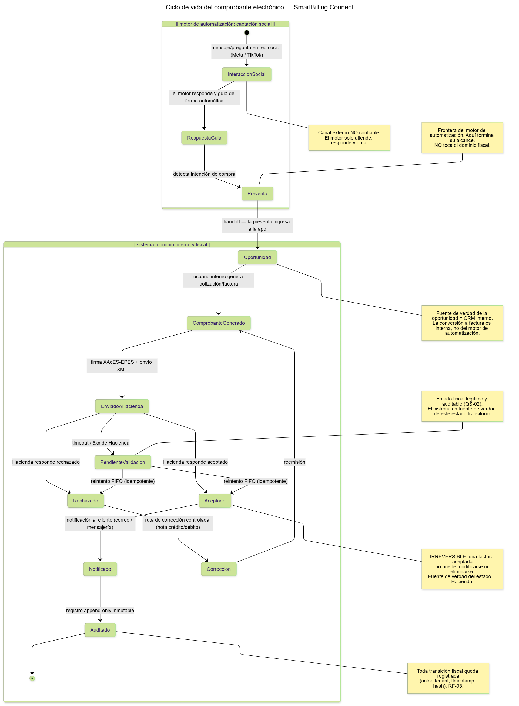
*Figura 1 — Ciclo de vida: captación social (motor de automatización) y tramo interno/fiscal, con responsables de cada transición. Código fuente en `/diagramas/ciclo-vida-factura.mmd`.*

Cada transición de este ciclo plantea preguntas arquitectónicas que el diseño debe responder en los hitos siguientes, pero que quedan formuladas desde ya: qué componente es responsable de cada transición, qué pasa si una transición falla o se ejecuta dos veces, y cuándo una transición es definitiva (irreversible). Estas preocupaciones se concretan en las fuentes de verdad e invariantes de la sección 1.6, en el escenario de idempotencia QS-06 (sección 4) y en la frontera del motor de automatización (REST-05 y sección 3.4).

### 1.6 Fuentes de verdad e invariantes del dominio

El sistema integra varias fuentes de datos (CRM interno, módulo fiscal, motor de automatización, Hacienda, auditoría, redes sociales). Para evitar inconsistencias, ambigüedad transaccional y exposición de datos, se declara explícitamente **quién es la fuente de verdad de cada entidad** y quién puede cambiar su estado.

| Entidad | Fuente de verdad | Quién puede cambiar el estado | Reversibilidad |
|---|---|---|---|
| **Factura — datos previos al envío** (borrador, líneas, montos) | SmartBilling Connect (módulo fiscal) | Usuario autorizado o integración, dentro del sistema principal | Reversible mientras esté en borrador / no enviada |
| **Factura — estado fiscal** (aceptado / rechazado) | **Hacienda** es la autoridad; SmartBilling refleja y conserva ese estado | Solo Hacienda determina aceptado/rechazado; el sistema nunca lo fija por su cuenta | **Irreversible** una vez aceptada |
| **Estado `pendiente_validacion_hacienda`** | SmartBilling Connect (estado interno legítimo y auditable) | El sistema, mientras espera la respuesta de Hacienda | Transitorio: converge a aceptado/rechazado |
| **Preventa** (lead de pre-venta) | Motor de automatización: la genera desde la conversación social y la entrega a la app | El motor la crea; una vez ingresada, el sistema/usuario interno la gestiona. El motor no la modifica después del handoff | Reversible (puede descartarse antes de convertirse en oportunidad) |
| **Oportunidad de venta** | CRM interno de SmartBilling (no la red social, que es solo canal de origen) | Usuario interno (vendedor) dentro de la app; el motor de automatización solo aporta la preventa inicial, no la oportunidad | Reversible |
| **Registro de auditoría** | Log append-only de SmartBilling | Nadie lo modifica tras escribirlo (ni administradores) | **Irreversible / inmutable** |
| **Notificación al cliente** | Servicio de correo/mensajería (mero ejecutor, nunca fuente de verdad del estado fiscal) | El sistema dispara; el proveedor solo entrega | N/A |

**Invariantes no negociables del dominio fiscal.** El diseño debe preservar estas reglas en todos los hitos:

1. Una factura **aceptada por Hacienda no puede ser modificada ni eliminada**; la corrección se hace mediante nota de crédito/débito, no editando el original.
2. Toda factura pertenece a **exactamente un tenant**; ninguna operación puede cruzar esa frontera.
3. Todo comprobante emitido tiene **trazabilidad del actor** (usuario o integración) que lo originó.
4. Todo intento de acceso a datos fiscales es **autorizable y auditable**.
5. Una factura **no puede pasar a "notificada"** si no existe un estado fiscal válido o explícitamente `pendiente_validacion_hacienda`.
6. Un **rechazo de Hacienda** debe generar una ruta de corrección controlada, no un estado terminal silencioso.
7. Ninguna consulta a repositorios de datos fiscales se ejecuta **sin un `tenant_id` válido** resuelto por el mecanismo central de autorización.

---
## 2. Stakeholders
 
**Plataforma de Facturación Electrónica Inteligente con Automatización Comercial y Redes Sociales**
 
Un stakeholder es cualquier persona, grupo u organización que tiene interés en el sistema, no solo los usuarios directos. Esta sección incluye desarrolladores, operadores, reguladores, áreas de negocio y proveedores externos. Para cada uno se identifica qué quieren del sistema y qué les preocupa. Esta tabla es la base de los drivers arquitectónicos de la sección 3.
 
---
 
### STK-01: Dueños de PYMES
 
**Rol:** Propietarios y tomadores de decisiones de pequeñas y medianas empresas que venden a través de redes sociales.
 
| Intereses principales | Preocupaciones o restricciones |
|---|---|
| Reducir la carga operativa en facturación y gestión de ventas. | Costo de adopción: la solución debe ser asequible para una PYME. |
| Centralizar ventas, mensajería y facturación en una sola plataforma. | Curva de aprendizaje: no tienen equipo técnico dedicado. |
| Convertir interacciones en redes sociales en ventas registradas y facturadas. | Continuidad: el sistema no puede fallar en horas de venta. |
| Obtener visibilidad sobre el estado comercial del negocio. | Cumplimiento fiscal sin complejidad adicional. |
---
 
### STK-02: Personal administrativo
 
**Rol:** Empleados que operan el sistema día a día: emiten facturas, gestionan clientes y procesan cotizaciones.
 
| Intereses principales | Preocupaciones o restricciones |
|---|---|
| Rapidez en la emisión de comprobantes electrónicos. | Interfaces complejas que ralenticen el trabajo. |
| Reducción de errores por ingreso manual de datos. | Pérdida de datos por fallos del sistema. |
| Flujos de trabajo claros y predecibles. | Doble digitación entre sistemas desconectados. |
| Acceso a historial de transacciones por cliente. | Falta de soporte ante errores de facturación. |
 
---
 
### STK-03: Clientes finales
 
**Rol:** Personas o empresas que compran productos/servicios de las PYMES y reciben los comprobantes electrónicos.
 
| Intereses principales | Preocupaciones o restricciones |
|---|---|
| Respuestas rápidas a consultas realizadas por redes sociales. | Tiempos de espera excesivos en la atención automatizada. |
| Recibir comprobantes electrónicos válidos de forma oportuna. | Recibir comprobantes con errores o inválidos ante Hacienda. |
| Transparencia en precios y condiciones de venta. | Privacidad de sus datos personales y fiscales. |
 
---
 
### STK-04: Administradores del sistema
 
**Rol:** Personal técnico o funcional responsable de configurar, monitorear y mantener la plataforma en operación.
 
| Intereses principales | Preocupaciones o restricciones |
|---|---|
| Control centralizado sobre configuración de tenants y usuarios. | Fallos silenciosos en integraciones con APIs externas. |
| Monitoreo en tiempo real del estado de integraciones externas. | Escalabilidad ante crecimiento de clientes (multi-tenant). |
| Capacidad de auditoría sobre todas las transacciones. | Gestión de certificados de firma digital y su renovación. |
| Herramientas de diagnóstico ante fallos. | Seguridad: accesos no autorizados, exfiltración de datos fiscales. |
 
---
 
### STK-05: Entidades tributarias (Ministerio de Hacienda)
 
**Rol:** Ente regulador que define los requisitos legales y técnicos para la facturación electrónica en Costa Rica.
 
| Intereses principales | Preocupaciones o restricciones |
|---|---|
| Que los comprobantes emitidos cumplan el esquema XML vigente. | Emisión de comprobantes fraudulentos o manipulados. |
| Que los documentos tengan firma digital válida (XADES-EPES). | Incumplimiento del formato o protocolo de comunicación. |
| Que exista trazabilidad fiscal completa y auditable. | Imposibilidad de fiscalizar por falta de registros. |
| Que los comprobantes se conserven por el plazo legal (5 años). | |
 
---
 
### STK-06: Equipo de desarrollo
 
**Rol:** Desarrolladores e ingenieros responsables de construir, evolucionar y mantener la plataforma.
 
| Intereses principales | Preocupaciones o restricciones |
|---|---|
| Arquitectura clara con subsistemas desacoplados. | Deuda técnica acumulada por decisiones apresuradas. |
| Stack tecnológico accesible y bien documentado. | Complejidad excesiva al integrar múltiples APIs externas. |
| Facilidad para agregar nuevas integraciones o adaptar las existentes. | Dependencia de herramientas cuya viabilidad a largo plazo es incierta (ej. decisión pendiente sobre el motor de automatización). |
| Procesos de despliegue y pruebas automatizados. | Mantenimiento de compatibilidad ante cambios de Hacienda o de redes sociales. |
 
---
 
### STK-07: Proveedores de APIs externas (Meta, TikTok)
 
**Rol:** Plataformas de redes sociales cuyos servicios se integran al sistema mediante APIs públicas.
 
| Intereses principales | Preocupaciones o restricciones |
|---|---|
| Que el consumo de sus APIs respete los términos de servicio. | Uso indebido de datos de usuarios obtenidos a través de sus APIs. |
| Que los flujos OAuth cumplan sus especificaciones de seguridad. | Abuso de cuotas de API o scraping no autorizado. |
| Que el volumen de llamadas se mantenga dentro de los rate limits. | Impacto reputacional si la integración genera spam o mala experiencia al usuario final. |
 
---
 
### Tabla resumen
 
| ID | Stakeholder | Tipo | Influencia | Drivers asociados |
|---|---|---|---|---|
| STK-01 | Dueños de PYMES | Usuario / Negocio | **Alta** | RF-01, RF-02, RF-03, RF-06, QA-02, REST-03 |
| STK-02 | Personal administrativo | Usuario operativo | **Media** | RF-03, RF-04, QA-04 |
| STK-03 | Clientes finales | Usuario externo | **Baja** | RF-02, QA-02, QA-04 |
| STK-04 | Administradores del sistema | Operador / Técnico | **Alta** | RF-04, RF-05, RF-06, QA-01, QA-03, QA-05, REST-05 |
| STK-05 | Entidades tributarias | Regulador | **Alta** | RF-01, RF-05, RF-06, QA-01, REST-01, REST-02 |
| STK-06 | Equipo de desarrollo | Constructor | **Alta** | QA-03, QA-05, REST-05, REST-06 |
| STK-07 | Proveedores APIs (Meta, TikTok) | Proveedor externo | **Media** | RF-02, QA-03, REST-04 |
## 3. Drivers Arquitectónicos

Plataforma de Facturación Electrónica Inteligente con Automatización Comercial y Redes Sociales

Los drivers arquitectónicos son los factores que moldean de forma determinante la arquitectura del sistema. No representan la totalidad de requerimientos, sino aquellos cuya omisión provocaría un fallo sistémico o un diseño fundamentalmente inadecuado (SWEBOK v3, Cap. 2 -- Software Design). A continuación se clasifican en tres categorías: requerimientos funcionales clave, atributos de calidad prioritarios y restricciones que actúan como drivers.

### 3.1 Requerimientos funcionales clave

Se incluyen únicamente los requerimientos funcionales con impacto arquitectónico directo: aquellos que obligan a tomar decisiones de estructura, componentes o integración, no de implementación interna.

| **ID** | **Requerimiento** | **Stakeholder** | **Por qué es un driver** |
|---|---|---|---|
| **RF-01** | Emisión de comprobantes electrónicos (factura, nota de crédito, nota de débito) cumpliendo el esquema XML del Ministerio de Hacienda de Costa Rica. | Dueños de PYMES, Entidades tributarias | Define el subsistema central del dominio. Obliga a un motor de facturación con generación XML, firma digital, envío al API de Hacienda y manejo de estados (aceptado/rechazado). Impone estructura de colas y reintentos. |
| **RF-02** | Integración con APIs de redes sociales (Meta Platforms, TikTok) para capturar mensajes y consultas que el motor de automatización atiende y deriva como preventas. | Dueños de PYMES, Clientes finales | Introduce un subsistema de integración social con sus propias fronteras, protocolos de autenticación OAuth y manejo de webhooks. Requiere un intermediario (el motor de automatización) que desacople la mensajería social del core de facturación, recibiendo el sistema solo el handoff de preventa. |
| **RF-03** | Automatización de la atención en redes sociales mediante un motor de workflows: responder mensajes y preguntas de usuarios, guiarlos hacia la aplicación con intención de compra y generar una **preventa** que ingresa al sistema. | Dueños de PYMES, Personal administrativo | Obliga a incorporar el motor de automatización como componente externo acotado a la **capa de captación social**, con una frontera explícita frente al dominio fiscal (sección 3.4). Define el contrato de handoff (preventa → app) y el patrón de comunicación, sin que el motor participe en la emisión fiscal. |
| **RF-04** | Gestión multiusuario con roles diferenciados (administrador, vendedor, asistente administrativo) y permisos granulares por operación. | Administradores del sistema, Personal administrativo | Obliga a un subsistema transversal de autenticación y autorización (Identity Provider). Afecta cada punto de entrada del sistema y requiere decisiones sobre protocolos (JWT, OAuth2) y almacenamiento de sesiones. |
| **RF-05** | Registro de auditoría completo e inmutable de todas las transacciones fiscales y acciones de usuarios. | Entidades tributarias, Administradores del sistema | Impone un log de auditoría append-only separado del almacenamiento transaccional. Afecta la estrategia de persistencia y puede requerir un almacén de eventos o base de datos dedicada para trazabilidad fiscal. |
| **RF-06** | Procesamiento idempotente de eventos externos (webhooks de redes sociales, respuestas de Hacienda, llamadas del motor de automatización, reintentos por timeout y acciones manuales), garantizando que un mismo evento no produzca efectos duplicados. | Dueños de PYMES, Entidades tributarias, Administradores | Es un driver porque el sistema es, por naturaleza, un receptor de eventos potencialmente duplicados. Obliga a un mecanismo transversal de claves de idempotencia / deduplicación por `event_id` y a definir qué operaciones son seguras de reintentar. Sin esto se producen efectos inaceptables: doble emisión de factura, doble notificación al cliente, doble registro de auditoría o doble cambio de estado. |

### 3.2 Atributos de calidad prioritarios

Se priorizan los cinco atributos de calidad más críticos para este sistema. La selección responde al contexto específico del dominio: un sistema fiscal con integración a servicios externos y automatización en tiempo real. Si todo es prioridad, nada lo es — por eso se limita a cinco.

| **ID** | **Atributo** | **Importancia** | **Stakeholder** | **Justificación** |
|---|---|---|---|---|
| **QA-01** | Seguridad | **Alta** | Entidades tributarias, Administradores | El sistema maneja información fiscal legalmente vinculante y datos sensibles de clientes (NIF, direcciones, montos). Una brecha comprometería la validez legal de los comprobantes y expondría a sanciones. Requiere firma digital, cifrado en tránsito/reposo y control de acceso estricto. |
| **QA-02** | Disponibilidad | **Alta** | Dueños de PYMES, Clientes finales | Las PYMES dependen del sistema para facturar en tiempo real. Una caída durante horas pico significa pérdida directa de ventas. La integración con redes sociales exige que el sistema esté disponible cuando llegan mensajes (24/7). Objetivo mínimo: 99.5% uptime mensual. |
| **QA-03** | Interoperabilidad | **Alta** | Dueños de PYMES, Administradores | El sistema debe comunicarse con al menos tres ecosistemas externos: API de Hacienda (XML/SOAP), APIs de redes sociales (REST/webhooks) y motor de automatización. Si la interoperabilidad falla, el valor diferenciador de la plataforma desaparece. Se mide en QS-07 (sustitución del motor sin tocar el sistema) y, para el ecosistema fiscal, en QS-05. |
| **QA-04** | Rendimiento | **Media-Alta** | Personal administrativo, Clientes finales | Las respuestas automáticas a consultas en redes sociales deben procesarse en segundos para no perder oportunidades comerciales. La emisión de facturas debe completarse en menos de 5 segundos incluyendo la respuesta de Hacienda. Tiempos mayores degradan la experiencia y generan doble envío. |
| **QA-05** | Modificabilidad | **Media** | Administradores, Dueños de PYMES | Las regulaciones fiscales cambian periódicamente (nuevos campos, versiones de XML, tarifas impositivas). Las APIs de redes sociales actualizan sus contratos con frecuencia. El sistema debe absorber estos cambios sin rediseño arquitectónico, lo que exige bajo acoplamiento entre subsistemas. |

### 3.3 Restricciones que actúan como drivers

Las siguientes restricciones no son negociables y condicionan directamente las decisiones arquitectónicas. Se clasifican por tipo según su origen.

| **ID** | **Restricción** | **Tipo** | **Impacto en el diseño** |
|---|---|---|---|
| **REST-01** | Los comprobantes electrónicos deben cumplir el formato XML y el protocolo de firma digital establecidos por el Ministerio de Hacienda de Costa Rica. | Regulatoria | Fuerza el uso de librerías de firma digital (XADES-EPES), certificados específicos (Firma Digital CR) y un módulo dedicado a construir y validar el XML fiscal. No hay margen de negociación sobre el formato. |
| **REST-02** | Los documentos fiscales emitidos deben conservarse por un mínimo de 5 años con integridad demostrable. | Regulatoria | Obliga a una estrategia de almacenamiento de largo plazo con respaldos, checksums de integridad y posible almacenamiento en frío. Afecta la selección de base de datos y la política de retención. |
| **REST-03** | La plataforma debe operar como servicio multi-tenant orientado a PYMES con modelo de suscripción (SaaS). | Negocio | **En un sistema fiscal, el multi-tenancy es una decisión arquitectónica crítica, no un detalle técnico.** No basta con un `tenant_id`: condiciona el aislamiento de datos fiscales entre empresas, el control de acceso por tenant, la trazabilidad y auditoría separadas por tenant, la estrategia de respaldos y recuperación por cliente, las migraciones de esquema sin afectar a todos los tenants y el cumplimiento normativo individual. Su principal riesgo arquitectónico es la **exposición cruzada de información fiscal** entre tenants, lo que obliga a centralizar la resolución de `tenant_id` en la capa de autorización (ver invariante 7 de la sección 1.6 y escenario QS-01). |
| **REST-04** | El sistema debe integrarse con APIs externas de Meta Platforms y TikTok, sujetas a sus términos de servicio, procesos de aprobación y límites de tasa. | Técnica | Las APIs de terceros imponen rate limiting, flujos OAuth específicos y revisiones de app. Obliga a implementar circuit breakers, colas de reintento, almacenamiento local de tokens y manejo de degradación cuando las APIs no están disponibles. |
| **REST-05** | El motor de automatización (herramienta a definir) se limita a la **capa de captación social**: responde mensajes/preguntas en redes sociales, guía al usuario hacia la app y genera una preventa. **Decisión de frontera ya tomada: NO participa en el dominio fiscal ni solicita la emisión de comprobantes.** | Técnica | La arquitectura define una interfaz abstracta para el motor (herramienta intercambiable, a definir en el análisis arquitectónico) y un **contrato de handoff** preventa → app como único punto de entrada del motor. El riesgo a evitar es que una herramienta externa concentre lógica de negocio fiscal. Por eso validación, emisión, cotización, autorización, auditoría e idempotencia del dominio fiscal permanecen dentro del sistema; el motor nunca cruza esa frontera. Cada llamada del motor (handoff de preventa) se autentica y audita como cualquier integración. |
| **REST-06** | El presupuesto y equipo corresponden a un proyecto académico/startup con recursos limitados. | Negocio | Restringe el uso de servicios cloud costosos, licencias comerciales y tecnologías que requieran expertise especializado escaso. Favorece stack open-source, servicios gestionados con capa gratuita y arquitectura que pueda operarse con un equipo pequeño. |

---

> **Nota metodológica:** *Esta clasificación sigue los lineamientos del SWEBOK v3 (Capítulo 2 -- Software Design), que establece que los drivers arquitectónicos comprenden los requerimientos funcionales significativos, los atributos de calidad que el sistema debe satisfacer y las restricciones del entorno de desarrollo y operación. Los stakeholders referenciados corresponden a la sección 2 del documento de arquitectura.*

> **Nota sobre el motor de automatización:** *La selección de la herramienta sigue sujeta al análisis arquitectónico, por lo que REST-05 mantiene su intercambiabilidad (cualquier motor de workflows o desarrollo propio). Lo que sí está decidido es su **alcance**: el motor es la capa de captación social y no participa del dominio fiscal.*

### 3.4 Frontera del motor de automatización

El motor de automatización se limita a la **capa de captación en redes sociales**. Su responsabilidad termina cuando entrega una **preventa** a la aplicación; a partir de ahí, todo el dominio fiscal vive en **SmartBilling Connect**. Esta frontera impide que una herramienta externa concentre lógica de negocio fiscal crítica.

| El motor de automatización **SÍ** puede | El motor de automatización **NO** puede |
|---|---|
| Atender, responder y dar seguimiento a mensajes/preguntas de usuarios en redes sociales. | Decidir, solicitar o validar la emisión de un comprobante fiscal. |
| Guiar al usuario hacia la aplicación cuando detecta intención de compra. | Crear o modificar cotizaciones, facturas o cualquier dato fiscal. |
| Generar una **preventa** y entregarla a la app mediante el contrato de handoff. | Participar como coordinador de la transacción fiscal o cambiar estados fiscales. |
| Consultar estados públicos expuestos por la API (p. ej. para responder al usuario). | Escribir en el log de auditoría o alterar su contenido. |

**Garantías sobre las acciones del motor:** el handoff de preventa se **autentica** como una integración más (credenciales propias, sin sesión de usuario humano), se **audita** igual que cualquier acción del sistema (RF-05) y es **idempotente** (RF-06), de modo que reejecutar un workflow no genera preventas duplicadas. Si un workflow social queda a medio ejecutar, no hay impacto fiscal: el dominio fiscal solo avanza por acción interna de la app a partir de una preventa ya recibida.
---

# BLOQUE 2 — REQUERIMIENTOS DE CALIDAD


## 4. Requerimientos de calidad — Escenarios 
 
Definir atributos de calidad en abstracto no es suficiente para tomar decisiones arquitectónicas. Un enunciado como "el sistema debe ser seguro y rápido" no le dice nada al equipo de diseño: no indica cuándo ocurre el problema, qué parte del sistema lo enfrenta ni cómo se mide el éxito. Los escenarios de calidad resuelven eso: convierten cada atributo en una situación concreta, con un actor real, una condición medible y una respuesta esperada del sistema.
 
Cada escenario en esta sección sigue la **estructura de seis elementos del escenario de atributo de calidad** de Bass, Clements y Kazman (*Software Architecture in Practice*): fuente del estímulo, estímulo, entorno de operación, artefacto afectado, respuesta esperada del sistema y medida de respuesta. Las medidas son siempre numéricas; expresiones como "rápido" o "disponible" no califican como criterios de aceptación en un diseño arquitectónico serio.
 
Se documentan **siete escenarios**. Seis de ellos operacionalizan los cinco atributos priorizados en la sección 3.2 —seguridad (QS-01, QS-04), disponibilidad (QS-02), rendimiento (QS-03), modificabilidad (QS-05) e interoperabilidad (QS-07)— y el séptimo, QS-06, cubre una preocupación transversal que no es un atributo de §3.2 sino la contrapartida obligatoria del driver RF-06: **idempotencia / integridad transaccional**. Se documenta como escenario propio porque, sin una medida verificable, "el sistema no duplica efectos" sería una afirmación no comprobable, y de él dependen las decisiones de ADR-002. Las medidas se expresan como **criterios de aceptación verificables en pruebas controladas**, no como deseos absolutos: en ingeniería casi nunca se puede demostrar un "cero" en términos absolutos, por lo que se acota a lo que una suite de pruebas puede comprobar. Al cierre de la sección se analizan las tensiones entre escenarios que entran en conflicto, porque es precisamente en esos conflictos donde se toman las decisiones arquitectónicas más importantes.
 
---
 
### QS-01 — Seguridad: Acceso no autorizado a datos fiscales de un tenant
 
En una plataforma multi-tenant, el riesgo más serio no siempre viene de afuera: un usuario legítimo de un tenant podría intentar —por error o con intención— acceder a los datos de otro. Este escenario valida que el aislamiento entre tenants es real y que cualquier intento de cruzar esa frontera queda registrado.
 
| Elemento | Descripción |
|---|---|
| **Fuente** | Actor externo no autenticado, o usuario autenticado perteneciente a un tenant diferente al del recurso solicitado. |
| **Estímulo** | Intento de consultar, modificar o exportar comprobantes electrónicos o datos fiscales de un tenant ajeno, ya sea mediante llamadas directas a la API REST o mediante manipulación de parámetros de sesión. |
| **Entorno** | Sistema en operación normal, con múltiples tenants activos simultáneamente. |
| **Artefacto** | Subsistema de autenticación y autorización (Identity Provider) y capa de acceso a datos con filtros por `tenant_id`. |
| **Respuesta** | El sistema rechaza la solicitud con HTTP 403, registra el intento en el log de auditoría inmutable con timestamp, IP de origen, usuario y recurso solicitado, y no devuelve ningún dato del tenant objetivo. |
| **Medida de respuesta** | El **100 % de los intentos incluidos en la suite de pruebas de autorización** (RBAC + aislamiento de tenant) son bloqueados con HTTP 403. **Ninguna consulta sin `tenant_id` válido puede ejecutarse contra los repositorios de datos fiscales** (verificado en pruebas de integración). Toda consulta multi-tenant pasa por el mecanismo centralizado de autorización. El evento de intento queda registrado en auditoría en ≤ 500 ms. Ningún registro de un tenant ajeno aparece en la respuesta para los casos cubiertos por la suite. |
 
 > **Tensión con QS-04 — Seguridad vs. Rendimiento:** El registro de auditoría que exige QS-01 por cada intento de acceso no autorizado comparte la misma infraestructura de log append-only que QS-04 utiliza para trazabilidad fiscal. Si ese log se convierte en un cuello de botella bajo carga alta, ambos escenarios se ven afectados. La decisión de diseño implicada es la misma que se detalla en QS-04: persistir el evento de auditoría de forma transaccional en un outbox durable antes de responder y procesar el log append-only final de forma asíncrona, con reintentos, orden e idempotencia. Esto evita la falsa contradicción entre "auditoría obligatoria" y "procesamiento asíncrono".


---
 
### QS-02 — Disponibilidad: Fallo del servicio de validación de Hacienda
 
La plataforma depende de una API externa para validar los comprobantes electrónicos. Esa dependencia es inevitable por regulación, pero no puede significar que el negocio se detenga cada vez que Hacienda tenga problemas técnicos. Este escenario define cómo debe comportarse el sistema cuando ese servicio externo falla, especialmente durante las horas de mayor actividad comercial.
 
| Elemento | Descripción |
|---|---|
| **Fuente** | API del Ministerio de Hacienda de Costa Rica (servicio externo fuera del control de la plataforma). |
| **Estímulo** | El endpoint de validación de comprobantes electrónicos retorna timeout o error HTTP 5xx de forma sostenida durante un período de indisponibilidad. |
| **Entorno** | Sistema en operación durante hora pico de facturación, entre las 8:00 a.m. y las 6:00 p.m. hora Costa Rica. |
| **Artefacto** | Módulo de facturación electrónica y la cola de reintentos asociada para persistencia temporal de documentos pendientes. |
| **Respuesta** | El sistema acepta el comprobante generado localmente, lo encola para reenvío automático, comunica al usuario el estado "pendiente de validación fiscal" y continúa operando con normalidad para todas las demás funciones. Cuando la conectividad se restaura, procesa la cola en orden FIFO sin intervención manual. |
| **Medida de respuesta** | Tiempo de degradación perceptible para el usuario ≤ 2 segundos (únicamente cambia el estado visible del comprobante). Documentos encolados procesados automáticamente en ≤ 10 minutos tras la restauración del servicio externo. Disponibilidad del flujo de facturación local, sin depender de Hacienda, ≥ 99.5 % mensual. Ningún documento encolado se pierde ante reinicios del sistema en la suite de pruebas de resiliencia, garantizado por persistencia durable de la cola. |
 
 > **Tensión con QS-04 — Disponibilidad vs. Integridad fiscal:** QS-02 requiere que el sistema persista comprobantes localmente cuando Hacienda no responde. Pero QS-04 exige que cada comprobante tenga su entrada de auditoría con un estado definitivo. Durante una ventana de indisponibilidad, el estado real del comprobante ante Hacienda es desconocido, lo que crea una inconsistencia temporal entre el log interno y el registro fiscal oficial. La decisión de diseño implicada es modelar `pendiente_validacion_hacienda` como un estado fiscal legítimo y auditable: el log captura el timestamp de encolado y el de confirmación posterior, de modo que la integridad del proceso queda trazada aunque la validación no sea inmediata.


---
 
### QS-03 — Rendimiento: Respuesta automática a consulta en red social durante evento de ventas
 
Uno de los valores diferenciales de SmartBilling Connect es responder automáticamente a mensajes de clientes en redes sociales. Pero ese valor desaparece si la respuesta llega tarde: en ventas por canal digital, unos pocos segundos de demora pueden ser la diferencia entre cerrar una venta o perderla. Este escenario evalúa el comportamiento del sistema bajo la carga concentrada típica de una campaña activa.
 
| Elemento | Descripción |
|---|---|
| **Fuente** | Cliente final que envía un mensaje de consulta de precio o disponibilidad mediante Instagram Direct o WhatsApp Business, recibido por el motor de automatización vía webhook de Meta Platforms. |
| **Estímulo** | Llegada simultánea de 50 eventos webhook en un intervalo de 60 segundos durante una campaña de ventas activa. |
| **Entorno** | Plataforma bajo carga sostenida, con el motor de automatización procesando flujos concurrentes en la capa de captación social (sección 3.4). |
| **Artefacto** | Motor de automatización (capa de captación social), API pública de consulta del sistema y endpoint de handoff de preventas. |
| **Respuesta** | El motor de automatización procesa cada evento, consulta a la API del sistema si el cliente ya existe en el CRM (acceso de solo lectura permitido por la frontera de 3.4), genera la respuesta automática configurada y la envía por el canal de origen, sin requerir intervención humana en ningún paso; ante intención de compra, entrega la preventa al sistema mediante el handoff idempotente. |
| **Medida de respuesta** | Tiempo de respuesta extremo a extremo —desde la recepción del webhook hasta el envío de la respuesta al cliente— ≤ 4 segundos en el percentil 95 bajo la carga descrita. Throughput mínimo sostenido de 50 eventos por minuto sin degradación. Tasa de mensajes no procesados por timeout del motor inferior al 1 % del total recibido. |
 
 > **Tensión con QS-01 y QS-04 — Rendimiento vs. Seguridad:** El log de auditoría append-only exigido por QS-01 y QS-04 introduce una escritura obligatoria en cada operación sensible. Si esa escritura es síncrona y bloqueante dentro del camino crítico del procesamiento de webhooks, la latencia acumulada puede superar fácilmente los 4 segundos bajo carga sostenida. La decisión de diseño implicada distingue dos casos: para **operaciones fiscales**, el evento se persiste transaccionalmente en un outbox durable antes de responder y el log append-only final se procesa de forma asíncrona (no es un bloqueo síncrono del camino crítico); para **eventos comerciales de redes sociales**, es aceptable un modelo "at-least-once" con verificación post-proceso. En ambos casos el procesamiento asíncrono garantiza reintentos, orden, idempotencia y detección de duplicados.


---
 
### QS-04 — Seguridad / Trazabilidad: Registro de auditoría ante emisión masiva de comprobantes
 
La facturación electrónica tiene implicaciones legales directas. Cuando un proceso automatizado emite cientos de facturas en un lote, debe existir evidencia verificable de cada operación: quién la originó, cuándo ocurrió, cuál fue el resultado y que el documento no fue alterado después. Este escenario es especialmente relevante porque el actor que dispara el proceso no es un humano sino un proceso interno programado del sistema (no el motor de automatización, que no participa del dominio fiscal — ver 3.4).
 
| Elemento | Descripción |
|---|---|
| **Fuente** | Proceso interno programado del sistema (p. ej. job de cierre de mes) actuando como actor no humano dentro del dominio fiscal. |
| **Estímulo** | Emisión de 200 facturas electrónicas en lote durante un cierre de mes. |
| **Entorno** | Operación normal en sistema multi-tenant, con varios tenants procesando transacciones simultáneamente. |
| **Artefacto** | Log de auditoría append-only y subsistema de facturación electrónica. |
| **Respuesta** | Por cada comprobante emitido, el sistema registra en el log de auditoría la identidad del actor (usuario o integración), el tenant de origen, un timestamp con precisión de milisegundo, el número de comprobante, el estado resultante (aceptado, rechazado o pendiente) y el hash de integridad del documento XML. Ningún actor del sistema —incluyendo administradores— puede modificar ni eliminar entradas del log una vez escritas. |
| **Medida de respuesta** | Antes de que el sistema retorne la respuesta de una operación fiscal, el evento de auditoría se **persiste transaccionalmente en un outbox durable** (misma transacción que el cambio de estado del comprobante); el procesamiento hacia el log append-only final ocurre de forma asíncrona, con reintentos, orden garantizado y deduplicación. Así, el 100 % de los comprobantes emitidos en la suite de pruebas tiene su evento de auditoría persistido de forma durable antes de responder, sin que el log final sea un bloqueo síncrono en el camino crítico. La latencia adicional del registro transaccional en outbox es ≤ 80 ms por comprobante. La integridad del log es verificable mediante hashes encadenados: ninguna entrada puede alterarse sin invalidar todas las posteriores. El log se conserva por un mínimo de 5 años (REST-02). |
 
 > **Tensión con QS-05 — Trazabilidad vs. Modificabilidad:** El despliegue en caliente requerido por QS-05 implica que durante la ventana de transición pueden coexistir en producción dos versiones del módulo fiscal. El log de auditoría debe mantener coherencia entre registros generados por versiones distintas del mismo módulo, y un token válido para una versión no debería poder operar contra la otra. La decisión de diseño implicada es que cada entrada del log incluya la versión del módulo fiscal que generó el comprobante, y que el subsistema de autorización aplique control de versión en los contratos de API internos.


---
 
### QS-05 — Modificabilidad: Adaptación a cambio en el esquema XML de Hacienda
 
Las regulaciones fiscales no son estáticas. Hacienda actualiza periódicamente el esquema XML de los comprobantes electrónicos, y el sistema debe poder absorber esos cambios sin afectar a los tenants en producción ni requerir una intervención de emergencia del equipo. Este escenario verifica que el módulo fiscal está suficientemente aislado como para ser actualizado de forma independiente.
 
| Elemento | Descripción |
|---|---|
| **Fuente** | Ministerio de Hacienda de Costa Rica en su rol de regulador externo. |
| **Estímulo** | Publicación de una nueva versión del esquema XML para comprobantes electrónicos, con cambios en campos obligatorios y reglas de validación, y un plazo de adopción de 60 días calendario. |
| **Entorno** | Sistema en producción con tenants activos emitiendo comprobantes a diario. |
| **Artefacto** | Módulo de construcción y validación del XML fiscal, aislado del resto del sistema mediante una interfaz de contrato definida. |
| **Respuesta** | El equipo de desarrollo modifica exclusivamente el módulo fiscal sin tocar otros subsistemas. El cambio atraviesa el pipeline de integración continua, se valida en el ambiente de pruebas y se despliega en producción sin downtime mediante un despliegue en caliente. |
| **Medida de respuesta** | Tiempo total desde la publicación del nuevo esquema hasta el despliegue en producción validado: ≤ 10 días hábiles. Número de subsistemas ajenos al módulo fiscal que requieren modificación: cero. Cobertura de pruebas automatizadas del módulo fiscal antes del despliegue: ≥ 90 % de los casos de validación definidos por Hacienda. |
 
 > **Tensión con QS-01 y QS-04 — Modificabilidad vs. Seguridad:** La coexistencia de dos versiones del módulo fiscal durante el despliegue amplía temporalmente la superficie de ataque del sistema. Esta tensión ya fue abordada desde la perspectiva de trazabilidad en QS-04; desde la perspectiva de acceso, la decisión complementaria es que el subsistema de autorización emita tokens con alcance de versión explícito, de modo que una sesión autenticada solo pueda operar contra la versión del módulo para la que fue emitida.


---
 
### QS-06 — Idempotencia / Integridad: Evento externo duplicado

Por su naturaleza, el sistema recibe eventos que pueden llegar duplicados: webhooks de redes sociales reenviados, **preventas duplicadas por reejecución de un workflow del motor de automatización**, respuestas tardías o repetidas de Hacienda y reintentos internos por timeout en la emisión fiscal. Sin un tratamiento explícito, un duplicado puede provocar una preventa repetida, una doble notificación, una doble emisión de factura (por reintento interno) o un cambio de estado aplicado dos veces. Este escenario verifica que el sistema reconoce y neutraliza los duplicados (RF-06).

| Elemento | Descripción |
|---|---|
| **Fuente** | Sistema externo o reintento interno: webhook de Meta/TikTok reenviado, handoff de preventa repetido por reejecución del motor de automatización, respuesta duplicada de Hacienda, o reintento interno de emisión fiscal por timeout. |
| **Estímulo** | Llega un evento que ya fue procesado: la misma solicitud de emisión, la misma confirmación de Hacienda o el mismo webhook arriba dos o más veces. |
| **Entorno** | Operación normal, con reintentos activos y al-menos-una-entrega ("at-least-once") en los canales de integración. |
| **Artefacto** | Puntos de entrada de eventos (webhooks, API de integración, callbacks de Hacienda), almacén de claves de idempotencia y módulo de facturación. |
| **Respuesta** | El sistema detecta el duplicado mediante una clave de idempotencia / `event_id` y reconoce la operación como ya aplicada, retornando el resultado previo sin volver a ejecutar el efecto. No se emite una segunda factura, no se envía una segunda notificación y no se duplica el registro de auditoría. |
| **Medida de respuesta** | En la suite de pruebas de idempotencia, el 100 % de los eventos duplicados reconocidos produce **exactamente un** efecto de negocio (una factura, una notificación, una entrada de auditoría lógica). Ninguna operación fiscal marcada como idempotente genera un segundo comprobante ante reentrega. La ventana de deduplicación cubre al menos el periodo máximo de reintento configurado para cada canal. |
 
 > **Tensión con QS-03 — Idempotencia vs. Rendimiento:** La verificación de la clave de idempotencia agrega una consulta al almacén de deduplicación en el camino de cada evento. Bajo la carga de QS-03 (50 eventos/min) esto suma latencia. La decisión de diseño implicada es usar un almacén de claves de baja latencia (p. ej. índice único o caché durable) y aplicar la verificación solo a operaciones con efecto de negocio, no a consultas de solo lectura.


---


### QS-07 — Interoperabilidad: sustitución del motor de automatización por otra herramienta

QA-03 identificó la interoperabilidad como atributo de alta prioridad porque el sistema conversa con tres ecosistemas externos que no controla. De los tres, Hacienda ya está cubierto por QS-05 (cambio de esquema) y QS-02 (indisponibilidad), y los canales sociales nunca tocan el sistema directamente. El riesgo de interoperabilidad que queda sin medir es el que REST-05 dejó deliberadamente abierto: **la herramienta de automatización aún no está elegida y debe poder cambiarse**. Si esa sustitución obligara a tocar el sistema, la frontera de §3.4 sería una ilusión.

| Elemento | Descripción |
|---|---|
| **Fuente** | Equipo de desarrollo / decisión de negocio: se reemplaza la herramienta que implementa el motor de automatización (o se conecta una segunda en paralelo para otro canal). |
| **Estímulo** | Solicitud de sustituir el motor por una herramienta distinta —otro producto de workflows o un desarrollo propio— manteniendo intacta la capacidad de captación social. |
| **Entorno** | Sistema en producción con tenants activos recibiendo preventas por el motor actual; la migración no puede detener la operación comercial. |
| **Artefacto** | Contrato de handoff de preventa (`POST /api/v1/preventas`), credencial de integración OAuth2 y su alcance, y el endpoint de consulta de estados públicos. |
| **Respuesta** | El motor nuevo se registra en Keycloak como cliente de integración con alcance `preventas:write`, se le entrega la especificación del contrato de handoff y comienza a entregar preventas. El sistema no distingue un motor de otro: valida credencial, alcance e `Idempotency-Key` igual que antes. Ningún componente interno se modifica ni se redespliega. |
| **Medida de respuesta** | Número de contenedores del sistema que requieren modificación de código: **cero**. Número de contenedores que requieren redespliegue: **cero** (el alta del cliente de integración es configuración de Keycloak). Tiempo desde la decisión hasta el primer handoff válido del motor nuevo: ≤ 5 días hábiles. La suite de pruebas de contrato del endpoint de handoff pasa sin cambios contra el motor nuevo. |

 > **Tensión con QS-01 — Interoperabilidad vs. Seguridad:** aceptar cualquier motor que hable el contrato amplía la superficie de confianza: un segundo cliente de integración es una credencial más que puede comprometerse. La decisión de diseño es que la intercambiabilidad se ejerza **solo a nivel de credencial y alcance**, nunca de permisos: cada motor recibe su propio `client_id` con alcance `preventas:write` y sin `facturacion:write`, de modo que comprometer cualquiera de ellos permite crear preventas basura pero jamás emitir un comprobante (§3.4, §14.5). El límite del punto de extensión está declarado en §15.2: el contrato admite **otro motor**, no otro **tipo de actor**.

---


## 5. Restricciones

Las restricciones que actúan como **drivers** ya se detallaron en la sección 3.3 (REST-01 a REST-06), porque condicionan directamente decisiones arquitectónicas. Esta sección consolida la **lista completa y autoritativa** de restricciones del proyecto e incorpora la columna **Origen** (quién impone cada restricción), que complementa el análisis de impacto de 3.3. Para evitar duplicación, el detalle de impacto en el diseño permanece en 3.3; aquí se resume y se añade el origen.

| ID | Restricción | Tipo | Origen | Impacto en el diseño (resumen — ver 3.3) |
|---|---|---|---|---|
| REST-01 | Comprobantes en formato XML y firma digital del Ministerio de Hacienda de Costa Rica. | Regulatoria | Ministerio de Hacienda CR | Módulo fiscal dedicado con firma XADES-EPES y certificados Firma Digital CR. |
| REST-02 | Conservación de documentos fiscales ≥ 5 años con integridad demostrable. | Regulatoria | Ministerio de Hacienda CR | Almacenamiento de largo plazo con checksums y política de retención. |
| REST-03 | Operación SaaS multi-tenant para PYMES. | Negocio | Equipo / modelo de negocio | Aislamiento de datos fiscales por tenant; `tenant_id` centralizado en autorización (driver crítico). |
| REST-04 | Integración con APIs de Meta Platforms y TikTok sujetas a sus ToS y rate limits. | Técnica | Proveedores externos (Meta, TikTok) | Circuit breakers, colas de reintento, OAuth y manejo de degradación. |
| REST-05 | Motor de automatización a definir; limitado a la captación social, no es dueño del dominio fiscal. | Técnica | Equipo / análisis arquitectónico | Interfaz abstracta de workflows; reglas fiscales dentro del sistema (ver 3.4). |
| REST-06 | Recursos limitados de proyecto académico/startup. | Negocio | Equipo / contexto del curso | Favorece stack open-source y servicios con capa gratuita. |
| REST-07 | Cumplimiento de la Ley 8968 de Protección de Datos Personales (Costa Rica) para datos de clientes finales. | Regulatoria | PRODHAB (regulador CR) | Consentimiento, minimización y derecho de acceso/eliminación sobre datos personales; refuerza cifrado y control de acceso (QA-01). |

> **Nota:** REST-07 se incorporó en el Avance 2 (S11) porque el sistema procesa datos personales de clientes finales (contacto, identificación fiscal) provenientes de redes sociales, lo que activa la Ley 8968 además del régimen tributario.

---

## 6. Principios de diseño adoptados

El grupo se compromete a respetar los siguientes principios durante todo el diseño. Se eligieron por su relevancia directa para un sistema fiscal, multi-tenant y orientado a eventos; en la sección 12 se aportará evidencia concreta de su aplicación.

| Principio | Justificación para este sistema |
|---|---|
| **Separación de responsabilidades** | El dominio fiscal, la integración social, la orquestación y la auditoría tienen ciclos de cambio y niveles de criticidad muy distintos. Separarlos evita que un cambio en un canal social afecte la lógica fiscal y permite aislar lo regulado de lo no regulado. |
| **Diseño para el cambio (bajo acoplamiento)** | Las reglas de Hacienda y los contratos de las APIs sociales cambian con frecuencia (QA-05, QS-05). El sistema aísla el módulo fiscal y el motor de automatización tras interfaces para absorber cambios sin rediseño. |
| **Defensa en profundidad** | Al manejar datos fiscales y personales (QA-01, REST-07), la seguridad no puede depender de una sola capa: autenticación, autorización por tenant, cifrado en tránsito/reposo y auditoría inmutable se combinan. |
| **Fuente de verdad única por entidad** | Para evitar inconsistencias entre CRM, módulo fiscal, motor de automatización y Hacienda, cada dato tiene un único dueño autoritativo (sección 1.6). Hacienda es autoridad del estado fiscal; el sistema, de los datos previos. |
| **Idempotencia por diseño** | Al ser un receptor de eventos potencialmente duplicados (RF-06, QS-06), las operaciones con efecto de negocio se diseñan para producir el mismo resultado ante reentregas. |
| **Principio de menor privilegio (PoLA)** | Cada actor e integración —incluido el motor de automatización— opera con el mínimo de permisos necesarios; este se limita a la captación social y a entregar preventas, sin ningún permiso sobre el dominio fiscal (sección 3.4). |
| **KISS / YAGNI** | Dado el contexto de recursos limitados (REST-06), se evita la sobre-ingeniería: solo se introduce complejidad arquitectónica donde un driver o invariante lo justifica. |

---

# BLOQUE 3 — VISTAS ARQUITECTÓNICAS
*Hito: Avance 1 (S07) — sección 7.1 / Avance 2 (S11) — secciones 7.2 y 7.3 / Entrega final (S14) — secciones 7.4 y 7.5*

> **Nota sobre notación:** Este documento usa **C4 como notación por defecto** para las vistas arquitectónicas porque es la notación del texto base del curso (Brown, 2014). Si para alguna vista específica C4 no es la notación más adecuada dado el tipo de sistema, el grupo puede usar la notación UML equivalente (diagrama de componentes, despliegue, estado o actividad), pero debe justificar explícitamente en esa sección por qué C4 no aplica y qué notación alternativa usa. Una justificación insuficiente se evalúa como si no hubiera diagrama.

---

## 7. Vistas arquitectónicas

### 7.1 Vista de contexto
*Hito: Avance 1 (S07)*

> **Qué muestra:** El sistema como una caja negra en su entorno. Las personas y sistemas externos que interactúan con él. Las relaciones entre ellos. **No muestra** lo que hay dentro del sistema.
>
> **Notación:** C4 nivel 1 (Context Diagram). Aplica a todos los tipos de sistema — un sistema embebido, un pipeline de datos, un monolito y una plataforma SaaS todos tienen contexto externo.


*Figura 2 — Vista de contexto del sistema SmartBilling Connect*

| Elemento | Tipo | Descripción de la relación |
|---|---|---|
| **SmartBilling Connect** | Sistema principal | Plataforma SaaS de facturación electrónica inteligente para PYMES. Centraliza la gestión de clientes, cotizaciones, facturación electrónica y automatización de flujos comerciales provenientes de canales digitales. |
| **Dueño de PYME** | Persona / Rol | Accede al sistema mediante la interfaz web para configurar parámetros fiscales y de integración, administrar usuarios y permisos, monitorear automatizaciones y consultar métricas operativas del negocio. Interacción: HTTPS / Web UI. |
| **Vendedor / Ejecutivo** | Persona / Rol | Utiliza el sistema para registrar clientes, generar cotizaciones, convertir cotizaciones en facturas electrónicas y dar seguimiento a ventas originadas en redes sociales. Interacción: HTTPS / Web UI. |
| **Asistente Administrativo** | Persona / Rol | Opera el sistema para emitir comprobantes electrónicos, validar información fiscal de clientes, reenviar documentos y corregir errores operativos de facturación. Interacción: HTTPS / Web UI. |
| **Cliente Final** | Persona / Rol externo | Recibe comprobantes electrónicos y notificaciones comerciales, consulta cotizaciones enviadas y confirma pedidos. No accede al back-office del sistema. Interacción: correo electrónico / portal web. |
| **API Ministerio de Hacienda CR** | Sistema externo | El sistema envía comprobantes electrónicos firmados digitalmente en formato XML y consulta su estado de validación (aceptado / rechazado / en proceso). Es el punto de cumplimiento tributario obligatorio para toda factura emitida. Interacción: XML sobre HTTPS. |
| **Meta Platforms (Instagram / WhatsApp)** | Sistema externo | Canal social donde los clientes envían mensajes e interacciones. La atención y respuesta automática las gestiona el motor de automatización, no directamente el sistema; SmartBilling recibe el resultado como preventa. Interacción: REST / Webhook (vía el motor de automatización). |
| **TikTok Business API** | Sistema externo | Canal social cuyos eventos de interacción atiende el motor de automatización, que deriva las oportunidades con intención de compra al sistema como preventas. Interacción: REST / Webhook (vía el motor de automatización). |
| **Motor de Automatización** | Sistema externo | Capa de captación social: atiende mensajes y preguntas de usuarios en redes sociales, responde de forma automática, los guía hacia la aplicación y, ante intención de compra, entrega una **preventa** al sistema mediante el contrato de handoff. **No participa en la emisión ni en ningún proceso fiscal.** Interacción: REST / Eventos (handoff de preventa). |
| **Servicio de Correo Electrónico** | Sistema externo | El sistema delega en este servicio el envío de comprobantes electrónicos, cotizaciones y notificaciones a los clientes finales. Interacción: SMTP / API. |
 
#### 7.1.1 Fronteras de confianza

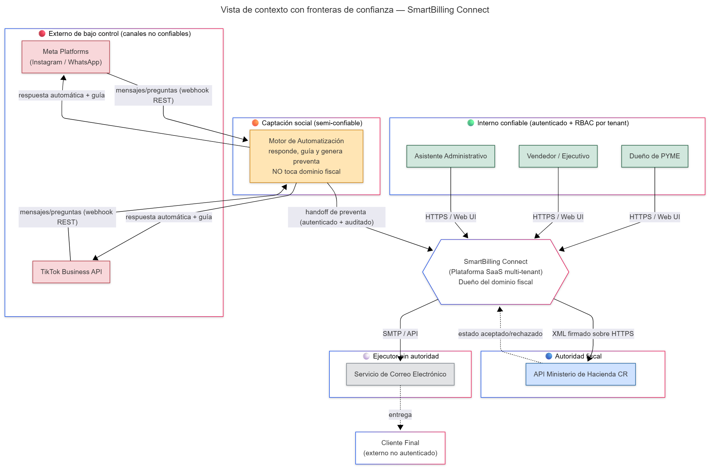
*Figura 3 — Fronteras de confianza del sistema SmartBilling Connect. Código fuente en `/diagramas/c4-contexto-confianza.mmd`.*

No todos los actores y sistemas externos tienen el mismo nivel de confianza, y esa distinción —no solo el diagrama— guía decisiones de seguridad, validación e idempotencia. Se clasifican así:

| Nivel de confianza | Elementos | Implicación arquitectónica |
|---|---|---|
| **Autoridad fiscal** | API Ministerio de Hacienda CR | Define el estado fiscal de los comprobantes (fuente de verdad del estado, sección 1.6). El sistema confía en su veredicto pero debe tolerar su indisponibilidad (QS-02) y respuestas tardías o duplicadas (QS-06). |
| **Interno confiable** | Dueño de PYME, Vendedor, Asistente Administrativo | Operan autenticados y autorizados por tenant (RBAC). Confiables, pero toda acción es auditable (RF-05) y acotada por menor privilegio. |
| **Externo de bajo control (canales)** | Meta Platforms, TikTok | Canales no confiables: disponibilidad y rate limits ajenos, payloads no validados. Toda entrada se valida y se trata como potencialmente duplicada o maliciosa. No son fuente de verdad de oportunidades. |
| **Automatización de captación social (semi-confiable)** | Motor de automatización | Acotado a la capa social: responde y guía a usuarios y entrega preventas. **No** toca el dominio fiscal (sección 3.4). Se autentica como integración, se audita y su handoff es idempotente; un fallo suyo no tiene impacto fiscal. |
| **Ejecutor sin autoridad** | Servicio de Correo Electrónico | Solo entrega mensajes; **nunca** es fuente de verdad del estado de un comprobante. Su fallo no debe bloquear ni alterar el estado fiscal. |
| **Externo no autenticado** | Cliente Final | Recibe comprobantes/notificaciones; no accede al back-office. Sin privilegios sobre datos de otros. |

> **Nota:** La agrupación visual de estos elementos por frontera de confianza se presenta en la Figura 3, que complementa la Figura 2 haciendo explícito el límite entre "lo que el sistema controla" y "lo que delega o recibe de terceros".

> **Refinamiento en la Entrega final (S14).** Al bajar a las vistas de contenedores (7.2), componentes (7.2.4) y despliegue (7.4) se revisó que no apareciera ningún actor o sistema externo nuevo ni desapareciera ninguno de los definidos en Avance 1: el contexto se mantiene con los mismos 9 elementos de frontera y sus mismos niveles de confianza. El único ajuste consciente fue reforzar en el texto que **Meta y TikTok llegan al sistema exclusivamente a través del Motor de Automatización** (nunca directo), coherente con la frontera de la sección 3.4; esto ya estaba implícito en Avance 1 y ahora es explícito en todas las vistas. La vista de contexto, por tanto, no cambió estructuralmente entre avances (ver trazabilidad completa en 7.6).

---

### 7.2 Vista de estructura interna
*Hito: Avance 2 (S11)*

> **Qué muestra:** Las piezas principales que componen el sistema, cómo están organizadas y cómo se comunican entre sí. Esta vista es la base del diseño detallado.
>
> **Notación por defecto — C4 nivel 2 (Container Diagram):** Usá esta notación si tu sistema tiene unidades desplegables separadas — APIs, aplicaciones web, bases de datos, servicios de mensajería, apps móviles, procesos batch, etc. "Contenedor" en C4 no es Docker — es cualquier unidad de ejecución o almacenamiento con una frontera propia.
>
> **Alternativa justificada:** Si el sistema es un monolito, un firmware, un sistema embebido o un pipeline de datos sin unidades desplegables separadas, podés usar un **diagrama de componentes UML** o un **diagrama de módulos**. Justificá en la subsección 7.2.1 por qué C4 contenedores no es la representación más honesta para tu sistema.

#### 7.2.1 Justificación de notación

**Se usa C4 nivel 2 (Container Diagram)** porque SmartBilling Connect no es un monolito único ni un firmware/pipeline sin unidades desplegables: es una plataforma SaaS multi-tenant compuesta por **nueve unidades desplegables y de almacenamiento con frontera propia**, que se ejecutan y escalan de forma independiente y que se comunican por protocolos explícitos. C4 nivel 2 es la representación más honesta porque el valor arquitectónico del sistema está justamente en *cómo se reparten las responsabilidades entre esas unidades* y en las fronteras entre ellas (en particular, el aislamiento del dominio fiscal).

Las nueve unidades son: (1) Aplicación Web (SPA), (2) API de Aplicación, (3) Servicio de Facturación Fiscal, (4) Procesador Asíncrono (Workers), (5) Identity Provider, (6) Broker de Mensajería, (7) Base de Datos Transaccional, (8) Almacén de Auditoría append-only y (9) Almacén de Documentos Fiscales.

Esta separación no es cosmética: responde directamente a los drivers. El **Servicio de Facturación Fiscal** se aísla como contenedor propio para mantener el dominio fiscal dentro del sistema y fuera del alcance del motor de automatización (REST-05, sección 3.4) y para poder endurecer su seguridad de forma independiente (QA-01). El **Almacén de Auditoría** es un contenedor separado, append-only, porque RF-05 exige un log inmutable distinto del almacenamiento transaccional. El **Procesador Asíncrono** y el **Broker de Mensajería** materializan el patrón *outbox* + procesamiento asíncrono que resuelve la tensión seguridad/rendimiento de QS-01/QS-04 y la idempotencia de RF-06/QS-06. El **Identity Provider** externaliza autenticación/autorización multi-tenant (RF-04, REST-03). El stack se apoya en componentes gratuitos u open-source (React, ASP.NET Core, Keycloak, RabbitMQ, MinIO) y en **SQL Server** como motor de datos —cubierto por su edición gratuita (Express/Developer) o por licenciamiento existente del equipo—, lo que mantiene el costo acotado a la restricción de presupuesto REST-06.

> **Nota:** "Contenedor" en C4 no significa Docker; designa cualquier unidad de ejecución o almacenamiento con frontera propia. La vista de despliegue físico (nodos, infraestructura) corresponde a la sección 7.4.

#### 7.2.2 Diagrama

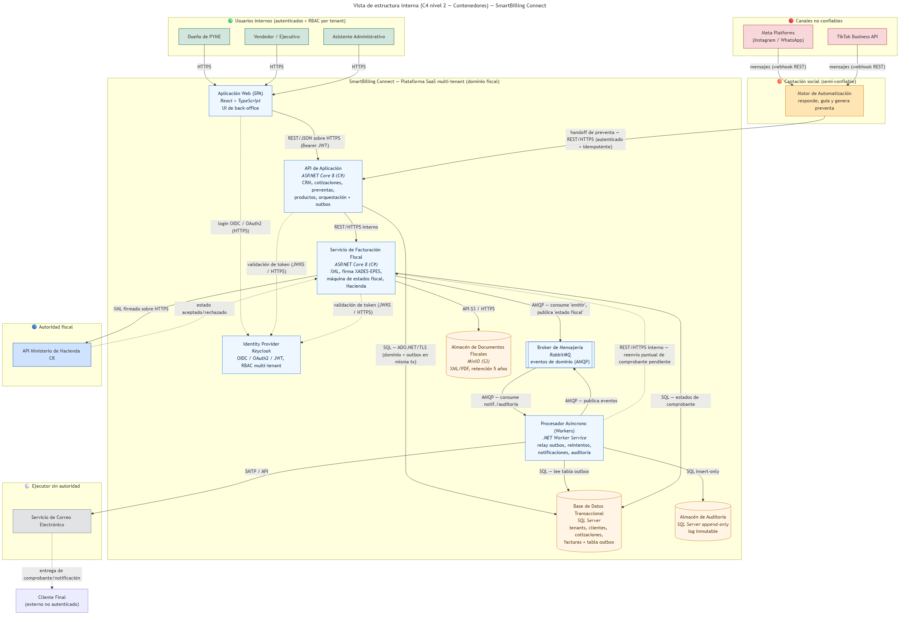
*Figura 4 — Vista de estructura interna (C4 nivel 2 — Contenedores) del sistema SmartBilling Connect. Código fuente en `/diagramas/c4-contenedores.mmd`.*

**Consistencia con la vista de contexto (7.1).** Los mismos actores y sistemas externos de la Figura 2 reaparecen aquí en los bordes, con idéntico nivel de confianza y protocolo: los usuarios internos (🟢) entran por HTTPS; el Motor de Automatización (🟠) entrega la preventa por REST/HTTPS autenticado e idempotente y **no cruza al dominio fiscal**; Meta y TikTok (🔴) solo tocan al motor por webhook REST; la API de Hacienda (🔵) intercambia XML firmado sobre HTTPS y devuelve el estado; el Servicio de Correo (⚪) recibe SMTP/API y entrega al Cliente Final. Lo que la vista de contexto trataba como una caja negra ("SmartBilling Connect") se abre aquí en sus nueve contenedores, sin añadir ni quitar relaciones externas: ninguna dependencia externa nueva aparece y ninguna del contexto desaparece.

#### 7.2.3 Descripción de elementos

| Elemento | Tipo | Responsabilidad | Tecnología | Interfaces expuestas | Dependencias |
|---|---|---|---|---|---|
| **Aplicación Web (SPA)** | Contenedor (frontend) | Interfaz de back-office para usuarios internos: gestión de clientes, cotizaciones, preventas, emisión y monitoreo. No contiene lógica fiscal. | React + TypeScript | UI web sobre HTTPS | API de Aplicación (REST), Identity Provider (login OIDC) |
| **API de Aplicación** | Contenedor (servicio) | Núcleo aplicativo (monolito modular): CRM/clientes, cotizaciones, preventas, productos y orquestación del flujo. Único punto de entrada del handoff de preventa. Escribe dominio + eventos en la tabla *outbox* en la misma transacción. | ASP.NET Core 8 (C#) | REST/JSON `/api/v1` sobre HTTPS (Bearer JWT); endpoint de handoff de preventa | BD Transaccional (SQL, ADO.NET/TLS), Servicio de Facturación Fiscal (REST interno), Identity Provider (validación JWT) |
| **Servicio de Facturación Fiscal** | Contenedor (servicio) | Dominio fiscal aislado: genera el XML, aplica firma XADES-EPES, gestiona la máquina de estados del comprobante y toda la comunicación con Hacienda. Fuente del estado interno `pendiente_validacion_hacienda`. | ASP.NET Core 8 (C#) | REST/HTTPS interno (consumido por la API y por los Workers); consumidor/productor AMQP | BD Transaccional (SQL), Almacén de Documentos (S3), Broker (AMQP), API Hacienda (XML/HTTPS), Identity Provider (JWKS, para validar por su cuenta el JWT de las llamadas internas) |
| **Procesador Asíncrono (Workers)** | Contenedor (servicio background) | Relay del *outbox* a eventos, reintentos con backoff/circuit breaker, envío de notificaciones y escritura del log de auditoría. Garantiza idempotencia por `event_id`. | .NET Worker Service (BackgroundService) | Consumidor AMQP; procesos programados | Broker (AMQP), BD Transaccional (lee outbox), Almacén de Auditoría (insert-only), Servicio de Correo (SMTP/API), Servicio de Facturación Fiscal (REST interno, reenvío puntual de un comprobante pendiente) |
| **Identity Provider** | Contenedor (servicio) | Autenticación y autorización multi-tenant: OIDC/OAuth2, emisión y validación de JWT, RBAC por rol y resolución de `tenant_id`. | Keycloak | OIDC / OAuth2 / JWKS sobre HTTPS | BD propia de Keycloak (interna) |
| **Broker de Mensajería** | Contenedor (infraestructura) | Transporte asíncrono de eventos de dominio; desacopla emisión fiscal, notificación y auditoría del hilo de request. Habilita reintentos y orden. | RabbitMQ | AMQP (colas/exchanges) | — |
| **Base de Datos Transaccional** | Contenedor (almacenamiento) | Persistencia transaccional multi-tenant con aislamiento por `tenant_id`: tenants, clientes, cotizaciones, facturas y tabla *outbox*. | SQL Server | SQL (ADO.NET/TLS) | — |
| **Almacén de Auditoría** | Contenedor (almacenamiento) | Log append-only e inmutable de acciones y transacciones fiscales; nadie lo modifica tras escribir (RF-05 y fila "Registro de auditoría" de la tabla de fuentes de verdad de §1.6). | SQL Server (esquema append-only / insert-only) | SQL insert-only | — |
| **Almacén de Documentos Fiscales** | Contenedor (almacenamiento) | Conservación de XML/PDF de comprobantes con integridad demostrable durante ≥5 años (REST-02). | MinIO (compatible S3) | API S3 sobre HTTPS | — |
| **Motor de Automatización** *(externo)* | Sistema externo | Capa de captación social: responde/guía en redes y entrega preventas. No participa del dominio fiscal (REST-05). | Fuera del sistema | — | API de Aplicación (handoff REST) |
| **API Ministerio de Hacienda CR** *(externo)* | Sistema externo | Autoridad fiscal: valida el comprobante y define su estado aceptado/rechazado. | Fuera del sistema | XML sobre HTTPS | — |
| **Servicio de Correo Electrónico** *(externo)* | Sistema externo | Entrega comprobantes y notificaciones al cliente final; nunca es fuente de verdad del estado fiscal. | Fuera del sistema | SMTP / API | — |

---

#### 7.2.4 Vista de componentes (C4 nivel 3)

> **Qué muestra:** El interior de un contenedor de la vista 7.2, descompuesto en sus componentes principales (agrupaciones de código con una responsabilidad clara), las interfaces que exponen/consumen y la tecnología con que se implementan. Es el puente entre la vista de contenedores (7.2.2) y el diseño detallado de clases (sección 10).

> **Notación — C4 nivel 3 (Component Diagram).** Se abren **dos subsistemas**, elegidos por ser los que concentran los escenarios de calidad más exigentes y las fronteras arquitectónicas del sistema: el **Servicio de Facturación Fiscal** (dominio regulado aislado — ADR-001) y el **Procesador Asíncrono** (materialización del outbox y de la idempotencia — ADR-002). Se eligieron estos dos por encima de la API de Aplicación porque son los que cargan con QS-01, QS-02, QS-04 y QS-06; la API de Aplicación es un monolito modular de responsabilidades más convencionales (CRM, cotizaciones) cuyo detalle relevante —el handoff— ya quedó cubierto en la vista de comportamiento (7.3, Flujos 2 y 4).

##### 7.2.4.1 Componentes del Servicio de Facturación Fiscal

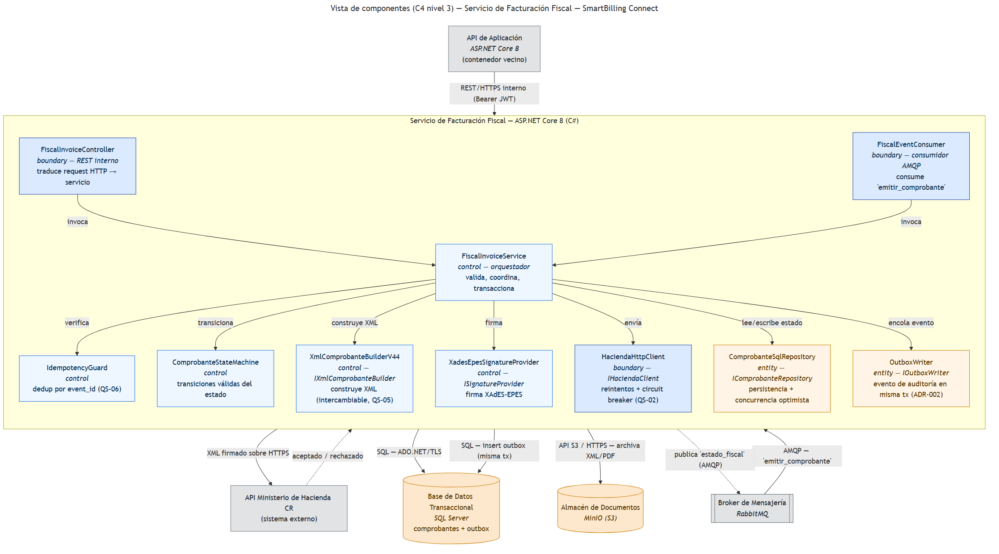
*Figura 5 — Vista de componentes (C4 nivel 3) del Servicio de Facturación Fiscal. Código fuente en `/diagramas/c4-componentes-fiscal.mmd`.*

El servicio expone **dos puntos de entrada** que convergen en el mismo orquestador, de modo que la validación, la idempotencia y la máquina de estados se aplican por igual sin importar por dónde entre la solicitud:

| Componente | Rol (B/C/E) | Responsabilidad | Interfaz |
|---|---|---|---|
| `FiscalInvoiceController` | Boundary | Punto de entrada REST interno consumido por la API de Aplicación; traduce HTTP ↔ dominio. | REST/HTTPS interno |
| `FiscalEventConsumer` | Boundary | Consumidor AMQP del evento `emitir_comprobante` relevado desde el outbox; delega en el mismo servicio que el controller. | AMQP (RabbitMQ) |
| `FiscalInvoiceService` | Control | Orquestador: valida, coordina construcción/firma/envío, transiciona estado y encola auditoría de forma transaccional. | — (núcleo) |
| `ComprobanteStateMachine` | Control | Concentra las transiciones válidas del comprobante; evita lógica de estado dispersa. | — |
| `IdempotencyGuard` | Control | Deduplica por `event_id`: un reintento interno no genera un segundo comprobante (QS-06). | — |
| `IXmlComprobanteBuilder` → `XmlComprobanteBuilderV44` | Control | Construye el XML conforme al esquema vigente; **intercambiable** ante cambios de Hacienda (QS-05). | Interfaz de construcción |
| `ISignatureProvider` → `XadesEpesSignatureProvider` | Control | Aplica la firma XAdES-EPES sobre el XML. | Interfaz de firma |
| `IHaciendaClient` → `HaciendaHttpClient` | Boundary | Cliente hacia Hacienda con **reintentos + circuit breaker** (QS-02). | XML/HTTPS externo |
| `IComprobanteRepository` → `ComprobanteSqlRepository` | Entity | Persistencia del estado del comprobante con **concurrencia optimista**. | SQL (ADO.NET/TLS) |
| `IOutboxWriter` → `OutboxWriter` | Entity | Escribe el evento de auditoría en la tabla outbox dentro de la misma transacción (ADR-002). | SQL (misma tx) |

**Consistencia hacia arriba (7.2) y hacia abajo (10).** Cada dependencia externa del diagrama coincide exactamente con las que la Figura 4 asigna al contenedor "Servicio de Facturación Fiscal" (BD Transaccional, Broker, Almacén de Documentos y API de Hacienda): la vista de componentes no introduce ninguna dependencia que no existiera ya a nivel de contenedor. Hacia abajo, estos mismos componentes son los que la sección 10.1 detalla a nivel de clases y contratos (Figura 14).

##### 7.2.4.2 Componentes del Procesador Asíncrono (Workers)

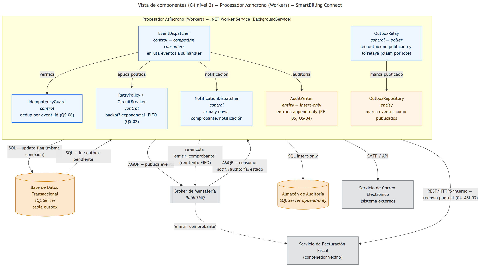
*Figura 6 — Vista de componentes (C4 nivel 3) del Procesador Asíncrono (Workers). Código fuente en `/diagramas/c4-componentes-workers.mmd`.*

Este contenedor tiene dos rutas de trabajo: **relevar** el outbox hacia el broker y **consumir** eventos para notificar y auditar. Ambas comparten la garantía de idempotencia y la política de reintentos.

| Componente | Rol (B/C/E) | Responsabilidad |
|---|---|---|
| `OutboxRelay` | Control | *Poller* que lee el outbox no publicado (claim por lote con bloqueo de fila) y lo relaya al broker. |
| `EventDispatcher` | Control | Enruta cada evento consumido a su handler (competing consumers). |
| `IdempotencyGuard` | Control | Deduplica por `event_id`: exactamente un efecto de negocio por evento (QS-06). |
| `RetryPolicy + CircuitBreaker` | Control | Backoff exponencial y reintento FIFO ante fallos aguas abajo (QS-02). La ruta de reintento por defecto **reencola `emitir_comprobante` en el broker**, desde donde lo consume `FiscalEventConsumer` (§7.2.4.1) — es la que traza la Figura 6 y el Flujo 3 de §7.3. Con el circuito hacia el Servicio Fiscal cerrado, `FiscalRetryEventHandler` puede además reenviar el comprobante pendiente por REST interno (`IFiscalServiceClient`, §10.2.2); ambas rutas convergen en el mismo orquestador fiscal y comparten la deduplicación por `event_id`. |
| `NotificationDispatcher` | Control | Arma y envía el comprobante/notificación al cliente por el Servicio de Correo. |
| `AuditWriter` | Entity | Escribe la entrada append-only e inmutable en el Almacén de Auditoría (RF-05, QS-04). |
| `OutboxRepository` | Entity | Marca los eventos del outbox como publicados tras confirmarse la publicación. |

**Consistencia con 7.2.** Las dependencias del diagrama —lee el outbox de la BD Transaccional, publica/consume en el Broker, escribe en el Almacén de Auditoría, envía por el Servicio de Correo y alcanza al Servicio Fiscal para el reintento de emisión— son exactamente las cinco que la Figura 4 asigna al contenedor "Procesador Asíncrono" (§7.2.3), sin agregados ni omisiones. La quinta merece una precisión, porque el diseño la resuelve por **dos caminos deliberados**: el reintento normal viaja por el broker (arista punteada de la Figura 6) y el reenvío puntual de un comprobante concreto usa el cliente REST interno `IFiscalServiceClient` (§10.2.2, §10.2.3). No son redundantes: el primero preserva el orden FIFO del drenaje masivo tras una caída de Hacienda; el segundo atiende el reenvío individual de CU-ASI-03 sin esperar al ciclo de la cola. El modelo de concurrencia de estos componentes (claim de outbox, competing consumers, concurrencia optimista) se analiza en detalle en la sección 7.5.

---

### 7.3 Vista de comportamiento
*Hito: Avance 2 (S11) — al menos 2 flujos; Entrega final (S14) — flujos completos*

> **Qué muestra:** Cómo fluye la información y el control a través del sistema para los casos de uso más importantes. Complementa la vista estática de la sección 7.2.
>
> **Notación:** Diagramas de secuencia UML. **Esta sección es obligatoria para todos los tipos de sistema.**

Para la Entrega final se documentan **cinco flujos**, cada uno con su camino feliz y al menos un camino de error o excepción. Los dos primeros (introducidos en Avance 2) son los más importantes porque cubren el driver central del dominio (RF-01 — emisión fiscal) y el driver diferenciador del producto (RF-02/RF-06 — captación social con handoff idempotente). Los tres restantes, añadidos en la Entrega final, cierran el comportamiento extremo a extremo: la **recuperación** ante la caída de Hacienda (que en el Flujo 1 solo se dejaba encolada), la **conversión comercial** completa preventa → cotización → factura (que enlaza los Flujos 2 y 1) y la **corrección** de un comprobante rechazado junto con la invariante de inmutabilidad. En conjunto ejercitan todos los contenedores y fronteras de confianza de 7.1 y 7.2.

| # | Flujo | Camino de error cubierto | Escenarios de calidad |
|---|---|---|---|
| 1 | Emisión de factura electrónica | Timeout/5xx de Hacienda → `pendiente_validacion_hacienda` | QS-01, QS-02, QS-04, QS-06 |
| 2 | Handoff de preventa desde el Motor de Automatización | Clave de idempotencia duplicada → 200 sin efecto nuevo | QS-01, QS-03, QS-06 |
| 3 | Recuperación asíncrona tras indisponibilidad de Hacienda | Hacienda sigue caída → circuito abierto, backoff, sin pérdida | QS-02, QS-06 |
| 4 | Conversión de preventa a cotización y factura | Preventa ya convertida (409) / cotización vencida (422) | QS-01, QS-06 |
| 5 | Corrección tras rechazo de Hacienda | Intento de editar un comprobante aceptado → 409 (inmutable) | RF-05, QS-06 |

#### Flujo 1 — Emisión de factura electrónica

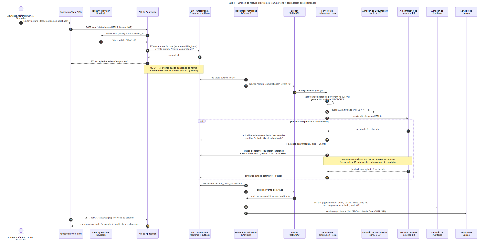
*Figura 7 — Secuencia: emisión de factura electrónica, camino feliz y degradación ante indisponibilidad de Hacienda. Código fuente en `/diagramas/secuencia-emision-factura.mmd`.*

**Descripción:** El flujo inicia cuando un usuario interno (Asistente Administrativo o Vendedor) solicita emitir una factura desde una cotización aprobada. La SPA envía la solicitud a la API de Aplicación con su JWT; la API valida token, rol y `tenant_id` contra el Identity Provider (ningún dato fiscal se toca sin esa validación — QS-01). La decisión de diseño clave ocurre en el paso 5: la factura (estado `emitida_local`) y el evento outbox `emitir_comprobante` se escriben **en la misma transacción**, de modo que el evento de emisión queda persistido de forma durable *antes* de responder 202 al usuario (patrón *outbox*, QS-04); la emisión fiscal nunca bloquea el hilo de request. El Procesador Asíncrono releva el outbox al Broker y el Servicio de Facturación Fiscal —único contenedor que habla con Hacienda— verifica idempotencia por `event_id` (un reintento interno no genera segunda factura — QS-06), genera el XML, aplica la firma XADES-EPES, archiva el documento en el Almacén de Documentos y lo envía a Hacienda. **Manejo de error:** si Hacienda responde timeout o 5xx, el comprobante pasa al estado fiscal legítimo `pendiente_validacion_hacienda` y entra a la cola de reintentos con backoff y circuit breaker; el usuario solo percibe el cambio de estado (≤ 2 s de degradación) y al restaurarse el servicio la cola se procesa en orden FIFO sin intervención manual ni pérdida de documentos (QS-02). En ambas ramas, el resultado termina en el Almacén de Auditoría (entrada append-only con actor, tenant, timestamp, número de comprobante, estado y hash del XML) y el comprobante se entrega al cliente final por el Servicio de Correo, que nunca es fuente de verdad del estado fiscal.

**Escenarios de calidad que este flujo valida:** QS-01 (autorización por tenant en el punto de entrada), QS-02 (degradación y recuperación ante fallo de Hacienda), QS-04 (auditoría persistida en outbox antes de responder, ≤ 80 ms), QS-06 (idempotencia por `event_id` ante reintentos internos de emisión).

---

#### Flujo 2 — Handoff de preventa desde el Motor de Automatización

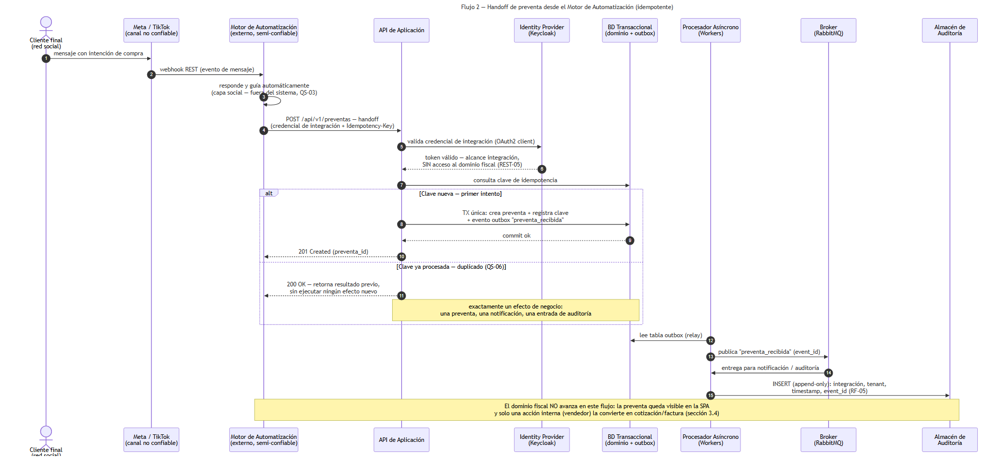
*Figura 8 — Secuencia: handoff idempotente de preventa desde el Motor de Automatización. Código fuente en `/diagramas/secuencia-handoff-preventa.mmd`.*

**Descripción:** El flujo inicia fuera del sistema: un cliente final envía un mensaje con intención de compra por Instagram/WhatsApp o TikTok (canales no confiables), el canal lo entrega por webhook al Motor de Automatización, y este responde y guía al cliente de forma automática dentro de su capa social (QS-03). Cuando detecta intención de compra, el motor ejecuta el **handoff**: un POST al endpoint de preventas de la API de Aplicación, autenticado con credencial de integración propia (OAuth2 client, sin sesión de usuario humano) y acompañado de una `Idempotency-Key`. El Identity Provider emite un token con alcance de integración que **no tiene acceso al dominio fiscal** (REST-05, sección 3.4). La API consulta la clave de idempotencia y decide: si la clave es nueva, crea la preventa, registra la clave y escribe el evento outbox `preventa_recibida` en una única transacción, respondiendo 201; **manejo del caso de error/duplicado:** si la clave ya fue procesada —reejecución de un workflow del motor, reintento por timeout— responde 200 con el resultado previo sin ejecutar ningún efecto nuevo, garantizando exactamente un efecto de negocio por evento (QS-06). El Procesador Asíncrono releva el outbox, publica el evento y escribe la entrada de auditoría append-only con la identidad de la integración (RF-05). El dominio fiscal no avanza en ningún punto de este flujo: la preventa queda visible en la SPA y solo una acción interna de un vendedor la convierte en cotización o factura, lo que garantiza que un fallo del motor no tenga impacto fiscal.

**Escenarios de calidad que este flujo valida:** QS-06 (deduplicación por clave de idempotencia con exactamente un efecto de negocio), QS-03 (la capa social responde fuera del camino crítico del sistema; el handoff es asíncrono respecto de la conversación), QS-01 (credencial de integración autenticada y acotada por alcance), además de los drivers RF-05 (auditoría del actor no humano) y REST-05 (el motor no participa del dominio fiscal).

---

#### Flujo 3 — Recuperación asíncrona tras indisponibilidad de Hacienda

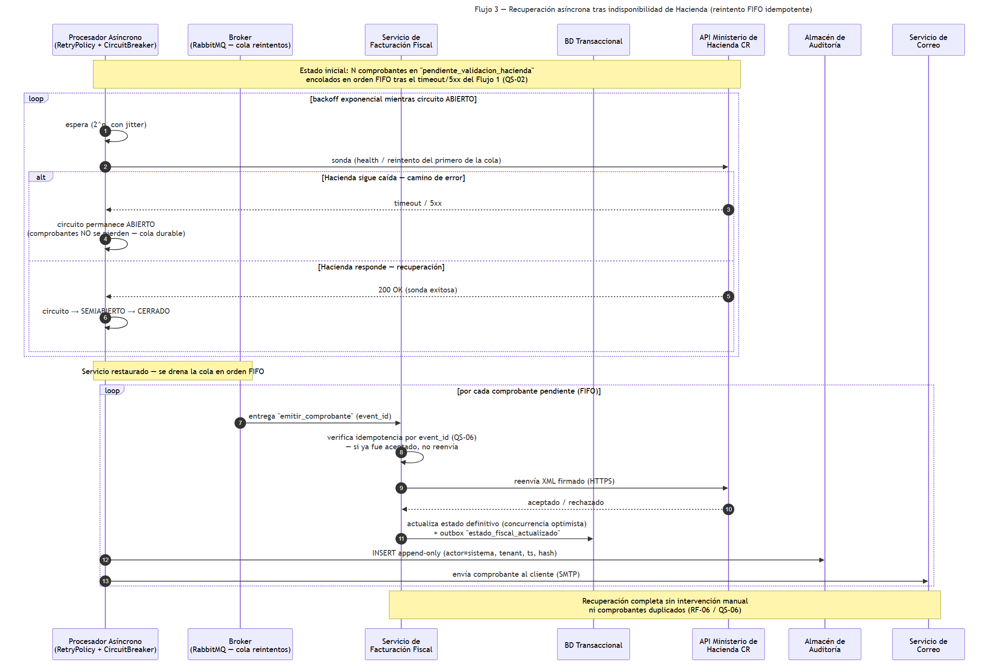
*Figura 9 — Secuencia: recuperación asíncrona y reintento FIFO idempotente tras la restauración de Hacienda, con el camino de error de indisponibilidad sostenida. Código fuente en `/diagramas/secuencia-recuperacion-hacienda.mmd`.*

**Descripción:** Este flujo completa el camino de error que el Flujo 1 dejaba abierto. El punto de partida es un conjunto de comprobantes en estado `pendiente_validacion_hacienda`, encolados en orden FIFO tras el timeout o 5xx de Hacienda. El Procesador Asíncrono mantiene un **circuit breaker**: mientras el circuito está abierto no golpea a Hacienda de forma continua, sino que espera con **backoff exponencial y jitter** y lanza sondas espaciadas. **Camino de error (indisponibilidad sostenida):** si la sonda vuelve a fallar, el circuito permanece abierto y los comprobantes **no se pierden** —la cola es durable—, simplemente se difiere el siguiente intento. **Camino de recuperación:** cuando una sonda tiene éxito, el circuito pasa a semiabierto y luego a cerrado, y se drena la cola en orden FIFO. Por cada comprobante, el Servicio Fiscal verifica idempotencia por `event_id` (si ya había sido aceptado en un intento previo no lo reenvía — QS-06), reenvía el XML firmado, actualiza el estado definitivo con concurrencia optimista y encola la auditoría; finalmente el Worker escribe la entrada append-only y notifica al cliente. Todo el proceso ocurre **sin intervención manual y sin comprobantes duplicados**.

**Escenarios de calidad que este flujo valida:** QS-02 (recuperación automática tras la restauración del servicio de Hacienda, sin pérdida de documentos) y QS-06 (idempotencia de los reintentos: exactamente un comprobante por evento aun tras múltiples reenvíos).

---

#### Flujo 4 — Conversión de preventa a cotización y factura

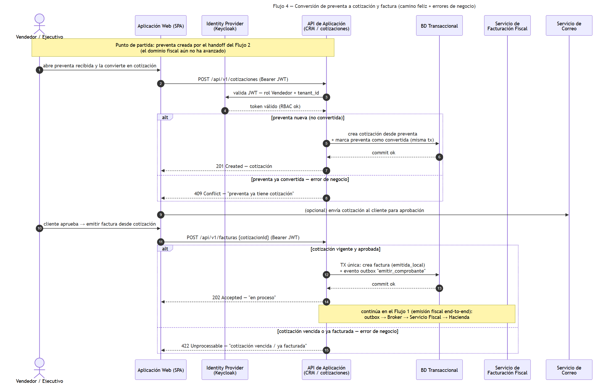
*Figura 10 — Secuencia: conversión comercial de preventa → cotización → factura, con caminos de error de negocio (preventa ya convertida, cotización vencida). Código fuente en `/diagramas/secuencia-preventa-a-factura.mmd`.*

**Descripción:** Este flujo enlaza el diferenciador del producto (Flujo 2) con el núcleo del dominio (Flujo 1), mostrando cómo una preventa recibida por handoff se transforma en una factura fiscal **solo por acción interna** de un usuario autorizado —nunca por el Motor de Automatización (REST-05)—. El Vendedor abre la preventa y solicita convertirla en cotización; la API valida rol y `tenant_id` contra el Identity Provider y, **en una única transacción**, crea la cotización y marca la preventa como convertida. **Camino de error 1 (preventa ya convertida):** si la preventa ya tiene cotización —doble clic, reintento— la API responde `409 Conflict` sin crear un duplicado. Tras la aprobación del cliente, el Vendedor emite la factura desde la cotización: si está vigente, la API crea la factura (`emitida_local`) y el evento outbox `emitir_comprobante`, respondiendo `202` y **entregando el control al Flujo 1** para la emisión fiscal end-to-end. **Camino de error 2 (cotización inválida):** si la cotización está vencida o ya fue facturada, responde `422 Unprocessable Entity`. Así, la frontera entre lo comercial (reversible, editable) y lo fiscal (regulado, con consecuencia legal) queda explícita en el flujo.

**Escenarios de calidad que este flujo valida:** QS-01 (autorización por rol y tenant en cada transición de estado comercial) y QS-06 (la conversión de una preventa produce exactamente una cotización aunque la acción se reintente).

---

#### Flujo 5 — Corrección tras rechazo de Hacienda e invariante de inmutabilidad

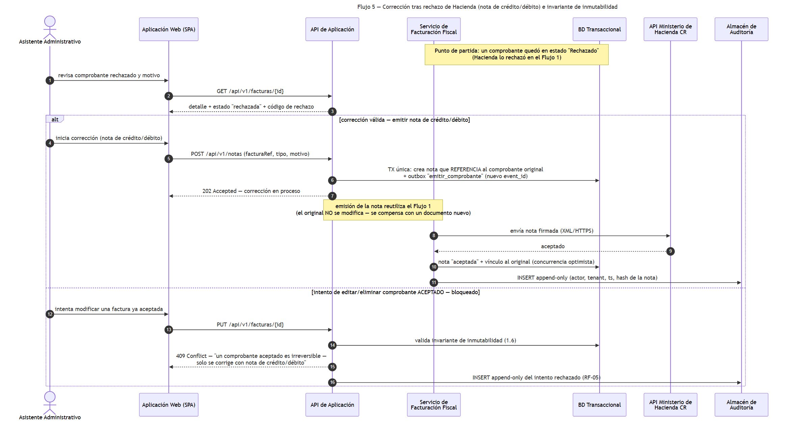
*Figura 11 — Secuencia: corrección mediante nota de crédito/débito tras un rechazo de Hacienda, y bloqueo del intento de modificar un comprobante aceptado. Código fuente en `/diagramas/secuencia-correccion-rechazo.mmd`.*

**Descripción:** Este flujo cierra el ciclo de vida del comprobante (ver la máquina de estados de la Figura 1) para el caso de rechazo. El Asistente Administrativo revisa un comprobante en estado `Rechazado` y su código de motivo. **Camino de corrección válido:** inicia una corrección que **no modifica el documento original** —irreversible por diseño— sino que emite una **nota de crédito/débito** que lo referencia; esta nota se crea con su propio `event_id` en una transacción con outbox y reutiliza el Flujo 1 para su emisión y validación ante Hacienda. **Camino de error (invariante de inmutabilidad):** si un usuario intenta editar o eliminar una factura ya `Aceptada`, la API valida la invariante de la sección 1.6 y responde `409 Conflict` explicando que un comprobante aceptado es irreversible y solo se corrige con una nota; además, **el intento rechazado también se audita** (append-only, RF-05), de modo que queda trazado incluso lo que no se permitió ejecutar.

**Escenarios de calidad que este flujo valida:** RF-05 (auditoría de acciones, incluidos los intentos bloqueados) y QS-06 (la nota de corrección se emite exactamente una vez por evento), apoyándose en la invariante de inmutabilidad del comprobante aceptado (sección 1.6).

---

### 7.4 Vista de despliegue
*Hito: Entrega final (S14)*

> **Qué muestra:** Dónde y cómo se despliega el sistema físicamente — servidores, contenedores Docker, servicios cloud, dispositivos edge, bases de datos, balanceadores, etc.
>
> **Notación:** C4 Deployment Diagram o diagrama de despliegue UML. Obligatorio si el sistema tiene componentes distribuidos en múltiples nodos. Opcional pero recomendado para sistemas monolíticos desplegados en cloud.

#### 7.4.1 Estrategia de despliegue y su justificación

La topología se elige en coherencia con el estilo arquitectónico (sección 8: *service-based* con núcleo de monolito modular) y, sobre todo, con la restricción **REST-06** (equipo de 3 personas, presupuesto limitado). Por eso el sistema se despliega como **contenedores Docker orquestados con Docker Compose sobre dos VMs cloud** (una de aplicación y una de datos), y **no** sobre Kubernetes ni sobre un stack de PaaS gestionado: Kubernetes excede la capacidad operativa del equipo (mismo argumento que descarta microservicios en la sección 8.2) y el PaaS gestionado introduce costo recurrente que el presupuesto no soporta. Docker Compose es la representación más honesta porque los "contenedores" de la vista 7.2 (que en C4 son unidades lógicas) se materializan aquí como contenedores Docker reales, uno por unidad desplegable, con un mapeo casi 1:1.

La separación en **dos nodos** no es cosmética: aísla el plano de cómputo (servicios sin estado, reiniciables y escalables verticalmente) del plano de datos (con estado y volúmenes persistentes), de modo que un reinicio o redeploy de la VM de Aplicación no arriesga la integridad de la BD transaccional, la auditoría append-only ni los documentos fiscales que deben conservarse ≥ 5 años (REST-02).

#### 7.4.2 Diagrama


*Figura 12 — Vista de despliegue (VM cloud + Docker Compose) del sistema SmartBilling Connect. Código fuente en `/diagramas/despliegue.mmd`.*

#### 7.4.3 Descripción de nodos

| Nodo | Descripción | Artefactos desplegados | Conectividad |
|---|---|---|---|
| **VM de Aplicación** | VM Linux (≈2 vCPU / 4 GB) con Docker Engine. Aloja los servicios sin estado y la puerta de entrada. Escala verticalmente; los servicios pueden replicarse con más réplicas de contenedor. | `nginx` (reverse proxy + terminación TLS), SPA (build estático servido por nginx), API de Aplicación (ASP.NET Core 8), Servicio de Facturación Fiscal (ASP.NET Core 8), Procesador Asíncrono (.NET Worker Service), Keycloak, RabbitMQ (con volumen durable) | Entrante: HTTPS/443 desde navegadores y desde el Motor de Automatización (handoff). Interno: HTTP a SPA/API, OIDC/JWKS a Keycloak, AMQP/5672 a RabbitMQ. Hacia VM de Datos: TDS/1433 (TLS) y S3/9000 (HTTPS). Saliente: HTTPS/443 a Hacienda, SMTP/587 al correo. |
| **VM de Datos** | VM Linux (≈2 vCPU / 8 GB) con Docker Engine y **volúmenes persistentes**. Aloja todo el estado del sistema. Se respalda de forma independiente. | SQL Server (Express/Developer) con la BD transaccional, el esquema de auditoría append-only y la BD interna de Keycloak; MinIO (almacén compatible S3, retención ≥ 5 años) | Entrante: TDS/1433 (TLS) desde API, Servicio Fiscal, Workers y Keycloak; API S3/9000 (HTTPS) desde el Servicio Fiscal. Sin exposición a Internet: solo accesible desde la VM de Aplicación (red privada). |
| **Dispositivos de usuario** *(fuera del sistema)* | Navegadores de los usuarios internos (Dueño de PYME, Vendedor, Asistente). | SPA cargada en el navegador | HTTPS/443 hacia el `nginx` de la VM de Aplicación. |
| **API Ministerio de Hacienda CR** *(externo)* | Autoridad fiscal. | — | Recibe XML firmado sobre HTTPS/443 desde el Servicio Fiscal. |
| **Motor de Automatización (+ Meta/TikTok)** *(externo)* | Capa de captación social. | — | HTTPS/443 hacia la API (handoff de preventa, autenticado e idempotente). |
| **Servicio de Correo (SMTP)** *(externo)* | Entrega de comprobantes y notificaciones. | — | SMTP/587 (TLS) desde el Procesador Asíncrono. |

**Consideraciones de despliegue relacionadas con los drivers.** (a) *Seguridad (QA-01):* solo la VM de Aplicación tiene interfaz pública; la VM de Datos vive en red privada y nunca se expone a Internet, y todo tráfico externo pasa por la terminación TLS de nginx. (b) *Disponibilidad (QA-02):* RabbitMQ usa un volumen durable para que los eventos encolados sobrevivan a un reinicio del contenedor (medida de QS-02), y el plano de datos, al estar aislado, no se ve afectado por redeploys del plano de cómputo. (c) *Costo (REST-06):* todo el stack corre sobre software gratuito/OSS y dos VMs modestas, sin servicios gestionados de pago. (d) *Evolución:* si en el futuro un servicio (p. ej. el Servicio Fiscal) necesitara escalar de forma independiente, este esquema permite moverlo a su propia VM o a más réplicas sin rediseñar la arquitectura lógica —los contenedores ya están aislados y se comunican por protocolos explícitos—.

---

### 7.5 Vista de concurrencia *(sección opcional)*
*Hito: Entrega final (S14) — obligatoria si el sistema maneja concurrencia*

> **Cuándo incluirla:** Si tu sistema tiene múltiples procesos o hilos ejecutándose simultáneamente, maneja eventos asincrónicos, tiene condiciones de carrera posibles, o requiere sincronización entre componentes. Si el sistema es completamente secuencial y single-threaded, omití esta sección y justificá por qué no aplica.
>
> **Notación:** Diagrama de estado UML o diagrama de actividad UML con swimlanes.

**¿Aplica esta sección? Sí.** SmartBilling Connect es un sistema concurrente por diseño: el Procesador Asíncrono corre como uno o más workers (`BackgroundService`) que compiten por procesar el outbox y los eventos del broker en paralelo con los hilos de request de la API; varios usuarios de un mismo tenant pueden operar simultáneamente sobre los mismos comprobantes; y el sistema recibe eventos externos potencialmente duplicados (RF-06). Existen, por tanto, recursos compartidos (tabla outbox, filas de `Comprobante`, colas del broker) y posibles condiciones de carrera. Omitir esta sección sería deshonesto; el modelo de concurrencia es precisamente lo que hace correctos a los patrones outbox e idempotencia.

#### 7.5.1 Diagrama del modelo de concurrencia

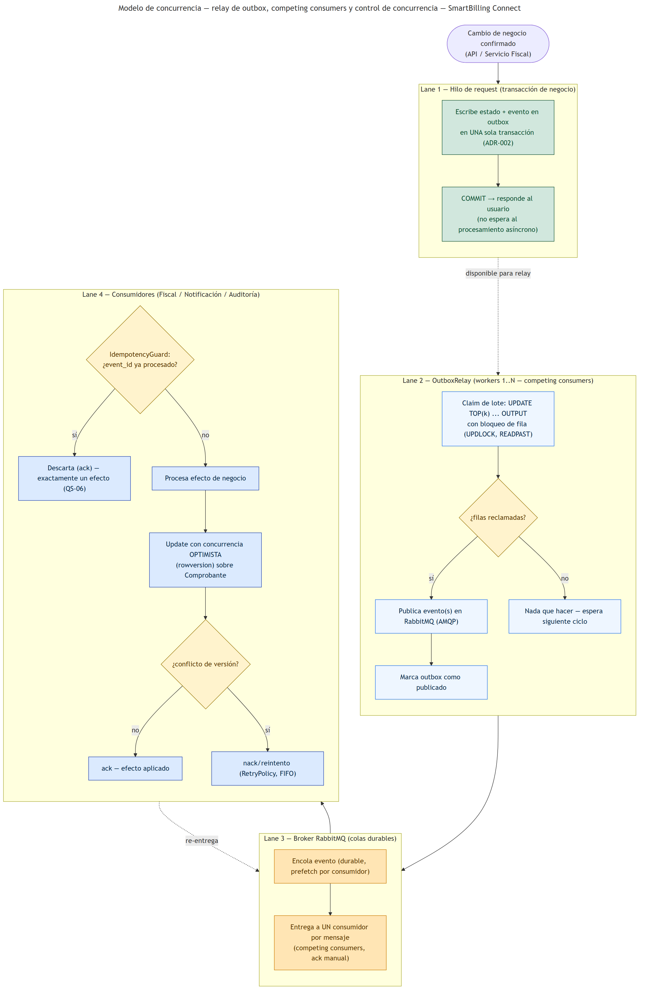
*Figura 13 — Modelo de concurrencia: relay de outbox, competing consumers y control de concurrencia (actividad con swimlanes). Código fuente en `/diagramas/concurrencia-outbox.mmd`. La máquina de estados del comprobante que estos procesos hacen avanzar está en la Figura 1.*

#### 7.5.2 Procesos, recursos compartidos y sincronización

| Aspecto | Cómo se resuelve | Driver / escenario |
|---|---|---|
| **Hilos/procesos concurrentes** | Hilos de request de la API y del Servicio Fiscal + N workers del Procesador Asíncrono (competing consumers) + consumidores del broker. Cada unidad es sin estado; el estado vive en la BD y el broker. | QA-04, REST-06 |
| **Publicación fiable de eventos** | Patrón *Transactional Outbox* (ADR-002): el cambio de negocio y el evento se escriben en **una sola transacción**; ningún evento se publica si la transacción no commitea, y ninguno se pierde si el proceso cae tras el commit. | QS-04, QS-02 |
| **Relay concurrente del outbox** | Los workers reclaman filas por lote con **bloqueo de fila** (`UPDATE TOP(k) … WITH (UPDLOCK, READPAST)`): dos workers nunca toman la misma fila y un worker no espera por filas ya reclamadas por otro (sin contención ni doble publicación). | QS-06 |
| **Entrega a consumidores** | RabbitMQ con **colas durables** y *competing consumers* con *ack* manual y *prefetch*: cada mensaje lo procesa exactamente un consumidor; si este falla antes del *ack*, el mensaje se re-entrega. | QS-02, QS-06 |
| **Idempotencia de efectos** | `IdempotencyGuard` deduplica por `event_id` / `Idempotency-Key` antes de aplicar cualquier efecto de negocio: reentregas y duplicados producen **exactamente un** comprobante, notificación o entrada de auditoría. | QS-06, RF-06 |
| **Actualización concurrente de comprobantes** | **Concurrencia optimista** (columna `rowversion`) sobre `Comprobante`: si dos flujos intentan transicionar el mismo comprobante, el segundo detecta el conflicto de versión y reintenta sobre el estado fresco, evitando transiciones inconsistentes. | QS-01, integridad fiscal |
| **Orden y reintentos ante fallos** | `RetryPolicy + CircuitBreaker` con backoff exponencial y reproceso **FIFO**; ante fallo aguas abajo se hace *nack*/re-encola sin romper el orden ni perder el mensaje. | QS-02 |
| **Prevención de deadlocks** | Las transacciones son cortas y de alcance mínimo (escribir dominio + outbox y commitear); el trabajo lento (Hacienda, correo, S3) ocurre **fuera** de la transacción, en los consumidores. Al no anidar transacciones largas ni tomar múltiples bloqueos en distinto orden, no hay ciclos de espera. | QA-04 |

**Cómo se evitan las condiciones de carrera clave.** (1) *Doble emisión:* aunque dos workers relayen o dos eventos duplicados lleguen, la deduplicación por `event_id` más la máquina de estados garantizan un solo comprobante (QS-06). (2) *Doble toma de outbox:* el bloqueo de fila con `READPAST` reparte el trabajo sin solapamiento. (3) *Transición de estado inconsistente:* la concurrencia optimista con `rowversion` hace que solo una transición gane y la otra reintente. Este modelo satisface QS-02 (recuperación sin pérdida), QS-04 (auditoría sin penalizar el camino crítico) y QS-06 (exactamente un efecto por evento).

---

### 7.6 Evolución del diseño entre avances

> Esta subsección documenta cómo evolucionaron las vistas arquitectónicas entre los tres hitos (Propuesta S03 → Avance 1 S07 → Avance 2 S11 → Entrega final S14), qué se mantuvo estable y por qué, y qué se agregó en cada paso. Complementa el *Historial de versiones* del encabezado con el detalle de las decisiones de diseño.

#### 7.6.1 Trazabilidad de vistas por hito

| Vista | Propuesta (0.1) | Avance 1 (0.2) | Avance 2 (0.3) | Entrega final (1.0) |
|---|---|---|---|---|
| 7.1 Contexto | Idea inicial del sistema | **Creada** (C4 nivel 1 + fronteras de confianza) | Sin cambios estructurales | Refinada: explícito que Meta/TikTok solo llegan vía el Motor |
| 7.2 Contenedores | — | — | **Creada** (C4 nivel 2, 9 contenedores + stack) | Consolidada su consistencia con contexto y componentes |
| 7.2.4 Componentes | — | — | — | **Creada** (C4 nivel 3: Servicio Fiscal y Procesador Asíncrono) |
| 7.3 Comportamiento | — | — | **Creada** (2 flujos: emisión y handoff) | Completada a **5 flujos** con caminos de error |
| 7.4 Despliegue | — | — | — | **Creada** (VM cloud + Docker Compose, 2 nodos) |
| 7.5 Concurrencia | — | — | — | **Creada** (outbox, competing consumers, concurrencia optimista) |

#### 7.6.2 Decisiones que cambiaron o se refinaron

| Cambio | De → A | Motivación |
|---|---|---|
| Frontera del Motor de Automatización | Implícita (Avance 1) → explícita y repetida en todas las vistas (7.1, 7.2, 7.3, ciclo de vida) | Evitar que se leyera al Motor como participante fiscal; endurece REST-05 y la frontera de la sección 3.4. |
| Aislamiento del dominio fiscal | Módulo dentro del sistema (Propuesta) → **contenedor propio** (Avance 2, ADR-001) → **componentes detallados** (Entrega final, 7.2.4) | Convertir una convención en una barrera arquitectónica verificable (QA-01, QS-05). |
| Comunicación entre partes | Llamadas directas (implícito) → **outbox + broker asíncrono** (Avance 2, ADR-002) → **modelo de concurrencia formalizado** (Entrega final, 7.5) | Resolver la tensión seguridad/rendimiento (QS-01/QS-04) y la idempotencia (RF-06/QS-06) sin bloquear el request. |
| Comportamiento cubierto | 2 flujos felices + degradación (Avance 2) → **5 flujos con recuperación, conversión y corrección** (Entrega final) | Cubrir el camino de error extremo a extremo, no solo dejarlo encolado. |
| Despliegue | No definido → **Docker Compose sobre 2 VMs** (Entrega final) | Coherencia con REST-06: la opción operable por 3 personas, descartando K8s y PaaS de pago. |

#### 7.6.3 Qué se mantuvo estable (y por qué es una buena señal)

Lo más importante de la evolución es lo que **no** cambió: los actores y sistemas externos de la vista de contexto (7.1) son los mismos desde Avance 1, y los nueve contenedores de Avance 2 se conservan sin altas ni bajas en la Entrega final. Las vistas nuevas (componentes, despliegue, concurrencia) **descomponen** lo ya definido en lugar de contradecirlo: cada dependencia de la vista de componentes existe ya a nivel de contenedor, y cada nodo de despliegue aloja exactamente los contenedores de 7.2. Esa estabilidad —agregar detalle sin reabrir decisiones— es evidencia de que los drivers de la sección 3 fueron suficientes para fijar la arquitectura temprano, en línea con los principios KISS/YAGNI de la sección 6.

---

# BLOQUE 4 — DECISIONES ARQUITECTÓNICAS
*Hito: Avance 2 (S11)*

---

## 8. Estilo arquitectónico

> El estilo arquitectónico de SmartBilling Connect responde a una tensión central identificada en los drivers de la sección 3: el sistema exige fronteras fuertes entre el dominio comercial, el dominio fiscal (con consecuencia legal directa), el procesamiento asíncrono y la identidad/acceso (RF-01 a RF-06, QA-05), e interoperabilidad con al menos tres ecosistemas externos (Hacienda, los canales sociales vía el motor de automatización y el servicio de correo) — pero debe ser construido y operado por un equipo de 3 personas con presupuesto limitado (REST-06). La selección del estilo prioriza satisfacer los atributos de calidad QA-01 a QA-05 dentro de esas restricciones, y se evalúa contra dos alternativas que fueron descartadas con sus respectivos trade-offs. El estilo adoptado es el que materializa la vista de contenedores de la sección 7.2.

### 8.1 Estilo(s) adoptado(s)

| Estilo | Aplicación en el sistema | Justificación |
|---|---|---|
| Arquitectura basada en servicios (*service-based*) con núcleo de monolito modular | Estructura general del sistema, materializada en la vista de contenedores (sección 7.2). El dominio comercial completo (CRM, cotizaciones, preventas, productos y orquestación del flujo) se concentra en la **API de Aplicación**, un monolito modular con módulos de fronteras explícitas. Solo se separan como unidades desplegables propias los servicios que un driver justifica: el **Servicio de Facturación Fiscal** (aislamiento del dominio regulado — ADR-001, REST-05, QS-05), el **Procesador Asíncrono** (desacople del camino crítico — ADR-002) y el **Identity Provider** (Keycloak — RF-04, REST-03). Es el punto medio entre monolito y microservicios: pocos servicios de grano grueso, una única base de datos transaccional compartida (con tabla outbox) y sin proliferación de infraestructura distribuida. | Responde a la tensión entre subsistemas desacoplados (RF-01 a RF-05, QA-05) y equipo reducido (REST-06). Un monolito puro no fuerza la frontera fiscal que exigen REST-05 y QS-05 — quedaría como convención, no como barrera arquitectónica (ver alternativas de ADR-001) —, mientras que microservicios completos exceden la capacidad operativa del equipo (sección 8.2). Con cuatro servicios de grano grueso, el pipeline CI/CD y el monitoreo siguen siendo operables por 3 personas, y el dominio fiscal puede endurecerse (QA-01) y desplegarse (QS-05) de forma independiente del resto. |
| Comunicación basada en eventos con broker y outbox transaccional (complementario) | Comunicación asíncrona entre contenedores: la API de Aplicación y el Servicio de Facturación Fiscal escriben los eventos de dominio en la tabla *outbox* dentro de la misma transacción que el cambio de estado; el Procesador Asíncrono los releva a RabbitMQ y desde ahí se procesan la emisión fiscal, las notificaciones y el log de auditoría, con reintentos, orden garantizado y deduplicación por `event_id` (ADR-002). | Responde a QA-02 (Disponibilidad) y QA-04 (Rendimiento): un fallo o lentitud de Hacienda no bloquea el hilo de request (QS-02), y la auditoría obligatoria no penaliza el camino crítico — solo la escritura en outbox, ≤ 80 ms (QS-01, QS-04). El broker durable garantiza que ningún evento encolado se pierda ante reinicios (medida de QS-02) y habilita la idempotencia de RF-06/QS-06. |

### 8.2 Alternativas consideradas y rechazadas

| Alternativa | Por qué se consideró | Por qué se rechazó |
|---|---|---|
| Microservicios (descomposición fina) | SmartBilling Connect tiene subsistemas con fronteras claras (dominio comercial, facturación fiscal, identidad, auditoría, notificaciones). Cada uno podría desplegarse como servicio independiente con su propia base de datos, permitiendo escalamiento y despliegue totalmente independientes. | Complejidad operacional vs. equipo (REST-06): descomponer en 8-10 servicios finos con base de datos por servicio exigiría API gateway, service discovery, distributed tracing y orquestación de contenedores (Kubernetes), inoperable para 3 personas y por encima del presupuesto. Consistencia de datos fiscales (QA-01, REST-01): la emisión exige que la factura y su evento de auditoría se confirmen en una única transacción local (ADR-002); con los datos repartidos entre servicios eso obligaría a sagas o two-phase commit. Escala prematura: los volúmenes iniciales (cientos de facturas/día) no justifican la distribución fina. El estilo adoptado ya captura el beneficio clave — aislar el dominio fiscal — sin ese costo. |
| Monolito en capas (N-Tier) desplegado como unidad única | Es el patrón más conocido, simple de implementar y con baja curva de aprendizaje. Consistente con KISS y la restricción de equipo (REST-06): un solo artefacto, un pipeline, un proceso a monitorear. | Sin frontera física del dominio fiscal: la frontera de REST-05 y el despliegue independiente del módulo fiscal que exige QS-05 (≤ 10 días hábiles, cero subsistemas ajenos modificados) quedarían como convención de código, no como algo forzado por el diseño (ADR-001). Sin fronteras de dominio (QA-05): en capas horizontales, la lógica fiscal y la comercial coexisten en la misma capa de negocio sin separación. Solo comunicación síncrona: el procesamiento asíncrono con outbox, broker y workers que exigen QS-02 y QS-04 no tiene un lugar natural en un modelo request/response en capas. |

### 8.3 Análisis de trade-offs del estilo elegido

> Todo estilo arquitectónico tiene compromisos. Los siguientes trade-offs son específicos de SmartBilling Connect y su contexto de drivers.

| Trade-off | Qué se gana | Qué se sacrifica | Escenario afectado |
|---|---|---|---|
| Pocos servicios de grano grueso vs. escalamiento fino por módulo | Cuatro unidades de ejecución operables por 3 personas (REST-06): pipeline CI/CD y monitoreo acotados. El Servicio de Facturación Fiscal y los Workers escalan y se despliegan de forma independiente del núcleo (QS-05). | Dentro de la API de Aplicación, CRM, cotizaciones y preventas escalan juntos: un pico de preventas obliga a replicar el núcleo completo, no solo ese módulo. | QA-02 (Disponibilidad) y QA-04 (Rendimiento) — se mitiga con réplicas del núcleo detrás de un balanceador; los picos de mensajería social los absorbe el motor de automatización (externo) y el handoff llega ya filtrado como preventas. |
| Consistencia transaccional local vs. visibilidad inmediata en el log final | La factura y su evento de auditoría/outbox se confirman en una única transacción de BD: nunca existe un comprobante sin su evento durable (RF-05, QS-04), sin la complejidad de sagas. | El log append-only final es eventualmente consistente: existe una ventana de segundos entre el commit transaccional y la entrada visible en el Almacén de Auditoría. | QS-04 (Trazabilidad) tensiona con QA-04 (Rendimiento) — resuelto con el outbox (ADR-002); la ventana queda trazada con los timestamps de encolado y de confirmación, por lo que no se confunde con falta de auditoría. |
| Fronteras lógicas dentro del núcleo vs. fronteras físicas | Los módulos del núcleo (API de Aplicación) comparten proceso y transacciones locales: sin overhead de serialización ni latencia de red entre CRM, cotizaciones y preventas. | Las fronteras entre módulos del núcleo son convenciones de equipo, no barreras del compilador ni de la red. Un desarrollador puede acceder directamente a tablas de otro módulo, violando el encapsulamiento. | QA-05 (Modificabilidad) — se mitiga con revisión de código, tests de dependencias entre módulos y convenciones de estructura de carpetas. El módulo de mayor riesgo — el fiscal — ya está extraído como servicio propio (ADR-001), donde la frontera sí es física. |
| Broker externo (RabbitMQ) vs. bus de eventos in-process | Eventos durables ante caídas y reinicios, reintentos con backoff, dead-letter queues y visibilidad operativa de las colas. Sin esto, la medida de QS-02 ("ningún documento encolado se pierde ante reinicios") no es demostrable. | Una pieza más de infraestructura que instalar, monitorear y actualizar (tensión con REST-06), y latencia adicional frente a eventos en memoria. | QS-02 (Disponibilidad) y QS-06 (Idempotencia) se favorecen sobre la simplicidad operativa — se mitiga porque RabbitMQ es open-source (REST-06) y se opera como un único contenedor con configuración estándar. |
---

## 9. Registro de decisiones — ADRs

---

### ADR-001 — Aislamiento del dominio fiscal en un servicio dedicado (Servicio de Facturación Fiscal)

> Documento completo: [`/decisiones/ADR-001-aislamiento-dominio-fiscal.md`](../decisiones/ADR-001-aislamiento-dominio-fiscal.md)

| Campo | Detalle |
|---|---|
| **Estado** | Aceptada |
| **Fecha** | 2026-07-04 |
| **Autores** | Edgar Jacob, Brandon Garita, Alejandro Mora |
| **Drivers / escenarios que responde** | REST-05, QA-01, RF-01, QS-05 |
| **Decisión** | Extraer todo el dominio fiscal —construcción del XML, firma XADES-EPES, máquina de estados del comprobante y comunicación con Hacienda— a un contenedor desplegable propio, alcanzable únicamente desde dentro del sistema. |
| **Alternativas rechazadas** | Lógica fiscal dentro del monolito de la API (la frontera de REST-05 quedaría como convención, no como barrera); el motor de automatización llamando directo al servicio fiscal (contradice REST-05 de frente); un microservicio por tipo de comprobante (desproporcionado frente a REST-06). |
| **Consecuencia principal** | *Gana:* despliegue y endurecimiento independientes del módulo fiscal —lo que habilita la medida de QS-05— y superficie de ataque reducida. *Cuesta:* un salto de red más dentro del presupuesto de latencia, un servicio adicional que versionar y monitorear, y autenticación entre servicios internos. |
| **Revisión requerida si** | El volumen obliga a escalar cada tipo de comprobante por separado, o Hacienda pasa a exigir validación síncrona en tiempo real (lo que eliminaría el estado `PendienteValidacionHacienda`). |

---

### ADR-002 — Patrón Transactional Outbox con procesamiento asíncrono para auditoría e idempotencia

> Documento completo: [`/decisiones/ADR-002-outbox-transaccional-asincrono.md`](../decisiones/ADR-002-outbox-transaccional-asincrono.md)

| Campo | Detalle |
|---|---|
| **Estado** | Aceptada |
| **Fecha** | 2026-07-04 |
| **Autores** | Edgar Jacob, Brandon Garita, Alejandro Mora |
| **Drivers / escenarios que responde** | RF-05, RF-06, QS-01, QS-03, QS-04, QS-06 |
| **Decisión** | Escribir cada evento de dominio en una tabla *outbox* dentro de la misma transacción que el cambio de estado, y relevarlo después a RabbitMQ desde el Procesador Asíncrono, con reintentos, orden y deduplicación por `event_id`. Lo único que espera el camino crítico es la escritura en el outbox. |
| **Alternativas rechazadas** | Auditoría síncrona dentro del request (la latencia se dispara bajo la carga de QS-03); publicación directa al broker sin outbox (el evento se pierde si la publicación falla tras el commit, rompiendo RF-05); Change Data Capture (infraestructura y conocimiento que REST-06 no soporta, y acopla el contrato de eventos al esquema físico). |
| **Consecuencia principal** | *Gana:* nunca existe un dato de negocio sin su evento durable, y la auditoría sale del camino crítico (≤ 80 ms). *Cuesta:* el log de auditoría final es eventualmente consistente, y hay tres piezas más que vigilar (outbox, broker, workers) más el costo de programar y probar la deduplicación. |
| **Revisión requerida si** | Un regulador exige evidencia de auditoría en tiempo real dentro de la misma transacción, o el volumen de eventos supera lo que una tabla outbox relacional sostiene con buen rendimiento. |

---

### ADR-003 — Aislamiento multi-tenant mediante `tenant_id` centralizado en la capa de autorización

> Documento completo: [`/decisiones/ADR-003-estrategia-multi-tenancy.md`](../decisiones/ADR-003-estrategia-multi-tenancy.md)

| Campo | Detalle |
|---|---|
| **Estado** | Aceptada |
| **Fecha** | 2026-07-04 |
| **Autores** | Edgar Jacob, Brandon Garita, Alejandro Mora |
| **Drivers / escenarios que responde** | REST-03, REST-06, QS-01, QA-01 |
| **Decisión** | Una sola base de datos compartida con columna `tenant_id` en todas las tablas transaccionales y fiscales, y resolución **centralizada** de ese `tenant_id` en la capa de autorización (claim del JWT emitido por Keycloak, propagado como `ITenantContext`), en lugar de confiar en que cada repositorio lo filtre por su cuenta. |
| **Alternativas rechazadas** | Base de datos por tenant (costo y trabajo operativo se multiplican con cada alta — REST-06); esquema por tenant (multiplica las migraciones; queda como camino para un tenant con requisitos especiales); filtrado manual del `tenant_id` consulta por consulta (basta olvidar un `WHERE` una vez para incumplir QS-01). |
| **Consecuencia principal** | *Gana:* QS-01 se valida en un único punto, fácil de probar y auditar, y las migraciones siguen un solo camino. *Cuesta:* todo el aislamiento depende de ese mecanismo, aparece el riesgo de *noisy neighbor* entre tenants, y no se puede ofrecer aislamiento físico a un cliente que lo exija por contrato. |
| **Revisión requerida si** | Un tenant exige aislamiento físico por contrato o regulación, o se repiten incidentes de *noisy neighbor* por encima de lo aceptable. |

---


# BLOQUE 5 — DISEÑO DETALLADO
*Hito: Avance 2 (S11) — primer componente / Entrega final (S14) — componentes restantes*

## 10. Diseño detallado de componentes

Se detallan **tres componentes**, que son los tres contenedores de servicio construidos por el equipo y evaluados en §13.3 (el Identity Provider es un producto de terceros y el Motor de Automatización es un sistema externo, §3.4, por lo que ninguno de los dos admite diseño detallado propio):

| # | Componente | Contenedor de §7.2.3 | Por qué se detalla | Escenarios que carga |
|---|---|---|---|---|
| 1 | **Servicio de Facturación Fiscal** | Servicio de Facturación Fiscal | Concentra toda la lógica con consecuencia legal (RF-01) y la frontera aislada frente al motor (REST-05, ADR-001). | QS-01, QS-02, QS-04, QS-05, QS-06 |
| 2 | **Procesador Asíncrono (Workers)** | Procesador Asíncrono | Materializa el patrón *outbox*, la idempotencia y la política de reintentos que sostienen la disponibilidad y la auditoría (ADR-002). | QS-02, QS-04, QS-06 |
| 3 | **API de Aplicación — Núcleo Comercial** | API de Aplicación | Es el único punto de entrada del handoff de preventa y el guardián de la frontera comercial/fiscal y de la autorización por tenant (ADR-003). | QS-01, QS-03, QS-06 |

Los componentes 1 y 2 corresponden uno a uno con los dos subsistemas ya abiertos en la vista de componentes C4 nivel 3 (§7.2.4.1 y §7.2.4.2): esta sección los baja de "agrupaciones de código" a clases, firmas y contratos. El componente 3 no se abrió a nivel C4-3 porque su estructura interna es la de un monolito modular convencional; aun así se detalla aquí a nivel de clases porque es donde se ejecutan tres reglas críticas del sistema —la deduplicación del handoff, la autorización por `tenant_id` y el bloqueo del motor frente al dominio fiscal— y porque §13.3 lo evalúa como uno de los tres contenedores de servicio del sistema.

La trazabilidad completa desde los casos de uso de §1.4 hacia cada componente se consolida en **§10.4**; cada componente repite además su trazabilidad específica en el campo correspondiente.

---

### 10.1 Componente 1 — Servicio de Facturación Fiscal

**Responsabilidad:** Genera el XML del comprobante electrónico, lo firma digitalmente (XADES-EPES), gestiona su máquina de estados y coordina el envío y la consulta de estado ante el Ministerio de Hacienda. Lo elegimos como el componente más crítico porque ahí vive toda la lógica que tiene consecuencia legal directa (RF-01). Además es la pieza que quedó aislada a propósito frente al motor de automatización (REST-05, ADR-001) y la que carga con los escenarios de calidad más exigentes del proyecto: QS-01, QS-02, QS-04, QS-05 y QS-06.

**Trazabilidad:** Casos de uso de §1.4 → **CU-ASI-01** (emitir facturas electrónicas), **CU-ASI-02** (validar información fiscal de clientes), **CU-ASI-04** (consultar estados tributarios), **CU-ASI-05** (corregir errores operativos de facturación), **CU-VEN-03** (convertir cotizaciones en facturas electrónicas, tramo fiscal), **CU-ADM-01** (configurar parámetros fiscales) y **CU-HAC-01 a CU-HAC-04** (validar comprobantes, recibir documentos fiscales, retornar estados y verificar cumplimiento, desde el lado del sistema que integra) → elemento **"Servicio de Facturación Fiscal"** de la vista de estructura interna (§7.2.3) y sus componentes internos de §7.2.4.1 → flujos de comportamiento **1, 3 y 5** de §7.3. Ver matriz consolidada en §10.4.

#### 10.1.1 Diagrama de clases de diseño

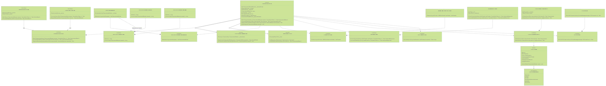
*Figura 14 — Diagrama de clases de diseño: Servicio de Facturación Fiscal. Código fuente en `/diagramas/clases-servicio-facturacion-fiscal.mmd`.*

Separamos el punto de entrada (`FiscalInvoiceController`, boundary) de la orquestación (`FiscalInvoiceService`, control) y de los detalles de infraestructura, cada uno detrás de su propia interfaz: `IXmlComprobanteBuilder` para construir el XML (intercambiable según la versión del esquema, pensando en QS-05), `ISignatureProvider` para la firma digital, `IHaciendaClient` para hablar con Hacienda (con su política de reintentos y circuit breaker), `IDocumentArchive` para el archivado a largo plazo en MinIO (REST-02) y `IComprobanteRepository` / `IOutboxWriter` para la parte de persistencia y outbox que se explica en ADR-002. `ComprobanteStateMachine` concentra las transiciones válidas del comprobante (Generado → Firmado → Enviado → Aceptado / Rechazado / PendienteValidacionHacienda) para que esa lógica no termine repartida por todo el servicio. Gracias a esta separación por interfaces, si Hacienda cambia el esquema el año que viene, en principio bastaría con reemplazar `XmlComprobanteBuilderV44` sin tocar `FiscalInvoiceService` ni el resto — que es más o menos lo que promete QS-05.

**Refinamiento respecto del Avance 2.** El diagrama incorpora dos clases que la vista de componentes (§7.2.4.1) ya declaraba y que el diseño de clases del Avance 2 aún no reflejaba: `FiscalEventConsumer`, el segundo punto de entrada (consumidor AMQP del evento `emitir_comprobante` relevado desde el outbox), e `IdempotencyGuard`, que deduplica por `event_id`. Ambos puntos de entrada —REST interno y AMQP— convergen deliberadamente en la misma interfaz `IFiscalInvoiceService`, de modo que validación, idempotencia y máquina de estados se aplican por igual sin importar por dónde entre la solicitud; esa convergencia es la que hace que el camino de reintento del Componente 2 no pueda saltarse ninguna regla del dominio fiscal. Se añadió además `RegistrarRespuestaHaciendaAsync` para el caso en que la respuesta de Hacienda llega de forma diferida (Flujo 3), el campo `RowVersion` en `Comprobante`, que materializa el control de concurrencia optimista descrito en §7.5, y `IXmlComprobanteBuilderResolver` → `XmlBuilderResolver`, que selecciona la implementación del constructor de XML según la versión de esquema vigente. Este último cierra una promesa que §13.1 hacía sobre QS-05 —«mantener dos implementaciones activas simultáneamente con routing por versión»— y que el diseño de clases todavía no soportaba: sin él, `FiscalInvoiceService` tendría que conocer las versiones del esquema para elegir entre ellas.

**Patrones aplicados en este componente (§11):** *Strategy* en `IXmlComprobanteBuilder` e `ISignatureProvider` (algoritmos intercambiables por versión de esquema o estándar de firma), *State* en `ComprobanteStateMachine`, *Adapter* en `HaciendaHttpClient` (traduce el dominio al contrato XML/HTTPS de Hacienda), *Repository* + *Transactional Outbox* en `ComprobanteSqlRepository` / `OutboxWriter`, y *Circuit Breaker* + *Retry* en la política de resiliencia de `HaciendaHttpClient`.

---

#### 10.1.2 Contratos de interfaz

| Método / Endpoint | Precondición | Postcondición | Excepciones |
|---|---|---|---|
| `Task<ComprobanteResult> FiscalInvoiceService.EmitirComprobanteAsync(ComprobanteRequest request, CancellationToken ct)` | `request.TenantId` corresponde a un tenant activo y resuelto por la capa de autorización (ADR-003); `request.Lineas` contiene al menos una línea con montos válidos (> 0); `request.EventId` no es vacío. | El comprobante queda persistido con estado `Firmado` o `PendienteValidacionHacienda`; su evento de auditoría queda encolado de forma transaccional en el outbox (ADR-002) antes de retornar. Si el `EventId` ya fue procesado, no se crea un segundo comprobante y se retorna el resultado previo. | `ValidationException` si `request` no cumple las reglas de negocio mínimas; `TenantMismatchException` si el `TenantId` del request no coincide con el del contexto de autorización; `FiscalSignatureException` si la firma digital falla por certificado inválido o vencido. |
| `Task<ComprobanteStatusDto> FiscalInvoiceService.ConsultarEstadoAsync(Guid comprobanteId, Guid tenantId)` | `comprobanteId` corresponde a un comprobante existente perteneciente a `tenantId`. | Retorna el estado actual del comprobante sin exponer datos de otro tenant. | `NotFoundException` si el comprobante no existe para ese `tenantId` (nunca revela si existe para otro tenant — QS-01). |
| `Task FiscalInvoiceService.RegistrarRespuestaHaciendaAsync(Guid comprobanteId, HaciendaResponse respuesta)` | El comprobante está en estado `Enviado` o `PendienteValidacionHacienda`; `respuesta` proviene de `IHaciendaClient` y trae la clave numérica coincidente. | El estado pasa a `Aceptado` o `Rechazado` de forma definitiva y se encola el evento de auditoría y notificación en el outbox. Una segunda respuesta idéntica no produce ningún efecto adicional. | `InvalidStateTransitionException` si el comprobante ya estaba en estado terminal (respuesta duplicada de Hacienda — QS-06). |
| `Task<bool> IdempotencyGuard.TryBeginAsync(Guid eventId, Guid tenantId)` | `eventId` es el identificador del evento de negocio que originó la solicitud. | Retorna `true` y reserva el `eventId` si es la primera vez que se procesa; retorna `false` si ya existe (índice único en SQL Server), sin efectos secundarios. | Ninguna en operación normal; propaga `DbException` si el almacén de eventos procesados no está disponible (el evento se reintenta, nunca se asume procesado). |
| `IXmlComprobanteBuilder IXmlComprobanteBuilderResolver.Resolver(string versionEsquema)` | `versionEsquema` corresponde a una versión de esquema soportada y vigente para el tenant emisor. | Retorna la única implementación de `IXmlComprobanteBuilder` registrada para esa versión; la selección no depende del orden de registro en el contenedor de dependencias. | `UnsupportedSchemaVersionException` si no hay implementación registrada para la versión solicitada (el comprobante no se emite: nunca se degrada silenciosamente a otra versión del esquema). |
| `string IXmlComprobanteBuilder.ConstruirXml(ComprobanteRequest request)` | `request` ya fue validado por `FiscalInvoiceService.ValidarRequest`. | Retorna un XML bien formado y conforme al esquema vigente del Ministerio de Hacienda. | `SchemaValidationException` si el XML resultante no valida contra el esquema XSD vigente. |
| `XmlFirmado ISignatureProvider.Firmar(string xmlContent, X509Certificate2 certificado)` | `certificado` es válido, no ha expirado y corresponde al tenant emisor. | Retorna el XML firmado digitalmente conforme al estándar XADES-EPES, listo para envío. | `CertificateExpiredException`; `InvalidCertificateException` si el certificado no corresponde al emisor declarado. |
| `Task<HaciendaResponse> IHaciendaClient.EnviarComprobanteAsync(XmlFirmado xmlFirmado, CancellationToken ct)` | `xmlFirmado` fue producido por un `ISignatureProvider` válido. | Retorna la respuesta de Hacienda (aceptado/rechazado) o agota la política de reintentos y propaga el fallo. El envío es seguro de reintentar: la clave numérica identifica unívocamente el comprobante ante Hacienda. | `TimeoutException` / `HttpRequestException` ante indisponibilidad de Hacienda (capturadas explícitamente para activar el camino `PendienteValidacionHacienda`, QS-02); `BrokenCircuitException` si el circuito está abierto. |
| `Task<string> IDocumentArchive.ArchivarAsync(string claveNumerica, XmlFirmado documento)` | El documento ya está firmado; `claveNumerica` es única dentro del tenant. | El XML queda almacenado con checksum de integridad y política de retención ≥ 5 años (REST-02); retorna el URI del objeto. Reejecutar con la misma clave sobrescribe con contenido idéntico (operación idempotente). | `StorageUnavailableException` si el almacén de documentos no responde (el comprobante no avanza a `Enviado`). |
| `ComprobanteEstado ComprobanteStateMachine.Transicionar(ComprobanteEstado actual, ComprobanteEvento evento)` | La transición solicitada (`actual` + `evento`) existe en la tabla de transiciones válidas. | Retorna el nuevo estado válido; nunca dos actores concurrentes pueden aplicar transiciones inconsistentes sobre el mismo comprobante (control de concurrencia optimista en el repositorio). | `InvalidStateTransitionException` si la transición solicitada no es válida desde el estado actual. |
| `Task IComprobanteRepository.GuardarAsync(Comprobante comprobante, byte[] rowVersion)` | `comprobante.TenantId` coincide con el `tenant_id` del contexto de autorización; `rowVersion` es la leída al obtener la entidad. | El estado queda persistido si nadie más modificó la fila; el `RowVersion` se incrementa. | `DbUpdateConcurrencyException` si otro proceso modificó el comprobante (se reevalúa la transición antes de reintentar); `TenantMismatchException` si el contexto de tenant no está resuelto (invariante 7 de §1.6). |

#### 10.1.3 Análisis de robustez

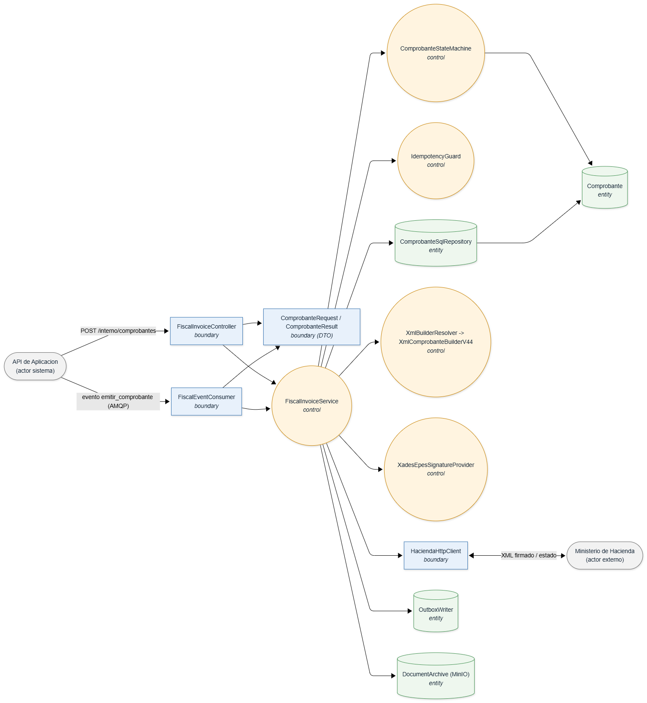
*Figura 15 — Análisis de robustez (boundary / control / entity): Servicio de Facturación Fiscal. Código fuente en `/diagramas/robustez-servicio-facturacion-fiscal.mmd`.*

| Objeto | Tipo (Boundary / Control / Entity) | Responsabilidad |
|---|---|---|
| `FiscalInvoiceController` | Boundary | Punto de entrada REST interno consumido únicamente por la API de Aplicación; traduce el request HTTP a la llamada del servicio y el resultado a una respuesta HTTP. |
| `FiscalEventConsumer` | Boundary | Segundo punto de entrada: consume el evento `emitir_comprobante` relevado desde el outbox (AMQP) y lo traduce a la misma llamada de servicio que el controller. |
| `ComprobanteRequest` / `ComprobanteResult` | Boundary (DTO) | Estructuras de datos que cruzan la frontera del componente hacia la API de Aplicación. |
| `HaciendaHttpClient` | Boundary | Interfaz hacia el sistema externo (API del Ministerio de Hacienda); traduce llamadas del dominio a HTTP/XML y viceversa, con reintentos y circuit breaker. |
| `FiscalInvoiceService` | Control | Orquesta el flujo completo de emisión: valida, verifica idempotencia, construye XML, firma, archiva, transiciona estado, persiste y encola auditoría. |
| `IdempotencyGuard` | Control | Decide si un `event_id` ya produjo efecto de negocio; garantiza exactamente un comprobante por evento (QS-06). |
| `ComprobanteStateMachine` | Control | Aplica las reglas de negocio que determinan qué transiciones de estado son válidas. |
| `XmlBuilderResolver` | Control | Selecciona la implementación de construcción de XML que corresponde a la versión de esquema vigente para el tenant. |
| `XmlComprobanteBuilderV43` / `XmlComprobanteBuilderV44` | Control | Transforman los datos de la solicitud en el XML fiscal conforme al esquema de su versión. |
| `XadesEpesSignatureProvider` | Control | Aplica la operación criptográfica de firma digital sobre el XML construido. |
| `Comprobante` | Entity | Representa el dato persistente central del dominio fiscal (estado, XML, hash de integridad, clave numérica, `RowVersion`). |
| `ComprobanteSqlRepository` | Entity | Objeto de acceso a datos que lee y escribe el estado persistente de `Comprobante` con concurrencia optimista. |
| `OutboxWriter` | Entity | Objeto de acceso a datos que persiste el evento de auditoría en la tabla outbox dentro de la misma transacción (ADR-002). |
| `DocumentArchive` (MinIO) | Entity | Conserva el XML/PDF firmado con checksum de integridad durante ≥ 5 años (REST-02). |

**Verificación del análisis:** ningún objeto *boundary* accede directamente a un objeto *entity* — toda interacción pasa por un objeto *control* — y ningún *entity* invoca lógica de negocio. Los dos puntos de entrada (`FiscalInvoiceController`, `FiscalEventConsumer`) desembocan en el mismo control (`FiscalInvoiceService`), lo que evita una ruta que se salte la validación de tenant o la idempotencia.

#### 10.1.4 Diagramas de secuencia

**Flujo principal — emisión aceptada por Hacienda**

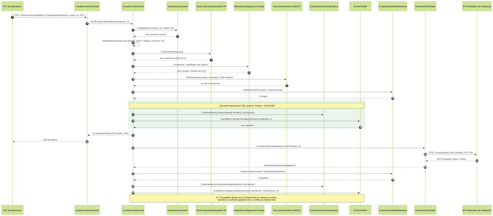
*Figura 16 — Secuencia: emisión de comprobante fiscal, camino feliz hasta el estado `Aceptado`. Código fuente en `/diagramas/secuencia-emision-comprobante-fiscal.mmd`.*

**Descripción:** La API de Aplicación llama a `FiscalInvoiceController`, que delega en `FiscalInvoiceService`. Este diagrama detalla el interior del componente; en el flujo extremo a extremo de la Figura 7, la solicitud de emisión llega al servicio como evento AMQP (`emitir_comprobante`) relevado desde el outbox — ese consumidor AMQP (`FiscalEventConsumer`) delega en el mismo `FiscalInvoiceService` que el endpoint REST interno mostrado aquí, por lo que ambas entradas comparten idéntica validación, idempotencia y máquina de estados. El servicio verifica primero el `event_id` contra `IdempotencyGuard`, valida la solicitud, construye el XML, lo firma, archiva el documento, pasa el comprobante a estado `Firmado` y lo guarda junto con su evento de auditoría en la misma transacción (el patrón outbox de ADR-002), devolviendo `202 Accepted` sin esperar a Hacienda. Luego el servicio envía el comprobante a Hacienda: si todo sale bien, Hacienda responde a tiempo y el comprobante pasa a `Aceptado`, con una segunda escritura transaccional que encola la auditoría y la notificación al cliente — que ejecuta el Componente 2.

**Flujos alternativos y de error**

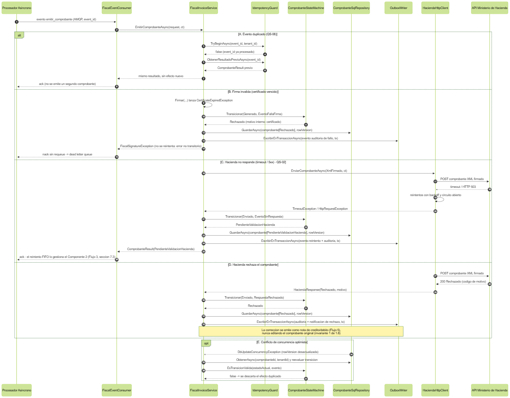
*Figura 17 — Secuencia: flujos alternativos del Servicio de Facturación Fiscal (evento duplicado, firma inválida, indisponibilidad de Hacienda, rechazo y conflicto de concurrencia). Código fuente en `/diagramas/secuencia-emision-comprobante-error.mmd`.*

**Descripción:** El diagrama recorre los cinco desvíos significativos del flujo, entrando por el consumidor AMQP (el punto de entrada más expuesto a reentregas):

| Camino | Disparador | Comportamiento del diseño | Respuesta |
|---|---|---|---|
| A — Evento duplicado | El Componente 2 reentrega un `event_id` ya procesado | `IdempotencyGuard.TryBeginAsync` retorna `false` y se devuelve el resultado previo | Sin segundo comprobante; `ack` (QS-06) |
| B — Firma inválida | Certificado del tenant vencido o no correspondiente | Error **no transitorio**: se transiciona a `Rechazado` con motivo interno y se audita | `nack` sin requeue → dead letter queue |
| C — Hacienda no responde | Timeout o HTTP 5xx sostenido | Transición a `PendienteValidacionHacienda` (estado legítimo de §1.6) y encolado del reintento | `ack`; el reintento FIFO lo gestiona el Componente 2 (Flujo 3) — degradación ≤ 2 s (QS-02) |
| D — Hacienda rechaza | Respuesta `Rechazado` con código de motivo | Estado terminal `Rechazado` + evento de notificación; la corrección se emite como nota de crédito/débito, nunca editando el original (invariante 1 de §1.6) | Flujo 5 de §7.3 |
| E — Conflicto de concurrencia | Dos procesos transicionan el mismo comprobante | `DbUpdateConcurrencyException`; se relee la entidad y se reevalúa la transición, que resulta inválida y descarta el efecto duplicado | Sin doble cambio de estado |

La distinción entre B (no reintentable) y C (reintentable) es deliberada: reintentar una firma con certificado vencido solo consumiría la cola sin posibilidad de éxito, mientras que reintentar ante la caída de Hacienda es exactamente lo que exige QS-02.

**Escenarios de calidad que estos flujos validan:** QS-01 (autorización por tenant antes de cualquier operación), QS-02 (degradación controlada y recuperación si Hacienda falla), QS-04 (auditoría transaccional vía outbox), QS-05 (el módulo de XML queda aislado detrás de una interfaz) y QS-06 (idempotencia de los reintentos y de las respuestas duplicadas de Hacienda).

---

### 10.2 Componente 2 — Procesador Asíncrono (Workers)

**Responsabilidad:** Releva los eventos de la tabla *outbox* hacia el broker y los procesa fuera del hilo de request, ejecutando los tres efectos que el sistema no puede perder: la escritura del log de auditoría append-only, la notificación del comprobante al cliente final y el reintento del envío a Hacienda con backoff y circuit breaker. Es crítico porque es la pieza que convierte la promesa transaccional del patrón outbox (ADR-002) en efectos reales: si falla, el sistema sigue facturando pero deja de auditar, notificar y recuperarse — precisamente lo que QS-02, QS-04 y QS-06 exigen que no ocurra.

**Trazabilidad:** Casos de uso de §1.4 → **CU-ADM-03** (monitorear automatizaciones), **CU-ADM-04** (auditar actividades del sistema), **CU-ADM-05** (consultar métricas operativas), **CU-ASI-03** (reenviar comprobantes electrónicos), **CU-CLI-01** (recibir comprobantes electrónicos), **CU-CLI-04** (recibir notificaciones comerciales) y **CU-HAC-04** (verificar cumplimiento tributario, mediante la retención e integridad del log) → elemento **"Procesador Asíncrono (Workers)"** de la vista de estructura interna (§7.2.3) y sus componentes internos de §7.2.4.2 → flujos de comportamiento **1, 2, 3 y 5** de §7.3, en su tramo asíncrono. Ver matriz consolidada en §10.4.

#### 10.2.1 Diagrama de clases de diseño

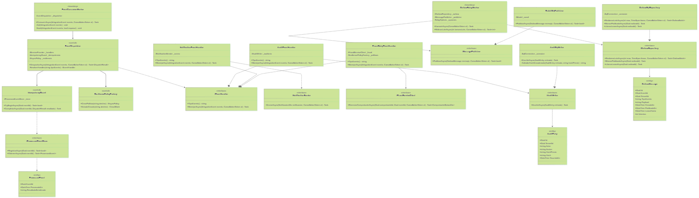
*Figura 18 — Diagrama de clases de diseño: Procesador Asíncrono (Workers). Código fuente en `/diagramas/clases-procesador-asincrono.mmd`.*

El componente tiene **dos rutas de trabajo independientes** que comparten las mismas garantías, y el diagrama las separa desde el punto de entrada. La ruta de **relay** (`OutboxRelayWorker`) es un `BackgroundService` que despierta periódicamente, reclama un lote de mensajes no publicados a través de `IOutboxRepository.ReclamarLoteAsync` —con bloqueo de fila y *lease* temporal, para que dos réplicas del worker nunca tomen el mismo lote— y los publica en RabbitMQ mediante `IMessagePublisher`. La ruta de **consumo** (`EventConsumerWorker`) recibe los eventos del broker como *competing consumer* y los delega en `EventDispatcher`, que resuelve el handler correspondiente al tipo de evento.

La decisión de diseño central es que `EventDispatcher` no conoce ningún handler concreto: depende de la interfaz `IEventHandler`, y `AuditEventHandler`, `NotificationEventHandler` y `FiscalRetryEventHandler` se registran como implementaciones. Agregar un canal nuevo (por ejemplo, notificación por WhatsApp) es agregar una implementación más, sin tocar el dispatcher ni los workers — que es la razón por la que §13.3 clasifica este componente como el más inestable del sistema (0.7) sin que eso sea un defecto: absorbe los cambios operativos para que el Servicio Fiscal no tenga que absorberlos.

`IdempotencyGuard` y `ResiliencePolicyFactory` son transversales a ambas rutas: el primero garantiza exactamente un efecto de negocio por `event_id` (QS-06) incluso ante reentregas del broker, y el segundo centraliza el backoff exponencial con jitter y el estado del circuito por destino (correo, Servicio Fiscal), de modo que la política de resiliencia no quede duplicada dentro de cada handler. `AuditSqlWriter` calcula el hash encadenado que hace verificable la integridad del log (QS-04): alterar una entrada invalida todas las posteriores.

**Patrones aplicados en este componente (§11):** *Strategy* en `IEventHandler` (un algoritmo de manejo por tipo de evento, seleccionado en tiempo de ejecución), *Publisher-Subscriber* con *Competing Consumers* sobre RabbitMQ, *Transactional Outbox* (lado relay) de ADR-002, *Retry* + *Circuit Breaker* en `ResiliencePolicyFactory`, y *Adapter* en `RabbitMqPublisher` y `SmtpNotificationSender`.

#### 10.2.2 Contratos de interfaz

| Método / Endpoint | Precondición | Postcondición | Excepciones |
|---|---|---|---|
| `Task<int> OutboxRelayWorker.RelevarLoteAsync(int tamañoLote, CancellationToken ct)` | El worker tiene conexión a la BD transaccional; `tamañoLote` > 0. | Todo mensaje efectivamente publicado en el broker queda marcado como publicado; ningún mensaje se marca como publicado sin *publisher confirm*. Retorna la cantidad relevada. | Ninguna se propaga fuera del worker: los fallos se registran y el lote se libera para el siguiente ciclo (garantía at-least-once). |
| `Task<OutboxBatch> IOutboxRepository.ReclamarLoteAsync(int max, TimeSpan lease, CancellationToken ct)` | Existe una transacción de lectura disponible sobre la tabla outbox. | Retorna hasta `max` mensajes no publicados y con lease vencido, marcándolos con un nuevo `lease_hasta`; **ninguna otra réplica del worker puede reclamar los mismos mensajes durante ese lease** (bloqueo de fila con `READPAST`). | `DbException` si la BD no está disponible (el ciclo se omite y se reintenta en el siguiente tick). |
| `Task IOutboxRepository.MarcarPublicadoAsync(Guid outboxId)` | El broker confirmó la publicación del mensaje (`publisher confirm`). | El mensaje no vuelve a ser reclamado por ningún ciclo posterior. | `DbException`; si falla, el mensaje se republicará y la deduplicación por `event_id` evita el doble efecto (QS-06). |
| `Task<bool> IMessagePublisher.PublicarAsync(OutboxMessage mensaje, CancellationToken ct)` | El mensaje tiene `event_id`, `tenant_id` y `tipo_evento` no vacíos. | Retorna `true` solo si el broker confirmó la recepción con persistencia en disco (cola durable). Retorna `false` ante fallo, sin lanzar. | `OperationCanceledException` si se solicita el apagado del worker. |
| `Task<DispatchResult> EventDispatcher.DespacharAsync(IntegrationEvent evento, CancellationToken ct)` | `evento.EventId` no es vacío y existe un `IEventHandler` registrado para `evento.TipoEvento`. | Se ejecuta exactamente un efecto de negocio por `event_id`: si el evento ya fue procesado, retorna `DispatchResult.Duplicado` sin invocar al handler. Al completarse con éxito, el `event_id` queda registrado como procesado. | `HandlerNotFoundException` si el tipo de evento no tiene handler (el mensaje va a la dead letter queue, nunca se descarta). |
| `Task<bool> IdempotencyGuard.TryBeginAsync(Guid eventId)` | — | Retorna `true` y reserva el `eventId` la primera vez; `false` si ya está registrado. La reserva se conserva al menos por el periodo máximo de reintento configurado por canal (QS-06). | Propaga la excepción del almacén: ante duda, el evento se reintenta, nunca se asume procesado. |
| `Task IEventHandler.ManejarAsync(IntegrationEvent evento, CancellationToken ct)` | El evento ya pasó la verificación de idempotencia. | El efecto del handler queda aplicado y es observable (entrada de auditoría escrita, correo entregado al servidor SMTP o comprobante reencolado al Servicio Fiscal). | Excepciones transitorias (timeout, 5xx) activan la política de reintento; excepciones no transitorias envían el mensaje a la dead letter queue. |
| `Task IAuditWriter.EscribirAsync(AuditEntry entrada)` | `entrada` contiene actor, `tenant_id`, acción, timestamp y referencia del comprobante. | La entrada queda persistida en el Almacén de Auditoría con hash encadenado al registro previo. **Es insert-only: no existe operación de actualización ni de borrado** (RF-05, invariante de §1.6). | `DbException`; el evento **no** se confirma (`ack`) mientras la auditoría no esté persistida. |
| `Task INotificationSender.EnviarAsync(NotificacionDto notificacion, CancellationToken ct)` | El comprobante referenciado tiene un estado fiscal válido o `PendienteValidacionHacienda` (invariante 5 de §1.6). | El comprobante queda entregado al servicio de correo. El proveedor **nunca** es fuente de verdad del estado fiscal: su fallo no altera el estado del comprobante. | `SmtpException` / `HttpRequestException` → reintento con backoff; tras agotarlo, dead letter queue y alerta operativa. |
| `Task<ComprobanteStatusDto> IFiscalServiceClient.ReenviarComprobanteAsync(Guid comprobanteId, Guid eventId, CancellationToken ct)` | El comprobante está en estado `PendienteValidacionHacienda`; el circuito hacia el Servicio Fiscal no está abierto. | El Servicio Fiscal reintenta el envío a Hacienda y retorna el estado resultante. Reenviar con el mismo `eventId` **no** genera un segundo comprobante (contrato de §10.1.2). | `BrokenCircuitException` si el circuito está abierto (el mensaje se reencola con backoff, sin pérdida — QS-02). |

#### 10.2.3 Análisis de robustez

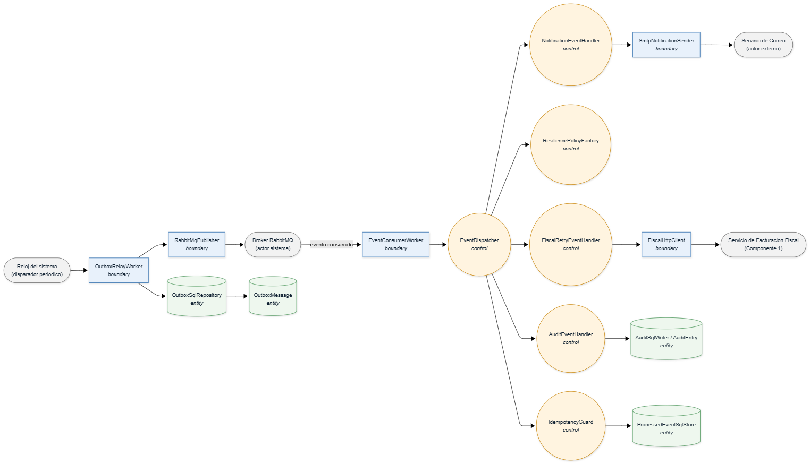
*Figura 19 — Análisis de robustez (boundary / control / entity): Procesador Asíncrono. Código fuente en `/diagramas/robustez-procesador-asincrono.mmd`.*

| Objeto | Tipo (Boundary / Control / Entity) | Responsabilidad |
|---|---|---|
| `OutboxRelayWorker` | Boundary | Punto de entrada temporal: el disparador periódico (tick) que inicia el ciclo de relevo del outbox. |
| `EventConsumerWorker` | Boundary | Punto de entrada de mensajería: recibe los eventos entregados por RabbitMQ y decide `ack` / `nack`. |
| `RabbitMqPublisher` | Boundary | Traduce el `OutboxMessage` al protocolo AMQP y espera el *publisher confirm* del broker. |
| `SmtpNotificationSender` | Boundary | Interfaz hacia el sistema externo de correo; traduce la notificación de dominio al protocolo SMTP/API. |
| `FiscalHttpClient` | Boundary | Interfaz hacia el Servicio de Facturación Fiscal para los reintentos de envío a Hacienda. |
| `EventDispatcher` | Control | Resuelve el handler que corresponde al tipo de evento y coordina idempotencia y resiliencia. |
| `IdempotencyGuard` | Control | Determina si el `event_id` ya produjo efecto; garantiza exactamente un efecto de negocio (QS-06). |
| `ResiliencePolicyFactory` | Control | Construye y expone la política de backoff exponencial con jitter y el estado del circuito por destino. |
| `AuditEventHandler` | Control | Aplica la regla de negocio de trazabilidad: toda acción relevante produce una entrada de auditoría. |
| `NotificationEventHandler` | Control | Decide qué se notifica, a quién y con qué documento adjunto según el estado fiscal. |
| `FiscalRetryEventHandler` | Control | Aplica la política de reintento de envío a Hacienda y su orden FIFO. |
| `OutboxMessage` | Entity | Evento de dominio persistido en la misma transacción que el cambio de estado (ADR-002). |
| `OutboxSqlRepository` | Entity | Acceso a datos del outbox: reclamo de lote con lease, marcado de publicado y liberación. |
| `AuditEntry` / `AuditSqlWriter` | Entity | Entrada append-only con hash encadenado y su objeto de acceso insert-only. |
| `ProcessedEventSqlStore` | Entity | Almacén de `event_id` ya procesados, con índice único como mecanismo de deduplicación. |

**Verificación del análisis:** los dos objetos boundary de entrada (`OutboxRelayWorker`, `EventConsumerWorker`) nunca escriben directamente en `AuditEntry` ni en `ProcessedEvent`; toda escritura pasa por un control. Ningún handler contiene lógica fiscal ni comercial — el componente es un ejecutor de efectos, no un dueño de reglas de dominio, lo que sostiene la alta cohesión que le atribuye §13.3.

#### 10.2.4 Diagramas de secuencia

**Flujo principal — relay del outbox, auditoría y notificación**

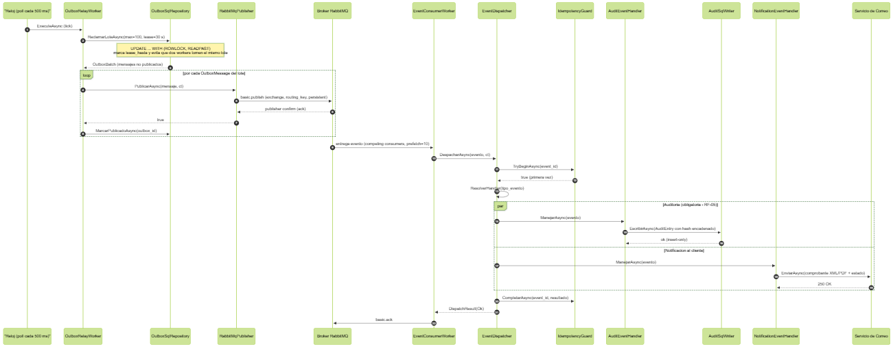
*Figura 20 — Secuencia: relevo del outbox al broker, escritura de auditoría append-only y notificación al cliente. Código fuente en `/diagramas/secuencia-relay-outbox-principal.mmd`.*

**Descripción:** El ciclo arranca por tiempo, no por request: `OutboxRelayWorker` despierta, reclama un lote de mensajes no publicados con *lease* y bloqueo de fila —el mecanismo que permite ejecutar varias réplicas del worker sin procesar dos veces el mismo mensaje, detallado en §7.5— y los publica uno a uno en RabbitMQ, marcando cada mensaje como publicado **solo después** del *publisher confirm*. Del lado del consumo, el broker entrega el evento a `EventConsumerWorker` (competing consumers con prefetch), que delega en `EventDispatcher`; este verifica el `event_id` contra `IdempotencyGuard`, resuelve el handler y ejecuta en paralelo los dos efectos del evento de emisión: la entrada de auditoría con hash encadenado (obligatoria, RF-05) y la notificación del comprobante al cliente final por el Servicio de Correo. El `ack` al broker se envía únicamente cuando ambos efectos se completaron y el `event_id` quedó registrado como procesado.

**Flujos alternativos y de error**

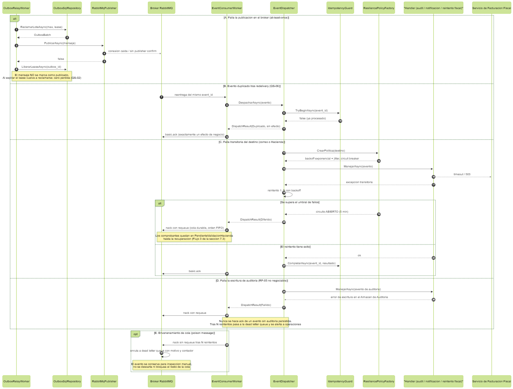
*Figura 21 — Secuencia: flujos alternativos del Procesador Asíncrono (fallo de publicación, evento duplicado, fallo transitorio del destino, fallo de auditoría y poison message). Código fuente en `/diagramas/secuencia-relay-outbox-error.mmd`.*

**Descripción:** Los cinco desvíos del diagrama responden a la pregunta que define este componente: qué pasa cuando algo aguas abajo falla.

| Camino | Disparador | Comportamiento del diseño | Garantía |
|---|---|---|---|
| A — Falla la publicación | El broker no confirma o la conexión cae tras reclamar el lote | El mensaje **no** se marca como publicado; al vencer el lease vuelve a reclamarse | Cero pérdida, entrega at-least-once (QS-02) |
| B — Evento duplicado | Reentrega del broker tras un `ack` perdido | `IdempotencyGuard` retorna `false` y se hace `ack` sin ejecutar efecto | Exactamente un efecto de negocio (QS-06) |
| C — Falla transitoria del destino | Timeout del correo o del Servicio Fiscal | Backoff exponencial con jitter; si se supera el umbral, circuito abierto 5 min y `nack` con requeue en cola durable FIFO | Recuperación automática sin intervención (QS-02, Flujo 3 de §7.3) |
| D — Falla la escritura de auditoría | Error en el Almacén de Auditoría | **Nunca se hace `ack` de un evento sin auditoría persistida**; se reintenta y, agotado el umbral, va a DLQ con alerta | RF-05 no negociable |
| E — Poison message | Un evento falla de forma reproducible | `nack` sin requeue a la dead letter queue con motivo y contador de intentos | No bloquea el resto de la cola ni descarta evidencia |

La asimetría entre C y D es intencional: una notificación puede diferirse, una entrada de auditoría no puede perderse. Por eso el fallo de auditoría bloquea la confirmación del evento mientras que el fallo de notificación solo lo difiere.

**Escenarios de calidad que estos flujos validan:** QS-02 (ningún documento encolado se pierde ante reinicios; recuperación en ≤ 10 min tras la restauración de Hacienda), QS-04 (auditoría persistida y verificable por hashes encadenados) y QS-06 (deduplicación por `event_id` ante reentregas del broker).

---

### 10.3 Componente 3 — API de Aplicación — Núcleo Comercial (preventas, cotizaciones y orquestación de emisión)

**Responsabilidad:** Es el núcleo aplicativo del dominio comercial y el **único punto de entrada del handoff de preventa**: recibe la preventa que genera el Motor de Automatización de forma autenticada e idempotente, permite convertirla en cotización y, a partir de una cotización vigente, solicita la emisión fiscal escribiendo el evento `emitir_comprobante` en el outbox. Es crítico por su ubicación en la arquitectura más que por su complejidad interna: es la frontera donde se decide qué entra al dominio fiscal y con qué identidad, y donde se aplican la autorización por `tenant_id` (ADR-003) y el bloqueo del motor frente a la emisión (REST-05, §3.4).

**Trazabilidad:** Casos de uso de §1.4 → **CU-VEN-01 a CU-VEN-05** (registrar clientes, generar cotizaciones, convertir cotizaciones en facturas electrónicas, consultar historial comercial, gestionar seguimiento de ventas provenientes de redes sociales), **CU-MOT-04** (generar una preventa que ingresa al sistema — único caso de uso del motor que toca el sistema), **CU-CLI-02** (consultar cotizaciones enviadas), **CU-CLI-03** (confirmar pedidos o servicios), **CU-ASI-02** (validar información fiscal de clientes), **CU-ASI-04** (consultar estados tributarios, como fachada de lectura hacia el Componente 1), **CU-ASI-05** (corregir errores operativos, creando la nota de crédito/débito) y **CU-ADM-01** (configurar parámetros de integración) → elemento **"API de Aplicación"** de la vista de estructura interna (§7.2.3) → flujos de comportamiento **2, 4 y 5** de §7.3. Ver matriz consolidada en §10.4.

> **Nota de consistencia con §7.2.4.** La vista de componentes C4 nivel 3 abrió deliberadamente solo los dos subsistemas que concentran los escenarios de calidad más exigentes. Esta subsección desciende directamente desde la vista de contenedores (§7.2.3) al nivel de clases para el núcleo comercial, sin introducir dependencias nuevas: las cuatro que aparecen aquí —BD transaccional, Identity Provider, Servicio de Facturación Fiscal y el handoff entrante del motor— son exactamente las que la Figura 4 asigna al contenedor "API de Aplicación".

#### 10.3.1 Diagrama de clases de diseño

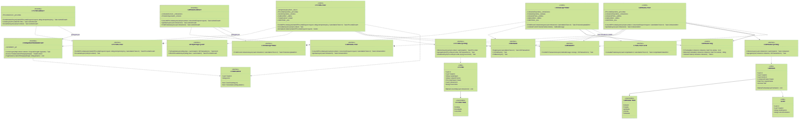
*Figura 22 — Diagrama de clases de diseño: API de Aplicación — Núcleo Comercial. Código fuente en `/diagramas/clases-api-aplicacion-comercial.mmd`.*

El diseño separa tres responsabilidades que en un CRUD convencional suelen mezclarse. La primera es la **autorización**: `TenantAuthorizationMiddleware` se ejecuta antes que cualquier controller, valida el JWT contra Keycloak, resuelve el `tenant_id` y exige el alcance requerido por la operación. Publica el resultado como `ITenantContext`, que los repositorios reciben como **dependencia obligatoria del constructor, no como parámetro opcional** — de modo que no existe forma de construir una consulta sin `tenant_id` resuelto (invariante 7 de §1.6, y la tercera capa de defensa de QS-01).

La segunda es la **recepción del handoff**: `PreventaService` concentra el único camino por el que un actor no humano crea datos en el sistema. La deduplicación por `Idempotency-Key` no ocurre antes ni después de crear la preventa, sino **dentro de la misma transacción** que la creación y la escritura del outbox: `IIdempotencyKeyStore.TryRegistrarAsync` se apoya en un índice único, de modo que dos handoffs concurrentes con la misma clave no pueden producir dos preventas ni siquiera bajo condición de carrera.

La tercera es la **frontera comercial/fiscal**: `CotizacionPolicy` concentra las reglas que deciden si una cotización puede facturarse (vigencia, estado, totales) y `EmisionOrquestador` es el único objeto autorizado a escribir el evento `emitir_comprobante`. `IFiscalServiceClient` existe únicamente con métodos de **consulta** de estado: la API de Aplicación nunca invoca la emisión de forma sincrónica —lo hace a través del outbox— lo que evita que un timeout del Servicio Fiscal bloquee el hilo de request (QS-03) y mantiene la emisión gobernada por la idempotencia del Componente 1.

**Patrones aplicados en este componente (§11):** *Repository* + *Unit of Work* (`IUnitOfWork` agrupa creación, deduplicación y escritura de outbox en una sola transacción), *Facade* en `EmisionOrquestador` (expone una operación de negocio y oculta la coordinación entre cotización, factura y outbox), *Policy / Specification* en `CotizacionPolicy` (reglas de facturabilidad extraídas del servicio para poder probarlas y cambiarlas de forma aislada), *Chain of Responsibility* en el pipeline de middleware de ASP.NET Core, y *Transactional Outbox* de ADR-002.

#### 10.3.2 Contratos de interfaz

| Método / Endpoint | Precondición | Postcondición | Excepciones |
|---|---|---|---|
| `POST /api/v1/preventas` → `Task<PreventaResult> PreventaService.RecibirPreventaAsync(HandoffPreventaRequest request, string idempotencyKey, CancellationToken ct)` | Token OAuth2 de integración válido con alcance `preventas:write` (**nunca alcance fiscal** — REST-05); header `Idempotency-Key` presente y no vacío; `request` trae canal de origen y datos de contacto. | Si la clave es nueva: la preventa (estado `Recibida`), el registro de la clave y el evento outbox `preventa_recibida` quedan persistidos **en una única transacción**, y se retorna `201`. Si la clave ya existe: se retorna `200` con el resultado previo y **ningún efecto nuevo** (QS-06). El dominio fiscal no avanza en ningún caso. | `401` si el token es inválido; `403` si el alcance no incluye `preventas:write`; `400` si falta la `Idempotency-Key` o el payload es inválido; `500` con rollback completo si falla el commit (ni preventa ni evento existen). |
| `POST /api/v1/preventas/{id}/cotizacion` → `Task<CotizacionDto> CotizacionService.ConvertirPreventaAsync(Guid preventaId, ConversionRequest request, CancellationToken ct)` | Usuario autenticado con rol `vendedor` o `administrador`; la preventa existe, pertenece al `tenant_id` del token y está en estado `Recibida`. | En una única transacción se crea la cotización (`Borrador`) y la preventa pasa a `Convertida` con referencia a esa cotización; se escribe el evento de auditoría en el outbox. Una preventa produce **exactamente una** cotización aunque la acción se reintente. | `403` si el rol o el tenant no corresponden (con el intento auditado); `404` si la preventa no existe para ese tenant; `409 Conflict` (`PreventaYaConvertidaException`) si ya fue convertida, retornando la cotización existente. |
| `POST /api/v1/cotizaciones/{id}/factura` → `Task<EmisionAceptadaDto> EmisionOrquestador.EmitirDesdeCotizacionAsync(Guid cotizacionId, CancellationToken ct)` | Usuario con rol `vendedor`, `asistente` o `administrador`; la cotización existe, pertenece al tenant, está `Aprobada`, vigente y no facturada. | En una única transacción la cotización pasa a `Facturada`, se crea la factura local (`emitida_local`) y se escribe el evento outbox `emitir_comprobante` con su `event_id`; se responde `202 Accepted`. **El control pasa al Componente 2 y luego al Componente 1**: la API nunca espera a Hacienda. | `403` por rol o tenant; `422 Unprocessable Entity` (`CotizacionNoFacturableException`) si está vencida o ya facturada, **sin escribir en el outbox**; `409` si la factura ya existe para esa cotización. |
| `bool CotizacionPolicy.EsFacturable(Cotizacion cotizacion, DateTime ahora)` | `cotizacion` fue cargada con su estado y su fecha `VigenteHasta`. | Retorna `true` solo si el estado es `Aprobada`, `ahora <= VigenteHasta` y no existe factura asociada. Función pura: no consulta la BD ni produce efectos. | Ninguna; el motivo del rechazo se obtiene con `MotivoNoFacturable`. |
| `Task<bool> IIdempotencyKeyStore.TryRegistrarAsync(string clave, Guid tenantId, IDbTransaction tx)` | Se ejecuta **dentro** de la transacción que crea la preventa; `clave` no vacía. | Retorna `true` y reserva la clave si es nueva; `false` si el índice único la rechaza. La reserva se conserva al menos el periodo máximo de reintento del canal (≥ 7 días para preventas). | `DbException` si la BD no responde (se responde `500` y el motor reintenta con la misma clave, sin riesgo de duplicado). |
| `Task TenantAuthorizationMiddleware.InvokeAsync(HttpContext contexto, RequestDelegate siguiente)` | La petición trae un `Bearer` JWT emitido por Keycloak. | Si el token es válido, publica `ITenantContext` con `tenant_id`, actor y roles/alcances, y cede al siguiente middleware. **Ninguna petición alcanza un controller sin `tenant_id` resuelto.** Todo intento bloqueado se registra en el outbox para auditoría (RF-05). | `401` ante token ausente, expirado o con firma inválida; `403` ante rol o alcance insuficiente, o cuando el recurso solicitado pertenece a otro tenant (QS-01). |
| `Task<ComprobanteStatusDto> IFiscalServiceClient.ConsultarEstadoAsync(Guid comprobanteId, CancellationToken ct)` | El comprobante pertenece al tenant del contexto. | Retorna el estado fiscal actual para mostrarlo en la SPA. **Es una operación de solo lectura**: el núcleo comercial no puede provocar transiciones fiscales por esta vía. | `404` si no existe para ese tenant; `503` si el Servicio Fiscal no responde (la SPA muestra el último estado conocido, sin bloquear la operación comercial). |

#### 10.3.3 Análisis de robustez

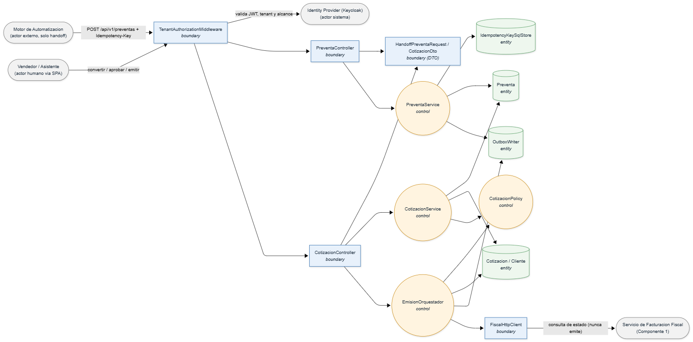
*Figura 23 — Análisis de robustez (boundary / control / entity): API de Aplicación — Núcleo Comercial. Código fuente en `/diagramas/robustez-api-aplicacion-comercial.mmd`.*

| Objeto | Tipo (Boundary / Control / Entity) | Responsabilidad |
|---|---|---|
| `PreventaController` | Boundary | Punto de entrada REST del handoff y de la gestión de preventas; traduce HTTP ↔ dominio y fija los códigos `201` / `200` idempotente. |
| `CotizacionController` | Boundary | Punto de entrada REST de la conversión, aprobación y solicitud de emisión; fija los códigos `201`, `202`, `409` y `422`. |
| `TenantAuthorizationMiddleware` | Boundary | Frontera de confianza del contenedor: valida el JWT contra Keycloak, resuelve el tenant y exige el alcance de la operación. |
| `HandoffPreventaRequest` / `CotizacionDto` / `EmisionAceptadaDto` | Boundary (DTO) | Estructuras que cruzan la frontera hacia el motor externo y hacia la SPA. |
| `FiscalHttpClient` | Boundary | Interfaz de solo lectura hacia el Servicio de Facturación Fiscal. |
| `PreventaService` | Control | Aplica la regla de idempotencia del handoff y coordina la transacción preventa + clave + outbox. |
| `CotizacionService` | Control | Aplica la regla de conversión única preventa → cotización y coordina su transacción. |
| `EmisionOrquestador` | Control | Único objeto autorizado a producir el evento `emitir_comprobante`; coordina cotización, factura local y outbox. |
| `CotizacionPolicy` | Control | Concentra las reglas de facturabilidad (vigencia, estado, totales) como lógica pura y testeable. |
| `Preventa` | Entity | Dato de origen social con su estado (`Recibida` / `Descartada` / `Convertida`) y `RowVersion`. |
| `Cotizacion` / `Cliente` | Entity | Datos del dominio comercial, reversibles y editables mientras no exista comprobante fiscal. |
| `IdempotencyKeySqlStore` | Entity | Almacén de claves de idempotencia del handoff, con índice único por `(tenant_id, clave)`. |
| `OutboxWriter` | Entity | Escribe el evento de dominio en la misma transacción que el cambio de estado (ADR-002). |

**Verificación del análisis:** el objeto boundary más importante de este componente no es un controller sino el middleware — es el único punto por el que pasan todas las peticiones, humanas y de integración, y el que garantiza que ningún control reciba una solicitud sin `tenant_id`. Ningún control invoca directamente al Servicio Fiscal para emitir: la comunicación de escritura hacia el dominio fiscal ocurre exclusivamente por el outbox, lo que mantiene la frontera de REST-05 verificable en el diseño y no solo en la documentación.

#### 10.3.4 Diagramas de secuencia

**Flujo principal — de la preventa a la solicitud de emisión**

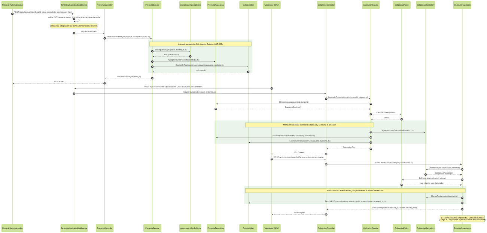
*Figura 24 — Secuencia: handoff idempotente de preventa, conversión a cotización y solicitud de emisión fiscal. Código fuente en `/diagramas/secuencia-handoff-conversion-principal.mmd`.*

**Descripción:** El diagrama recorre el camino comercial completo en tres transacciones independientes, todas con la misma estructura: validar autorización → aplicar la regla de negocio → escribir el cambio de estado y su evento outbox en un único commit. Primero, el Motor de Automatización ejecuta el handoff con credencial propia de integración; el middleware verifica que el token **no** tenga alcance fiscal y `PreventaService` registra la clave de idempotencia, crea la preventa y escribe `preventa_recibida` en la misma transacción, respondiendo `201`. Después, un Vendedor —actor humano, con JWT de usuario— convierte la preventa en cotización: la preventa pasa a `Convertida` y la cotización nace en `Borrador` en un solo commit. Finalmente, con la cotización aprobada y vigente, el Vendedor solicita la factura: `CotizacionPolicy` confirma que es facturable y `EmisionOrquestador` escribe la factura local junto al evento `emitir_comprobante`, respondiendo `202 Accepted` y cediendo el control al Componente 2 (relay) y luego al Componente 1 (emisión fiscal). El dominio fiscal solo avanza por acción interna: si el motor desaparece a mitad de un workflow, no hay impacto fiscal alguno.

**Flujos alternativos y de error**

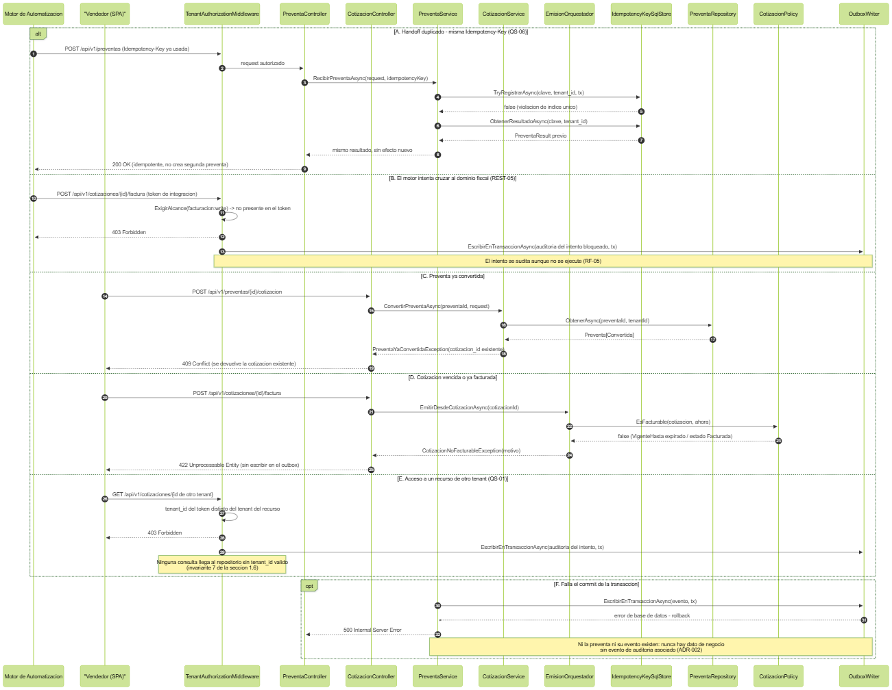
*Figura 25 — Secuencia: flujos alternativos del núcleo comercial (handoff duplicado, intento del motor de cruzar al dominio fiscal, preventa ya convertida, cotización no facturable, acceso cruzado entre tenants y fallo de commit). Código fuente en `/diagramas/secuencia-handoff-conversion-error.mmd`.*

**Descripción:** Los seis desvíos cubren los dos tipos de error que este componente debe distinguir: los de negocio (C, D), que devuelven un código semántico al usuario, y los de seguridad (B, E), que además se auditan aunque no se ejecuten.

| Camino | Disparador | Comportamiento del diseño | Respuesta |
|---|---|---|---|
| A — Handoff duplicado | Reejecución de un workflow o reintento por timeout del motor | El índice único rechaza la clave; se recupera y devuelve el resultado previo | `200 OK`, sin segunda preventa (QS-06) |
| B — El motor intenta emitir | Token de integración invocando un endpoint de facturación | El middleware exige el alcance `facturacion:write`, ausente en ese token; **el intento se audita** | `403 Forbidden` (REST-05, §3.4, RF-05) |
| C — Preventa ya convertida | Doble clic o reintento del vendedor | Se detecta el estado `Convertida` y se devuelve la cotización existente, sin duplicar | `409 Conflict` |
| D — Cotización no facturable | Cotización vencida o ya facturada | `CotizacionPolicy` retorna `false` con motivo; **no se escribe nada en el outbox** | `422 Unprocessable Entity` |
| E — Acceso cruzado entre tenants | `tenant_id` del token distinto del tenant del recurso | El middleware rechaza antes de tocar el repositorio; el intento se audita en ≤ 500 ms | `403 Forbidden` (QS-01) |
| F — Falla el commit | Error de BD durante la transacción | Rollback completo: ni el dato de negocio ni su evento existen | `500`, sin estados huérfanos (ADR-002) |

El caso F merece énfasis porque es la contrapartida del patrón outbox: la propiedad que se gana no es "el evento siempre se publica", sino "nunca existe un dato de negocio sin su evento asociado". Un fallo de infraestructura degrada la disponibilidad, nunca la trazabilidad.

**Escenarios de calidad que estos flujos validan:** QS-01 (100 % de intentos de acceso cruzado bloqueados con `403` y auditados), QS-03 (el handoff es una operación ligera fuera del camino crítico de la conversación social) y QS-06 (una clave de idempotencia produce exactamente una preventa; una preventa produce exactamente una cotización).

---

### 10.4 Trazabilidad de casos de uso hacia componentes

Los casos de uso de §1.4 se expresaban en prosa por tipo de usuario. Para poder trazarlos de forma verificable hacia el diseño detallado, aquí se identifican con un código estable —sin alterar su enunciado original— y se mapean hacia los componentes de esta sección, los elementos de la vista de estructura interna (§7.2.3), los flujos de comportamiento (§7.3) y los escenarios de calidad (§4).

**Leyenda de componentes:** **C1** = Servicio de Facturación Fiscal (§10.1) · **C2** = Procesador Asíncrono (§10.2) · **C3** = API de Aplicación — Núcleo Comercial (§10.3) · **IdP** = Identity Provider (Keycloak, §7.2.3, producto de terceros) · **MA** = Motor de Automatización (sistema externo, §3.4).

| CU | Caso de uso (§1.4) | Actor | Componente(s) | Elemento de diseño que lo realiza | Flujo (§7.3) | QS |
|---|---|---|---|---|---|---|
| CU-ADM-01 | Configurar parámetros fiscales y de integración | Administrador | C1, C3 | `IXmlComprobanteBuilder` (versión de esquema), certificado por tenant; credenciales del handoff en C3 | — | QS-05 |
| CU-ADM-02 | Administrar usuarios y permisos | Administrador | IdP | Keycloak: OIDC, RBAC y `tenant_id` (§7.2.3) — sin diseño detallado propio (producto de terceros) | — | QS-01 |
| CU-ADM-03 | Monitorear automatizaciones | Administrador | C2, C3 | Estado de outbox, DLQ y circuito (`ResiliencePolicyFactory`); listado de preventas recibidas (`PreventaController`) | 2, 3 | QS-02 |
| CU-ADM-04 | Auditar actividades del sistema | Administrador | C2 | `AuditEventHandler` → `AuditSqlWriter` (append-only con hash encadenado) | 1, 2, 5 | QS-04 |
| CU-ADM-05 | Consultar métricas operativas | Administrador | C2, C3 | Contadores de relay/reintentos de C2; consultas de lectura del núcleo comercial | 3 | QS-02 |
| CU-VEN-01 | Registrar clientes | Vendedor | C3 | `Cliente` + `IClienteRepository` bajo `ITenantContext` | 4 | QS-01 |
| CU-VEN-02 | Generar cotizaciones | Vendedor | C3 | `CotizacionService.ConvertirPreventaAsync`, `CotizacionPolicy.CalcularTotales` | 4 | QS-01, QS-06 |
| CU-VEN-03 | Convertir cotizaciones en facturas electrónicas | Vendedor | C3 → C2 → C1 | `EmisionOrquestador.EmitirDesdeCotizacionAsync` → outbox → `FiscalInvoiceService.EmitirComprobanteAsync` | 4 → 1 | QS-01, QS-04, QS-06 |
| CU-VEN-04 | Consultar historial comercial | Vendedor | C3 | Repositorios de cotizaciones y facturas con filtro obligatorio por `tenant_id` | — | QS-01 |
| CU-VEN-05 | Gestionar seguimiento de ventas provenientes de redes sociales | Vendedor | C3 | `Preventa` con `CanalOrigen`, estados `Recibida` / `Descartada` / `Convertida` | 2, 4 | QS-03 |
| CU-ASI-01 | Emitir facturas electrónicas | Asistente | C3 → C2 → C1 | Mismo camino que CU-VEN-03, iniciado desde la SPA por el asistente | 1, 4 | QS-01, QS-02, QS-04 |
| CU-ASI-02 | Validar información fiscal de clientes | Asistente | C1, C3 | `FiscalInvoiceService.ValidarRequest` (identificación, montos, esquema); `Cliente` en C3 | 1 | QS-05 |
| CU-ASI-03 | Reenviar comprobantes electrónicos | Asistente | C2 | `NotificationEventHandler` → `INotificationSender` (reintento idempotente) | 1 | QS-06 |
| CU-ASI-04 | Consultar estados tributarios | Asistente | C1, C3 | `FiscalInvoiceService.ConsultarEstadoAsync`; fachada de lectura `IFiscalServiceClient` en C3 | 3 | QS-01 |
| CU-ASI-05 | Corregir errores operativos de facturación | Asistente | C1, C3 | Nota de crédito/débito como comprobante nuevo (`ComprobanteStateMachine`); creación desde C3; bloqueo `409` sobre comprobantes aceptados | 5 | QS-06 |
| CU-CLI-01 | Recibir comprobantes electrónicos | Cliente final | C2 | `NotificationEventHandler` con el XML/PDF archivado en MinIO | 1 | QS-04 |
| CU-CLI-02 | Consultar cotizaciones enviadas | Cliente final | C3 | Consulta de `Cotizacion` por enlace del tenant emisor | 4 | QS-01 |
| CU-CLI-03 | Confirmar pedidos o servicios | Cliente final | C3 | `CotizacionService.AprobarAsync` (transición `Enviada` → `Aprobada`) | 4 | QS-06 |
| CU-CLI-04 | Recibir notificaciones comerciales | Cliente final | C2 | `NotificationEventHandler` sobre eventos de dominio no fiscales | 1, 2 | QS-04 |
| CU-CLI-05 | Interactuar mediante canales digitales | Cliente final | MA | Capa de captación social, fuera del sistema (REST-05, §3.4) | 2 | QS-03 |
| CU-MOT-01 | Atender mensajes y preguntas en redes sociales | Motor | MA | Fuera del sistema (§3.4) | 2 | QS-03 |
| CU-MOT-02 | Responder de forma automática | Motor | MA | Fuera del sistema (§3.4) | 2 | QS-03 |
| CU-MOT-03 | Guiar al usuario hacia la aplicación ante intención de compra | Motor | MA | Fuera del sistema (§3.4) | 2 | QS-03 |
| CU-MOT-04 | Generar una preventa que ingresa al sistema | Motor | C3 | `PreventaController.RecibirHandoffAsync` → `PreventaService` con `Idempotency-Key` | 2 | QS-01, QS-06 |
| CU-HAC-01 | Validar comprobantes electrónicos | Hacienda | C1 | `IHaciendaClient.EnviarComprobanteAsync` (XML firmado sobre HTTPS) | 1, 3 | QS-02 |
| CU-HAC-02 | Recibir documentos fiscales | Hacienda | C1 | `XadesEpesSignatureProvider` + `HaciendaHttpClient` | 1 | QS-01 |
| CU-HAC-03 | Retornar estados de aceptación o rechazo | Hacienda | C1 | `FiscalInvoiceService.RegistrarRespuestaHaciendaAsync` + `ComprobanteStateMachine` | 1, 3, 5 | QS-06 |
| CU-HAC-04 | Verificar cumplimiento tributario | Hacienda | C1, C2 | Archivado ≥ 5 años en `IDocumentArchive` (REST-02) y log append-only con hash encadenado | 1 | QS-04 |

**Cobertura.** De los 28 casos de uso derivados de §1.4, **23 se realizan en los tres componentes con diseño detallado** y 5 quedan fuera por decisión arquitectónica explícita, no por omisión: CU-ADM-02 lo resuelve Keycloak (producto de terceros, §7.2.3) y CU-CLI-05 junto con CU-MOT-01 a CU-MOT-03 pertenecen a la capa de captación social del Motor de Automatización, que REST-05 y §3.4 mantienen deliberadamente fuera del sistema. Ningún caso de uso queda sin un componente o sistema responsable identificado.

**Trazabilidad inversa — de cada componente a lo que justifica su existencia:**

| Componente | Casos de uso que realiza | Drivers | ADR | Escenarios de calidad | Figuras |
|---|---|---|---|---|---|
| **C1 — Servicio de Facturación Fiscal** (§10.1) | CU-ASI-01, CU-ASI-02, CU-ASI-04, CU-ASI-05, CU-VEN-03 (tramo fiscal), CU-ADM-01, CU-HAC-01 a CU-HAC-04 | RF-01, RF-06, REST-01, REST-02, REST-05 | ADR-001 | QS-01, QS-02, QS-04, QS-05, QS-06 | 14, 15, 16, 17 |
| **C2 — Procesador Asíncrono** (§10.2) | CU-ADM-03, CU-ADM-04, CU-ADM-05, CU-ASI-03, CU-CLI-01, CU-CLI-04, CU-HAC-04 | RF-05, RF-06 | ADR-002 | QS-02, QS-04, QS-06 | 18, 19, 20, 21 |
| **C3 — API de Aplicación (núcleo comercial)** (§10.3) | CU-VEN-01 a CU-VEN-05, CU-MOT-04, CU-CLI-02, CU-CLI-03, CU-ASI-02, CU-ASI-04, CU-ASI-05, CU-ADM-01 | RF-02, RF-03, RF-04, RF-06, REST-03, REST-05 | ADR-002, ADR-003 | QS-01, QS-03, QS-06 | 22, 23, 24, 25 |

---

## 11. Patrones de diseño aplicados


Se documentan **cinco patrones**, seleccionados con un criterio explícito: cada uno resuelve un problema concreto que aparece en los escenarios de calidad de §4 y tiene evidencia verificable en las clases de la sección 10. No se incluyen patrones que el equipo "podría" aplicar ni patrones que solo existen a nivel de estilo arquitectónico (esos están en §8); los que aparecen aquí están en el diagrama de clases del componente que los aloja.

| # | Patrón | Categoría | Ubicación en el sistema (§10) | Problema que resuelve | Escenario |
|---|---|---|---|---|---|
| 1 | **Strategy** | Comportamiento | Componente 1 — `IXmlComprobanteBuilder`, `ISignatureProvider` (§10.1.1) | El esquema XML de Hacienda cambia por vía regulatoria | QS-05 |
| 2 | **State** | Comportamiento | Componente 1 — `ComprobanteStateMachine` (§10.1.1, §10.1.2) | Las transiciones fiscales son irreversibles y no pueden quedar dispersas | QS-06, invariantes de §1.6 |
| 3 | **Transactional Outbox** | Comportamiento (integración) | Componentes 1, 2 y 3 — `OutboxWriter`, `OutboxRelayWorker` (§10.1.3, §10.2.1, §10.3.1) | Escritura dual entre base de datos y broker sin transacción distribuida | QS-02, QS-04, QS-06 |
| 4 | **Retry + Circuit Breaker** | Comportamiento (resiliencia) | Componente 1 — `HaciendaHttpClient`; Componente 2 — `ResiliencePolicyFactory` (§10.2.1) | Hacienda o el correo caen y el sistema debe seguir operando | QS-02 |
| 5 | **Repository + Unit of Work** | Estructural / Comportamiento | Componente 3 — repositorios con `ITenantContext` e `IUnitOfWork` (§10.3.1); reutilizado en el Componente 1 | Ninguna consulta puede ejecutarse sin `tenant_id`, y tres escrituras deben ser atómicas | QS-01, QS-06 |

---

### Patrón 1 — Strategy

| Campo | Detalle |
|---|---|
| **Categoría** | Comportamiento |
| **Ubicación en el sistema** | **Componente 1 — Servicio de Facturación Fiscal** (§10.1). Concretamente en `IXmlComprobanteBuilder` (con `XmlComprobanteBuilderV43` / `V44`, seleccionadas por `XmlBuilderResolver`) y en `ISignatureProvider` (con `XadesEpesSignatureProvider`). Ambas interfaces aparecen en el diagrama de clases del componente (Figura 14) y en sus contratos (§10.1.2). |
| **Problema que resuelve** | El Ministerio de Hacienda modifica periódicamente el esquema XML del comprobante electrónico (nuevos campos, cambios de cardinalidad, versiones 4.3 → 4.4 → 4.5). QS-05 exige absorber ese cambio en ≤ 10 días hábiles, con **cero subsistemas ajenos modificados** y cobertura de pruebas ≥ 90 %. El problema concreto no es "construir XML": es que la lógica de construcción cambia por una razón (la regulación) distinta de la que hace cambiar al orquestador (el flujo de emisión), y que durante la ventana de migración **deben coexistir dos versiones activas** porque los tenants no migran todos el mismo día. Lo mismo aplica, con menor frecuencia, al estándar de firma: hoy XAdES-EPES por REST-01, pero el entorno de pruebas necesita una implementación que no consuma el certificado real. |
| **Alternativa considerada** | Un único `XmlComprobanteBuilder` con un `switch (versionEsquema)` interno —o una cadena de `if`— que arme el XML de una u otra forma según la versión configurada del tenant. Es la solución más directa y la que un equipo de tres personas escribiría por defecto. |
| **Por qué el patrón y no la alternativa** | Tres razones medibles contra QS-05. **(1) Alcance del cambio:** con el `switch`, agregar la versión 4.5 obliga a modificar y volver a desplegar una clase que ya contiene la lógica de las versiones 4.3 y 4.4 en producción — el riesgo de regresión recae sobre comprobantes que hoy Hacienda acepta. Con Strategy, la versión nueva es un archivo nuevo: el código en producción no se toca. **(2) Verificabilidad:** la métrica "cero subsistemas ajenos modificados" es demostrable con un diff cuando la unidad de cambio es una clase nueva; con un `switch` creciente la afirmación es de palabra. **(3) Pruebas:** cada estrategia se prueba de forma aislada contra el XSD de su versión, mientras que un `switch` obliga a ejercitar todas las ramas en cada suite. El costo aceptado es real —un nivel de indirección más y un `XmlBuilderResolver` que mapea versión → implementación—, pero es un costo fijo, no proporcional al número de versiones. Se descartó también resolver esto con **herencia** (`XmlBuilderV44 : XmlBuilderV43`) porque encadenaría las versiones: un cambio en la 4.3 se propagaría a la 4.4, que es exactamente lo contrario de lo que exige el aislamiento regulatorio. |
| **Consecuencia aceptada** | El sistema debe saber qué versión aplica a cada tenant en cada momento. Se resuelve con configuración por tenant y fecha de vigencia, y `Resolver` lanza `UnsupportedSchemaVersionException` si no hay implementación registrada: el comprobante no se emite antes que emitirse con un esquema equivocado. |

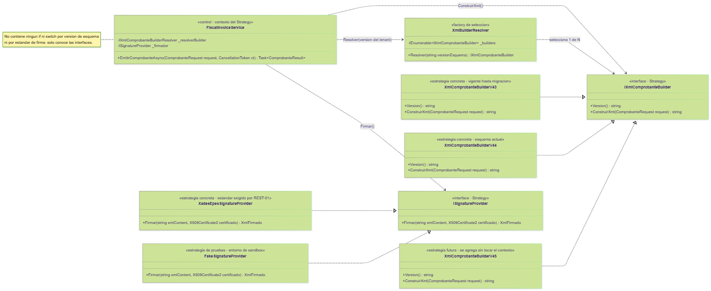
*Figura 26 — Aplicación real del patrón Strategy: construcción de XML por versión de esquema y proveedor de firma en el Componente 1. Código fuente en `/diagramas/patron-strategy-xml-firma.mmd`.*

---

### Patrón 2 — State (máquina de estados del comprobante)

| Campo | Detalle |
|---|---|
| **Categoría** | Comportamiento |
| **Ubicación en el sistema** | **Componente 1 — Servicio de Facturación Fiscal** (§10.1), en la clase `ComprobanteStateMachine` y en el contrato `Transicionar(ComprobanteEstado, ComprobanteEvento)` de §10.1.2. Sus efectos se observan en los caminos D y E de la Figura 17 y en el Flujo 5 de §7.3. |
| **Problema que resuelve** | El comprobante electrónico tiene un ciclo de vida con **transiciones irreversibles y con consecuencia legal**: una factura aceptada por Hacienda no puede modificarse ni eliminarse (invariante 1 de §1.6), el sistema nunca puede fijar por su cuenta el estado `Aceptado` (Hacienda es la fuente de verdad), y una factura no puede pasar a "notificada" sin estado fiscal válido o `PendienteValidacionHacienda` (invariante 5). Además, el mismo comprobante recibe eventos desde **cuatro orígenes distintos** —el controller REST interno, el consumidor AMQP, la respuesta de Hacienda y el reintento del Componente 2—, y cada uno podría intentar una transición inválida o repetida. QS-06 exige que una segunda respuesta de aceptación sobre un comprobante ya aceptado produzca exactamente cero efectos. |
| **Alternativa considerada** | Un campo `estado` en la entidad `Comprobante` validado con condicionales en cada punto donde se cambia (`if (comprobante.Estado == Enviado) comprobante.Estado = Aceptado;`), que es la forma habitual de manejar estados en un CRUD. Se evaluó también delegar el ciclo de vida a un **motor de workflow externo**, aprovechando que el proyecto ya contempla un motor de automatización. |
| **Por qué el patrón y no la alternativa** | Contra la validación dispersa: con cuatro orígenes de eventos, la regla "solo Hacienda fija el estado fiscal" tendría que repetirse en cuatro lugares y mantenerse sincronizada en los cuatro; basta que un punto olvide la comprobación para que el sistema viole una invariante con consecuencia legal, y eso no lo detecta ninguna prueba unitaria de ese punto. Concentrar la tabla de transiciones en un solo objeto convierte el conjunto de transiciones legales en un **artefacto único, enumerable y testeable**: la prueba "no existe transición de salida desde `Aceptado`" se escribe una vez y protege al sistema entero. Además, la ausencia de una transición es la forma en que el diseño implementa la idempotencia frente a respuestas duplicadas de Hacienda: no hace falta código defensivo adicional, la transición simplemente no existe y se lanza `InvalidStateTransitionException`, que la capa REST traduce a `409 Conflict`. Contra el motor de workflow externo: **REST-05 lo prohíbe explícitamente** —el motor de automatización no puede coordinar la transacción fiscal ni cambiar estados fiscales—, y adoptarlo sacaría del sistema la lógica de mayor consecuencia legal, justo lo contrario de lo que decidió ADR-001. |
| **Consecuencia aceptada** | La tabla de transiciones es un punto de cambio obligado: agregar un estado (por ejemplo, `AnuladoPorNotaDeCredito`) exige tocar `ComprobanteStateMachine`. Se acepta porque es exactamente el lugar donde queremos que se discuta y se revise ese cambio. |

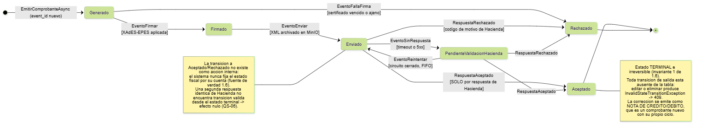
*Figura 27 — Aplicación real del patrón State: tabla de transiciones de `ComprobanteStateMachine`, con los estados terminales irreversibles y las transiciones deliberadamente ausentes. Código fuente en `/diagramas/patron-state-comprobante.mmd`.*

---

### Patrón 3 — Transactional Outbox

| Campo | Detalle |
|---|---|
| **Categoría** | Comportamiento (patrón de integración) |
| **Ubicación en el sistema** | **Los tres componentes.** Lado escritor: `OutboxWriter` en el Componente 1 (§10.1.3) y en el Componente 3 (`PreventaService`, `CotizacionService`, `EmisionOrquestador`, §10.3.1). Lado relevo: `OutboxRelayWorker` + `OutboxSqlRepository` en el Componente 2 (§10.2.1, contrato `ReclamarLoteAsync`). Es la materialización de ADR-002. |
| **Problema que resuelve** | Es el problema de la **escritura dual**: cada operación de negocio del sistema debe producir dos efectos que tienen que ocurrir juntos o no ocurrir —un cambio de estado en SQL Server y un evento que dispare auditoría, notificación o emisión fiscal—, pero viven en tecnologías distintas (base de datos y RabbitMQ) que no comparten transacción. Si se confirma la base de datos y luego falla la publicación, existe una factura sin evento de auditoría, lo que viola RF-05 y la medida de QS-04 (100 % de comprobantes con evento de auditoría). Si se publica primero y falla el commit, se notifica al cliente una factura que no existe. A esto se suma la restricción de rendimiento: QS-04 admite ≤ 80 ms de latencia adicional por comprobante, de modo que la auditoría no puede resolverse con una llamada síncrona a otro contenedor dentro del hilo de request. |
| **Alternativa considerada** | Dos alternativas reales. **(a) Transacción distribuida (2PC / `TransactionScope` con MSDTC)** abarcando SQL Server y el broker, que resolvería la atomicidad de forma directa. **(b) Publicar directamente al broker inmediatamente después del commit**, con reintentos en memoria si la publicación falla. Se evaluó además **(c) Change Data Capture** (Debezium sobre el log de transacciones) como forma de derivar los eventos sin tabla intermedia. |
| **Por qué el patrón y no la alternativa** | Contra **(a)**: el two-phase commit introduce un coordinador transaccional como punto único de fallo y bloqueos que sostienen recursos durante toda la ventana de coordinación, degradando justamente el escenario de emisión masiva de QS-04 (200 facturas en lote); además, RabbitMQ no participa en 2PC de forma nativa, y operar MSDTC excede lo razonable para un equipo de tres personas (REST-06). Contra **(b)**: es precisamente el escenario que el patrón evita — si el proceso muere entre el commit y la publicación, el evento se pierde sin dejar rastro, y la medida "ningún documento encolado se pierde ante reinicios" (QS-02) deja de ser demostrable. Contra **(c)**: CDC evita la tabla intermedia pero acopla el contrato de eventos al esquema físico de las tablas, exige infraestructura adicional (conector, Kafka Connect o equivalente) y deja de ser un artefacto que el equipo pueda inspeccionar con una consulta SQL durante una incidencia. El outbox gana porque **usa la transacción local que ya existe**: el evento se escribe como una fila más en la misma base de datos y en la misma transacción que el cambio de estado, con costo de una inserción indexada (dentro del presupuesto de 80 ms), y convierte un problema de atomicidad distribuida en uno de entrega *at-least-once*, que se cierra con la deduplicación por `event_id` del `IdempotencyGuard` para obtener exactamente un efecto de negocio (QS-06). |
| **Consecuencia aceptada** | El log de auditoría final es **eventualmente consistente**: hay una ventana de segundos entre el commit y la entrada visible en el Almacén de Auditoría. Se acepta porque la evidencia durable ya existe en el outbox desde el commit, y la ventana queda trazada con los timestamps de encolado y confirmación (§8.3, §13.1). El costo operativo es un proceso más que monitorear —el relay— y la necesidad de un mecanismo de *lease* para permitir varias réplicas sin doble publicación (§7.5). |

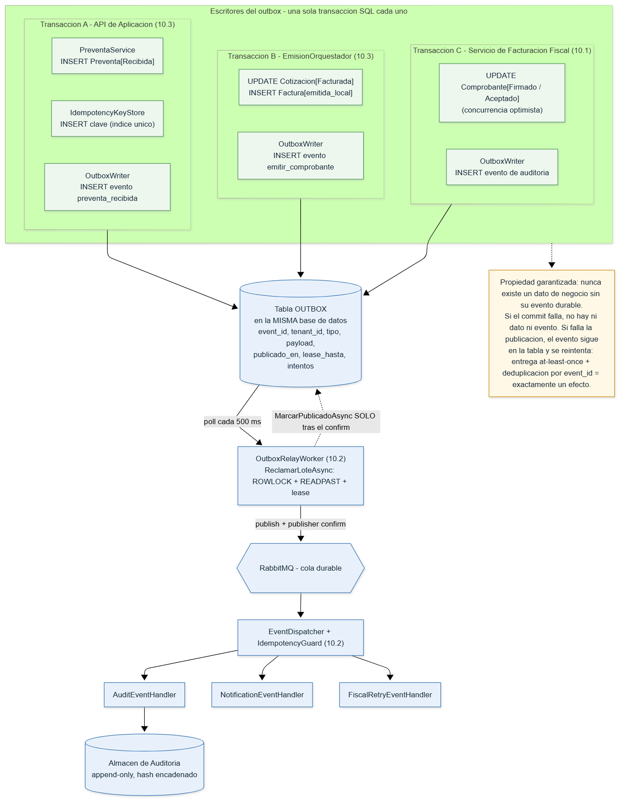
*Figura 28 — Aplicación real del patrón Transactional Outbox: los tres escritores transaccionales, la tabla outbox compartida y el relevo hacia el broker con marcado posterior al *publisher confirm*. Código fuente en `/diagramas/patron-transactional-outbox.mmd`.*

---

### Patrón 4 — Retry con backoff exponencial + Circuit Breaker

| Campo | Detalle |
|---|---|
| **Categoría** | Comportamiento (patrón de resiliencia) |
| **Ubicación en el sistema** | **Componente 1** — política de resiliencia de `HaciendaHttpClient` (§10.1.1, contrato `EnviarComprobanteAsync` con `BrokenCircuitException`). **Componente 2** — `ResiliencePolicyFactory`, que centraliza la política y el estado del circuito por destino y la aplica en `FiscalRetryEventHandler` y `NotificationEventHandler` (§10.2.1, §10.2.2). Se observa en el camino C de la Figura 17 y en el camino C de la Figura 21. |
| **Problema que resuelve** | El sistema depende de tres servicios externos cuya disponibilidad no controla: la API de Hacienda, el Servicio de Correo y —desde los workers— el propio Servicio de Facturación Fiscal. QS-02 exige que, ante una caída de Hacienda de 30+ minutos, la degradación perceptible sea ≤ 2 s, que ningún documento encolado se pierda y que la cola se procese en ≤ 10 min tras la restauración, **sin intervención manual**. El problema concreto tiene dos caras: por un lado no rendirse ante un fallo transitorio (un timeout aislado no debe convertirse en una factura perdida); por el otro, no seguir golpeando un destino que está caído, porque los reintentos ciegos consumen los workers, saturan la cola y prolongan la recuperación del servicio remoto cuando vuelve. |
| **Alternativa considerada** | **(a)** Reintento simple con intervalo fijo y número máximo de intentos, sin cortar el circuito. **(b)** Sin reintento: marcar el comprobante como fallido y exponer un botón de "reenviar" para que el asistente administrativo lo reintente manualmente. |
| **Por qué el patrón y no la alternativa** | Contra **(a)**: el reintento fijo resuelve el fallo transitorio pero no el sostenido. Con Hacienda caída 30 minutos y un intervalo fijo de 10 s, cada comprobante encolado genera ~180 llamadas inútiles; con decenas de comprobantes pendientes, los workers quedan ocupados reintentando y no procesan auditoría ni notificaciones, degradando escenarios que nada tienen que ver con Hacienda. El circuit breaker corta ese consumo: mientras está abierto, la llamada falla de inmediato con `BrokenCircuitException` y el mensaje se reencola con backoff. Además, el backoff **con jitter** evita el efecto de manada al reconectar, cuando todos los mensajes pendientes intentarían salir en el mismo instante. Contra **(b)**: viola la medida explícita de QS-02 ("sin intervención manual") y traslada al usuario un problema de infraestructura; en un flujo con consecuencia fiscal, depender de que alguien recuerde reenviar es un riesgo de cumplimiento. Un detalle de diseño que justifica la combinación de ambos patrones y no solo uno: la política **distingue errores transitorios de no transitorios** —un certificado vencido o un `4xx` de esquema no se reintenta nunca, va directo a la dead letter queue (camino B de la Figura 17)—, porque reintentar un error determinista solo consume la cola sin posibilidad de éxito. |
| **Consecuencia aceptada** | Cada destino mantiene su propio circuito y su propio estado en memoria del worker, lo que implica que con varias réplicas el circuito se abre por réplica y no de forma global. Se acepta para esta escala (cientos de facturas/día, una a dos réplicas): el costo de coordinar el estado del circuito entre réplicas —un almacén compartido— no se justifica frente al beneficio, y el efecto práctico es a lo sumo unas pocas sondas adicionales hacia el destino caído. |

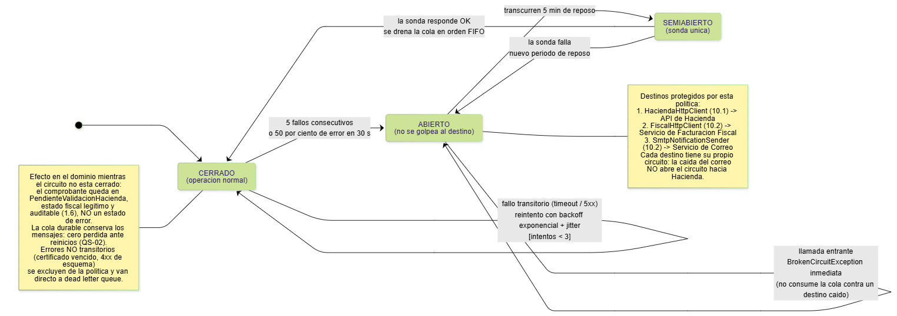
*Figura 29 — Aplicación real de Retry + Circuit Breaker: estados del circuito con los umbrales configurados, destinos protegidos y efecto sobre el estado fiscal del comprobante. Código fuente en `/diagramas/patron-circuit-breaker-retry.mmd`.*

---

### Patrón 5 — Repository + Unit of Work con contexto de tenant obligatorio

| Campo | Detalle |
|---|---|
| **Categoría** | Estructural (Repository) combinado con Comportamiento (Unit of Work) |
| **Ubicación en el sistema** | **Componente 3 — API de Aplicación** (§10.3.1): `IPreventaRepository` / `PreventaSqlRepository`, `ICotizacionRepository`, `IIdempotencyKeyStore` e `IOutboxWriter`, coordinados por `IUnitOfWork` en `PreventaService`, `CotizacionService` y `EmisionOrquestador`. El mismo patrón se reutiliza en el **Componente 1** (`ComprobanteSqlRepository`, §10.1.3). El `ITenantContext` que consumen lo publica `TenantAuthorizationMiddleware` (§10.3.3). |
| **Problema que resuelve** | Dos problemas que el diseño resuelve con la misma pieza. **(1) Aislamiento multi-tenant:** la invariante 7 de §1.6 exige que ninguna consulta a repositorios de datos fiscales se ejecute sin un `tenant_id` válido, y QS-01 mide 100 % de intentos de acceso cruzado bloqueados. El riesgo real no es que alguien escriba código malicioso, sino que un desarrollador olvide el filtro en una consulta nueva un martes cualquiera. **(2) Atomicidad de operaciones compuestas:** el handoff de preventa debe registrar la clave de idempotencia, crear la preventa y escribir el evento outbox de forma indivisible; si fueran tres commits, existiría una ventana en la que la preventa existe sin clave registrada, y un handoff duplicado que llegara en ese instante crearía una segunda preventa, rompiendo QS-06 justo bajo condición de carrera. |
| **Alternativa considerada** | **(a)** Acceso directo con Entity Framework o consultas ADO.NET desde los servicios, agregando `WHERE tenant_id = @tenant` por disciplina y revisión de código, y usando `TransactionScope` ad hoc donde haga falta atomicidad. **(b)** Delegar todo el aislamiento a **Row-Level Security de SQL Server**, sin patrón en el código de aplicación. |
| **Por qué el patrón y no la alternativa** | Contra **(a)**: convierte una invariante del dominio en una convención de equipo. La diferencia de diseño está en el constructor — `ITenantContext` se inyecta como **dependencia obligatoria del repositorio, no como parámetro opcional del método**, de modo que no existe forma de instanciar el repositorio sin tenant resuelto; el compilador, no la revisión de código, es quien impide la consulta sin filtro. Es la tercera capa de la defensa en profundidad de QS-01 (§12), y la que sigue en pie si el middleware o el token fallan. Contra **(b)**: RLS es una buena red de seguridad y de hecho se mantiene como capa adicional, pero por sí sola no cubre el segundo problema —no aporta nada a la atomicidad de las tres escrituras del handoff—, ni permite responder `403` con auditoría del intento: una consulta filtrada por RLS simplemente devuelve cero filas, lo que el sistema no puede distinguir de "el recurso no existe", y QS-01 exige registrar el intento bloqueado en ≤ 500 ms. Se descartó también el patrón **Active Record** (la entidad se persiste a sí misma) porque colocaría el acceso a datos dentro de `Preventa` y `Comprobante`, disolviendo la separación boundary/control/entity que verifican los análisis de robustez de §10.1.3, §10.2.3 y §10.3.3, y haciendo imposible compartir una misma `IDbTransaction` entre tres entidades. |
| **Consecuencia aceptada** | Una capa de indirección más entre servicio y base de datos, y la disciplina de que toda operación compuesta pase por `IUnitOfWork`. A cambio, las pruebas de los servicios se ejecutan contra repositorios en memoria sin base de datos, lo que sostiene la cobertura ≥ 90 % que exige QS-05. |

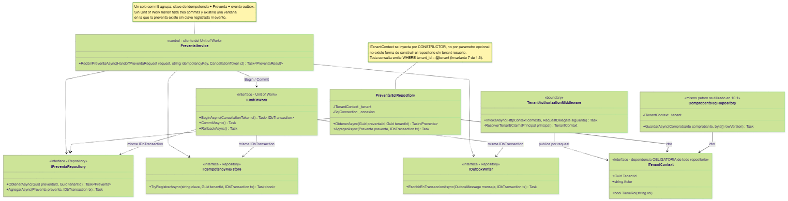
*Figura 30 — Aplicación real de Repository + Unit of Work: inyección obligatoria de `ITenantContext` por constructor y agrupación de las tres escrituras del handoff en una única `IDbTransaction`. Código fuente en `/diagramas/patron-repository-unitofwork-tenant.mmd`.*

---

### 11.1 Patrones considerados y descartados

Documentar lo que no se aplicó es tan informativo como lo que sí, porque muestra que la selección respondió a los drivers y no al catálogo.

| Patrón | Dónde se evaluó | Por qué se descartó |
|---|---|---|
| **Saga (orquestada o coreografiada)** | Coordinación de la emisión entre la API de Aplicación y el Servicio de Facturación Fiscal | Las sagas resuelven consistencia entre servicios con bases de datos separadas. Aquí los dos servicios comparten la misma base de datos transaccional (§8.1), de modo que la atomicidad se logra con una transacción local + outbox. Introducir compensaciones agregaría complejidad sin resolver ningún problema existente. Se reconsideraría si el Servicio Fiscal migrara a su propia base de datos. |
| **Event Sourcing + CQRS** | Almacén de auditoría y reconstrucción de estado del comprobante | Atractivo por la trazabilidad, pero el volumen (cientos de comprobantes/día) no justifica reconstruir estado desde eventos, y añadiría proyecciones y consistencia eventual a un dominio donde el estado actual es lo que se consulta el 99 % del tiempo. El log append-only con hashes encadenados cubre RF-05 y QS-04 con una fracción del costo (§15.1). |
| **Observer / eventos en proceso (MediatR)** | Desacople entre emisión, auditoría y notificación | Un bus en memoria pierde los eventos si el proceso se reinicia, lo que rompe la medida de QS-02 ("ningún documento encolado se pierde ante reinicios"). El outbox + broker durable sí la sostiene (§8.3). |
| **Singleton** para el cliente de Hacienda | Reutilización de la conexión HTTP y del certificado | El contenedor de dependencias de ASP.NET Core ya ofrece ciclos de vida gestionados y `IHttpClientFactory` resuelve el agotamiento de sockets; implementar Singleton a mano introduciría estado global difícil de probar y de aislar por tenant (cada tenant firma con su propio certificado). |
| **Template Method** | Flujo común de emisión con variantes por tipo de comprobante (factura, nota de crédito, nota de débito) | Se prefirió Strategy: la herencia fijaría el esqueleto del algoritmo en una clase base y las variantes fiscales quedarían acopladas entre sí, con el mismo problema de propagación de cambios que se rechazó en el Patrón 1. Hoy las tres variantes comparten flujo y difieren solo en el XML, que ya es responsabilidad de `IXmlComprobanteBuilder`. |

### 11.2 Cobertura de patrones por componente

| Componente | Patrones que aloja | Evidencia (clase / figura) |
|---|---|---|
| **C1 — Servicio de Facturación Fiscal** (§10.1) | Strategy, State, Transactional Outbox (escritor), Retry + Circuit Breaker, Repository, Adapter | `IXmlComprobanteBuilder`, `ComprobanteStateMachine`, `OutboxWriter`, `HaciendaHttpClient`, `ComprobanteSqlRepository` — Figuras 14, 26, 27, 28, 29 |
| **C2 — Procesador Asíncrono** (§10.2) | Transactional Outbox (relevo), Retry + Circuit Breaker, Strategy (`IEventHandler`), Publisher-Subscriber con Competing Consumers, Adapter | `OutboxRelayWorker`, `ResiliencePolicyFactory`, `EventDispatcher`, `RabbitMqPublisher` — Figuras 18, 28, 29 |
| **C3 — API de Aplicación (núcleo comercial)** (§10.3) | Repository + Unit of Work, Transactional Outbox (escritor), Facade (`EmisionOrquestador`), Policy (`CotizacionPolicy`), Chain of Responsibility (pipeline de middleware) | `PreventaSqlRepository`, `IUnitOfWork`, `EmisionOrquestador`, `CotizacionPolicy`, `TenantAuthorizationMiddleware` — Figuras 22, 28, 30 |

Los cinco patrones documentados en detalle son los que responden directamente a un escenario de calidad de §4. Los restantes que aparecen en esta tabla (Adapter, Facade, Policy, Publisher-Subscriber, Chain of Responsibility) están aplicados y visibles en los diagramas de clases de la sección 10, pero se mencionan sin ficha propia porque resuelven problemas de organización interna, no tensiones entre atributos de calidad.

---

## 12. Principios y técnicas habilitadoras — evidencia
 
> Para cada principio declarado en la sección 6, se aporta evidencia concreta con referencia a clase, interfaz, ADR o diagrama que demuestra su aplicación en SmartBilling Connect. Los principios evaluados son los siete comprometidos en la sección 6, sin omisiones ni adiciones.
 
| Principio | Evidencia concreta | Referencia |
|---|---|---|
| **Separación de responsabilidades** | El dominio fiscal está físicamente aislado del dominio comercial: el **Servicio de Facturación Fiscal** es un contenedor desplegable independiente de la **API de Aplicación** (§7.2.3). Esto no es una convención de carpetas sino una frontera de proceso y de red: la API de Aplicación llama al Servicio Fiscal por REST/HTTPS interno y nunca accede directamente a sus tablas. El **Procesador Asíncrono** (Workers) vive en un tercer proceso que se ocupa exclusivamente de relevar el outbox, reintentar envíos a Hacienda, escribir en el Almacén de Auditoría y despachar notificaciones. El **Identity Provider** (Keycloak) corre como cuarto contenedor con su propia base de datos. Cada unidad tiene un ciclo de cambio y un nivel de criticidad distinto: el Servicio Fiscal puede endurecerse o desplegarse sin tocar el CRM; los Workers pueden escalar sin afectar la API. | ADR-001 (Aislamiento del dominio fiscal), Diagrama C4 nivel 2 (§7.2.2, Figura 4), Tabla de contenedores (§7.2.3) |
| **Diseño para el cambio (bajo acoplamiento)** | El Servicio de Facturación Fiscal encapsula el esquema XML de Hacienda detrás de la interfaz `IXmlComprobanteBuilder` (§10.1.2). Si Hacienda publica una versión 4.4, se implementa un `XmlComprobanteBuilderV44` sin modificar `FiscalInvoiceService` ni ningún otro contenedor — el formato XML es un detalle interno del servicio. La firma digital está detrás de `ISignatureProvider`; la comunicación con Hacienda, detrás de `IHaciendaClient` con su política de reintentos y circuit breaker. En la frontera externa, el motor de automatización (sistema externo) entrega preventas por un contrato de handoff REST con `Idempotency-Key`; si se cambia la herramienta de automatización, la API de Aplicación no cambia porque solo conoce el contrato del endpoint, no al motor. | QS-05 (≤ 10 días hábiles, cero subsistemas ajenos), Contratos de interfaz (§10.1.2), Diagrama de clases del Componente 1 (Figura 14) y aplicación del patrón Strategy (Figura 26) |
| **Defensa en profundidad** | Contra el riesgo principal del sistema —la exposición cruzada de datos fiscales entre tenants (REST-03)— operan **cuatro capas independientes, y las cuatro deben fallar a la vez** para que un tenant vea datos de otro: **(1) Keycloak** autentica y emite el JWT con `tenant_id`, roles y alcances; un token ausente, expirado o con firma inválida se rechaza con `401` antes de tocar ningún servicio. **(2) `TenantAuthorizationMiddleware`** en la API de Aplicación y en el Servicio Fiscal evalúa RBAC y alcance y verifica que el recurso pertenezca al tenant del token, respondiendo `403` y auditando el intento. **(3) `ITenantContext` inyectado como dependencia obligatoria del constructor** de cada repositorio (§11 Patrón 5): no existe forma de construir una consulta sin `tenant_id` resuelto — es el compilador, no la revisión de código, quien lo impide. **(4) Row-Level Security de SQL Server** como red final, por debajo del repositorio. A esas cuatro se suman dos controles transversales que no son capas de aislamiento pero sí de contención del daño: **cifrado** en tránsito (TLS incluso interno) y en reposo (certificados de firma, datos personales — REST-07), y el **Almacén de Auditoría** append-only en contenedor separado, donde ningún actor —tampoco un administrador— puede modificar ni eliminar entradas (RF-05 y tabla de fuentes de verdad de §1.6), de modo que un acceso indebido queda registrado aunque se consume. | ADR-003 (multi-tenancy centralizada), QS-01 (cuatro capas deben fallar simultáneamente, §13.1), §11 Patrón 5, §14.5 (Information Disclosure), §7.1.1 (fronteras de confianza) |
| **Fuente de verdad única por entidad** | La tabla de fuentes de verdad de §1.6 se implementa de forma concreta: el estado fiscal del comprobante (`Aceptado`/`Rechazado`) lo determina exclusivamente **Hacienda** — el Servicio de Facturación Fiscal refleja y conserva ese estado pero nunca lo fija por su cuenta (`ComprobanteStateMachine` solo permite la transición `Enviado → Aceptado` o `Enviado → Rechazado` como resultado de una respuesta de Hacienda, no como acción interna). El estado `PendienteValidacionHacienda` es legítimo y auditable: marca la ventana entre el envío y la respuesta, con timestamps de encolado y confirmación (QS-02). La **preventa** la genera el motor de automatización y, una vez entregada por handoff, el motor no puede modificarla — solo el usuario interno la gestiona dentro de la API de Aplicación. El **registro de auditoría** es su propia fuente de verdad inmutable en un contenedor separado. | §1.6 (Tabla de fuentes de verdad e invariantes), §10.1.2 (`ComprobanteStateMachine.Transicionar`), QS-02, Flujo 1 de §7.3 (Figura 7) |
| **Idempotencia por diseño** | Toda operación con efecto de negocio que recibe eventos potencialmente duplicados implementa deduplicación por clave: (1) El **handoff de preventa** del motor usa una `Idempotency-Key` en el header HTTP; la API de Aplicación verifica la clave contra un almacén antes de crear la preventa — si ya existe, retorna 200 con el resultado previo sin ejecutar efecto (Flujo 2, Figura 8). (2) El **Servicio de Facturación Fiscal** verifica `event_id` antes de procesar un evento `emitir_comprobante` relevado desde el outbox — un reintento del Procesador Asíncrono no genera una segunda factura (§10.1.2, contrato de `EmitirComprobanteAsync`). (3) Los **callbacks de Hacienda** se deduplican por ID de comprobante: una respuesta duplicada de aceptación no cambia el estado de un comprobante ya aceptado (transición inválida en `ComprobanteStateMachine`). | RF-06 (driver de idempotencia), QS-06 (100 % eventos duplicados producen exactamente un efecto), ADR-002 (outbox con deduplicación por `event_id`) |
| **Principio de menor privilegio (PoLA)** | El motor de automatización se autentica con credencial de integración OAuth2 propia (no sesión de usuario humano) y recibe un token con alcance que **no incluye acceso al dominio fiscal** (§3.4, REST-05). Concretamente: puede hacer POST al endpoint de handoff de preventa y GET a estados públicos, pero no puede invocar ningún endpoint del Servicio de Facturación Fiscal ni escribir en la tabla de comprobantes. Esto se verifica en el flujo 2 (Figura 8). Dentro del sistema, los roles RBAC (administrador, vendedor, asistente administrativo) limitan las operaciones por usuario: un vendedor puede crear cotizaciones y convertirlas en facturas, pero no puede modificar parámetros fiscales ni acceder a la configuración de tenants — eso es exclusivo del administrador (RF-04, §1.4). El Procesador Asíncrono tiene permiso insert-only sobre el Almacén de Auditoría y nunca update ni delete. | §3.4 (Tabla: el motor SÍ/NO puede), Flujo 2 (§7.3, Figura 8), ADR-003 (resolución de `tenant_id` en autorización) |
| **KISS / YAGNI** | Se eligió una arquitectura service-based con 4 servicios de grano grueso en lugar de microservicios finos (§8.2): esto da la frontera física que el dominio fiscal necesita sin proliferar infraestructura distribuida. La base de datos transaccional es una única instancia de SQL Server compartida (con aislamiento lógico por `tenant_id`), no una BD por servicio. El Identity Provider es Keycloak (producto maduro, gratuito, no desarrollo propio). El broker es RabbitMQ (open-source, un solo contenedor, configuración estándar). No se adoptó event sourcing ni CQRS porque el volumen de eventos (cientos/día) no lo justifica (§15.1): la tabla de auditoría append-only cubre la trazabilidad fiscal sin la complejidad de reconstruir estado desde eventos. Cada decisión de complejidad fue evaluada contra REST-06 (equipo de 3 personas). | ADR-001 (justificación service-based vs. microservicios), §8.2 (alternativas rechazadas), §15.1 (postura frente a event sourcing) |
 
### 12.1 Tensiones entre principios y cómo se resolvieron
 
> Cuando dos principios entran en conflicto, se debe tomar una decisión explícita. Las siguientes tensiones se identificaron durante el diseño de SmartBilling Connect.
 
| Tensión | Principio A | Principio B | Cómo se resolvió | ADR/Referencia |
|---|---|---|---|---|
| **KISS vs. Separación de responsabilidades** | KISS dice que menos unidades desplegables es mejor: un solo proceso sería lo más simple de operar para un equipo de 3 (REST-06). | Separación de responsabilidades dice que el dominio fiscal debe tener una frontera física, no solo lógica, para impedir que el motor de automatización o el código comercial crucen al ámbito regulado. | Se priorizó la separación pero acotada: solo 4 servicios de grano grueso, no 8-10 microservicios (§8.2). El Servicio de Facturación Fiscal se extrajo como contenedor propio porque REST-05 y QS-05 lo exigen como barrera arquitectónica, no como convención. KISS se aplicó dentro de cada servicio (implementaciones directas, sin sobre-abstracción) y en la infraestructura (un solo broker, una sola BD transaccional, un solo Identity Provider). | ADR-001, §8.1, §8.2 |
| **Fuente de verdad única vs. Disponibilidad** | Fuente de verdad única (§1.6) dice que el estado fiscal lo determina Hacienda: sin respuesta de Hacienda, el estado es indefinido. | Disponibilidad (QA-02, QS-02) exige que el sistema siga facturando aunque Hacienda no responda durante 30+ minutos. | Se modeló `PendienteValidacionHacienda` como un estado fiscal legítimo y auditable — no es un hack ni un estado de error, sino la representación honesta de "enviado, esperando veredicto". El log de auditoría captura el timestamp de encolado y el de confirmación posterior, preservando la trazabilidad sin bloquear la operación. Hacienda sigue siendo la autoridad del estado final, pero el sistema puede operar mientras espera. | QS-02, §1.6 (tabla de fuentes de verdad), Flujo 1 §7.3 (camino de degradación) |
| **Defensa en profundidad vs. KISS** | Defensa en profundidad exige 4 capas de seguridad (Keycloak, RBAC, cifrado, auditoría inmutable), cada una con configuración y mantenimiento. | KISS dice que cada capa añadida es complejidad que el equipo de 3 personas debe mantener (REST-06). | Se implementaron las 4 capas usando componentes que minimizan el esfuerzo operativo: Keycloak es un producto gestionado (no un desarrollo propio de autenticación), el middleware de autorización es reutilizable en la API y en el Servicio Fiscal (mismo código, dos despliegues), el cifrado usa TLS estándar y funciones nativas de SQL Server (no un servicio externo), y la auditoría es un subscriber del outbox que escribe en un esquema insert-only (sin infraestructura adicional más allá del Procesador Asíncrono que ya existe). La profundidad se mantiene, pero cada capa es la implementación más simple que cumple el requisito. | ADR-002, ADR-003, §7.2.3 (contenedores) |
| **Idempotencia por diseño vs. Rendimiento** | Idempotencia (RF-06, QS-06) exige verificar una clave de deduplicación antes de cada operación con efecto de negocio, lo que añade una consulta al almacén de claves en cada evento. | Rendimiento (QA-04, QS-03) exige procesar 50 eventos/minuto en ≤ 4 s P95 sin degradación. | Se aplicó idempotencia solo a operaciones con efecto de negocio (handoff de preventa, emisión de comprobante, callbacks de Hacienda), no a consultas de solo lectura. La verificación usa un índice único sobre la clave de idempotencia en SQL Server, con costo marginal por consulta (lookup por índice, no full scan). Para el handoff de preventa, la verificación y la creación ocurren en la misma transacción, sin round-trip adicional. El overhead medido es despreciable frente al costo de las operaciones de red (Hacienda: cientos de ms; handoff: decenas de ms). | RF-06, QS-06, QS-03, §10.1.2 (contrato de `EmitirComprobanteAsync`) |
 
---

# BLOQUE 6 — CALIDAD Y TRAZABILIDAD
*Hito: Entrega final (S14)*

---

## 13. Análisis de calidad del diseño
### 13.1 Validación de escenarios de calidad contra el diseño final
 
> Para cada escenario QS-XX de la sección 4, se argumenta cómo el diseño final lo satisface. Las medidas requeridas son las definidas en la sección 4; la columna "Cómo el diseño lo satisface" referencia las decisiones concretas (contenedores, componentes, ADRs, patrones) que lo habilitan. Se incluye el riesgo residual donde corresponde.
 
| Escenario | Medida requerida (§4) | Cómo el diseño lo satisface | Decisiones que lo habilitan | Riesgo residual |
|---|---|---|---|---|
| **QS-01 — Seguridad: acceso no autorizado a datos de otro tenant** | 100 % de intentos bloqueados con HTTP 403 en la suite de pruebas de autorización. Ninguna consulta sin `tenant_id` válido llega a repositorios fiscales. Evento de auditoría registrado en ≤ 500 ms. | **Cuatro capas independientes deben fallar simultáneamente** para que el acceso cruce tenants: (1) **Keycloak** valida el JWT y extrae `tenant_id`, roles y alcances; si el token es inválido o ausente, rechaza con 401 antes de tocar cualquier servicio. (2) **`TenantAuthorizationMiddleware`** en la API de Aplicación y el Servicio Fiscal verifica que el recurso solicitado pertenezca al `tenant_id` del token; si no coincide, rechaza con 403. (3) **`ITenantContext` como dependencia obligatoria del constructor** de cada repositorio (`ComprobanteSqlRepository`, `PreventaSqlRepository`): ninguna consulta puede omitir el filtro por `tenant_id` porque no existe forma técnica de instanciar el repositorio sin el contexto resuelto — no es un parámetro opcional (§11 Patrón 5). (4) **Row-Level Security de SQL Server** como red final por debajo del repositorio, para la ruta que se saltara las tres anteriores. El intento fallido se persiste en el outbox dentro de la misma transacción y el Procesador Asíncrono lo escribe en el Almacén de Auditoría append-only. | ADR-003 (tenant_id centralizado), ADR-001 (frontera física del Servicio Fiscal), §11 Patrón 5 (`ITenantContext` por constructor), §7.1.1 (fronteras de confianza), §1.6 (invariante 7: ninguna consulta sin tenant_id válido) | Un desarrollador podría saltarse el repositorio y escribir una query ADO.NET manual sin filtro de tenant: en ese caso las capas (2) y (3) no intervienen y todo queda en manos de la capa (4), RLS. Se mitiga con revisión de código y tests de integración que verifican que toda ruta de acceso pasa por el contexto de tenant (§14.5, riesgos residuales). |
| **QS-02 — Disponibilidad: fallo del servicio de Hacienda** | Degradación perceptible ≤ 2 s. Documentos encolados procesados en ≤ 10 min tras restauración. Disponibilidad del flujo local ≥ 99.5 % mensual. Ningún documento encolado se pierde ante reinicios. | Cuando Hacienda retorna timeout o 5xx, el Servicio de Facturación Fiscal transiciona el comprobante a `PendienteValidacionHacienda` (estado fiscal legítimo y auditable, §1.6) y publica el evento de reintento al broker. El **Procesador Asíncrono** reintenta con backoff exponencial y circuit breaker: si Hacienda sigue caído, el circuito se abre por 5 minutos y deja de intentar, evitando saturación. Al restaurarse, la cola FIFO se procesa en orden sin intervención manual. El usuario solo percibe el cambio de estado en la SPA (≤ 2 s de degradación visual). La durabilidad la garantiza **RabbitMQ** (cola durable con persistencia en disco): un reinicio del sistema no pierde mensajes encolados. El resto del sistema (CRM, preventas, cotizaciones) no se ve afectado porque la emisión fiscal es asíncrona (outbox → broker → Servicio Fiscal). | ADR-002 (outbox transaccional), ADR-001 (Servicio Fiscal aislado), Flujo 1 §7.3 (Figura 7, camino de degradación) y Flujo 3 (Figura 9, recuperación), §14.1 (reintentos y circuit breaker) | La ventana de inconsistencia temporal: durante la indisponibilidad, el comprobante existe internamente pero Hacienda no lo ha validado. Se mitiga con el estado `PendienteValidacionHacienda` que hace esa ventana visible y auditable, no silenciosa. |
| **QS-03 — Rendimiento: 50 webhooks en 60 s durante campaña de ventas** | Respuesta extremo a extremo ≤ 4 s P95 (webhook → respuesta al cliente). Throughput ≥ 50 eventos/min. Tasa de no procesados < 1 %. | El procesamiento de webhooks ocurre **fuera del sistema**: el motor de automatización (externo) recibe los webhooks de Meta/TikTok, responde al cliente y guía hacia la app. SmartBilling Connect solo recibe el resultado como **handoff de preventa** — un POST REST con `Idempotency-Key`. Esto desacopla la latencia social de la operación interna: el P95 de 4 s se mide en la capa del motor, donde no hay transacción fiscal ni escritura de outbox en el camino crítico. Dentro del sistema, el handoff es una operación ligera (validar clave, crear preventa, escribir outbox, responder 201) que no compite con la emisión fiscal. La API de Aplicación no procesa webhooks de redes sociales directamente — esa es responsabilidad del motor, que escala de forma independiente. | REST-05 y §3.4 (frontera del motor), Flujo 2 §7.3 (Figura 8), §8.1 (el motor absorbe los picos de mensajería social) | Si el motor de automatización se satura, las respuestas a clientes se degradan fuera del control del sistema. Se mitiga documentando requisitos de capacidad del motor como parte del contrato operativo, pero el riesgo es inherente a una dependencia externa. |
| **QS-04 — Trazabilidad: auditoría ante emisión masiva (200 facturas en lote)** | Evento de auditoría persistido en outbox durable antes de responder (misma transacción). Latencia adicional del outbox ≤ 80 ms por comprobante. 100 % de comprobantes con evento de auditoría en la suite de pruebas. Integridad del log verificable por hashes encadenados. Retención ≥ 5 años. | El patrón **Transactional Outbox** (ADR-002) es la pieza central: `FiscalInvoiceService.EmitirComprobanteAsync` escribe el comprobante (estado `Firmado`) y su evento de auditoría en la tabla outbox **dentro de la misma transacción de SQL Server** — si la transacción falla, ni el comprobante ni el evento existen; si confirma, ambos están durablemente persistidos. El `OutboxWriter` (§10.1.3) es el responsable de esa escritura transaccional. El Procesador Asíncrono releva el outbox al broker y desde ahí escribe en el **Almacén de Auditoría** (contenedor separado, insert-only, §7.2.3). El log final es eventualmente consistente, pero el evento durable ya existe en el outbox antes de que el sistema retorne respuesta. Los hashes encadenados en el Almacén de Auditoría hacen que alterar una entrada invalide todas las posteriores. El actor que originó cada comprobante (usuario humano o proceso interno de cierre de mes) queda registrado con su identidad, tenant y timestamp con precisión de milisegundo. | ADR-002 (outbox transaccional), §10.1.2 (contrato de `EmitirComprobanteAsync`), §10.1.3 (`OutboxWriter`), §7.2.3 (Almacén de Auditoría append-only) | Ventana de segundos entre el commit transaccional y la entrada visible en el Almacén de Auditoría final. Durante esa ventana, la evidencia existe en el outbox pero no es consultable desde la interfaz de auditoría. Se mitiga registrando timestamps de encolado y de confirmación para que la ventana quede trazada. |
| **QS-05 — Modificabilidad: nuevo esquema XML de Hacienda** | Tiempo total publicación → despliegue validado ≤ 10 días hábiles. Subsistemas ajenos al módulo fiscal que requieren modificación: cero. Cobertura de pruebas ≥ 90 %. | El **Servicio de Facturación Fiscal** es un contenedor desplegable independiente (ADR-001): tiene su propio pipeline CI/CD, su propia imagen Docker y su propio ciclo de releases. El cambio de esquema XML se localiza exclusivamente en la implementación de `IXmlComprobanteBuilder` (§10.1.2): se crea `XmlComprobanteBuilderV44`, se actualizan las validaciones y se ajustan los tests unitarios del servicio. La interfaz `IXmlComprobanteBuilder` no cambia — `FiscalInvoiceService` la consume sin conocer la versión del esquema (inversión de dependencia). Ningún otro contenedor se modifica: la API de Aplicación llama al Servicio Fiscal por la misma interfaz REST, los Workers relevan los mismos eventos del outbox, Keycloak no participa del flujo XML. El despliegue del Servicio Fiscal se hace de forma independiente, en caliente, sin downtime para los demás contenedores. | ADR-001 (aislamiento físico del dominio fiscal), §10.1.2 (interfaz `IXmlComprobanteBuilder`), §8.1 (justificación de service-based) | Durante la ventana de despliegue en caliente, pueden coexistir dos versiones del Servicio Fiscal. Las entradas de auditoría incluyen la versión del esquema XML para mantener trazabilidad entre versiones. El riesgo es que Hacienda cambie el esquema de forma incompatible hacia atrás; se mitiga porque `IXmlComprobanteBuilder` permite mantener dos implementaciones activas simultáneamente con routing por versión. |
| **QS-06 — Idempotencia: evento externo duplicado** | 100 % de eventos duplicados reconocidos producen exactamente un efecto de negocio. Ninguna operación fiscal marcada como idempotente genera segundo comprobante. Ventana de deduplicación ≥ periodo máximo de reintento por canal. | Tres puntos de entrada implementan deduplicación por clave: (1) **Handoff de preventa**: la API de Aplicación verifica la `Idempotency-Key` del header contra un índice único en SQL Server; si la clave existe, retorna 200 con el resultado previo sin crear segunda preventa (Flujo 2, Figura 8). (2) **Emisión fiscal**: el Servicio de Facturación Fiscal verifica `event_id` del evento AMQP antes de procesar `emitir_comprobante`; un reintento del Procesador Asíncrono no genera segunda factura (§10.1.2). (3) **Callbacks de Hacienda**: `ComprobanteStateMachine` rechaza transiciones inválidas — una respuesta duplicada de "Aceptado" sobre un comprobante ya aceptado no produce ningún efecto (transición `Aceptado → Aceptado` no existe en la tabla de transiciones). En los tres casos, la respuesta al duplicado es idéntica a la original: el sistema se comporta como si el evento hubiera llegado exactamente una vez. | ADR-002 (outbox con deduplicación), RF-06, §10.1.2 (`ComprobanteStateMachine.Transicionar` con `InvalidStateTransitionException`), Flujo 2 §7.3 | La ventana de deduplicación tiene un límite temporal: las claves de idempotencia se conservan por el periodo máximo de reintento configurado (ej. 72 h para webhooks, 7 días para preventas). Un duplicado que llegue después de ese periodo podría procesarse como nuevo. Se mitiga porque los reintentos de las fuentes externas (Meta, Hacienda, motor) tienen timeouts muy inferiores a esa ventana. |
| **QS-07 — Interoperabilidad: sustitución del motor de automatización** | Cero contenedores modificados y cero redespliegues. Primer handoff válido del motor nuevo en ≤ 5 días hábiles. La suite de pruebas de contrato del endpoint de handoff pasa sin cambios. | El motor nunca fue una dependencia de código del sistema, sino un **consumidor de un contrato**: `POST /api/v1/preventas` con credencial OAuth2 *client credentials* e `Idempotency-Key` (§10.3.2). La API de Aplicación no conoce la herramienta, solo valida token, alcance `preventas:write` y clave de idempotencia — el mismo camino para cualquier emisor. Dar de alta un motor distinto es crear un cliente en Keycloak y entregarle la especificación del endpoint: no hay código que tocar ni contenedor que redesplegar, porque la frontera de REST-05 se materializó como un único punto de entrada y no como una integración punto a punto. Los canales sociales tampoco cambian: nunca tocaron el sistema (§7.1.1). Los otros dos ecosistemas de QA-03 ya están aislados tras interfaz — Hacienda tras `IXmlComprobanteBuilder` / `IHaciendaClient` (QS-05) y el correo tras `INotificationSender`. | REST-05 y §3.4 (frontera y contrato de handoff), ADR-001 (el dominio fiscal nunca se expone al motor), §10.3.2 (contrato de `RecibirPreventaAsync`), §15.2 (punto de extensión "Contrato de handoff de preventa") | El contrato admite otro **motor**, no otro **tipo de actor**: si la herramienta nueva necesitara crear cotizaciones o comprobantes, no sería una sustitución sino una violación de §3.4, y exigiría rediseñar la frontera. Además, cada motor adicional es una credencial más que proteger (tensión declarada en QS-07). |
 
### 13.2 Trade-offs entre atributos de calidad
 
> Los conflictos reales entre atributos de calidad donde se tomó una decisión explícita. Cada trade-off referencia el escenario de la sección 4 donde se manifiesta.
 
| Atributo A | Atributo B | Tensión | Decisión tomada | Consecuencia aceptada |
|---|---|---|---|---|
| **Seguridad (QA-01)** | **Rendimiento (QA-04)** | Cada request pasa por las 4 capas de validación de §13.1 (JWT en Keycloak, RBAC y tenant en middleware, filtro obligatorio del repositorio, RLS en SQL Server) antes de ejecutar la operación de negocio. Cada capa añade latencia. La tensión se intensifica en QS-03 (50 eventos/min) y QS-04 (200 facturas en lote). | Se priorizó seguridad. El overhead de validación se minimizó: JWT se verifica localmente contra la clave pública de Keycloak (sin llamada de red por request), los permisos RBAC se cachean en memoria por sesión, y tanto el filtro de `tenant_id` del repositorio como el predicado de RLS resuelven por índice (costo marginal, no *full scan*). | Se acepta un overhead de ~10-20 ms por request por las 4 capas. No afecta el objetivo de ≤ 4 s P95 en QS-03 (el handoff de preventa es una operación ligera) ni de ≤ 80 ms de outbox en QS-04 (el outbox es una escritura transaccional, no un request externo). |
| **Disponibilidad (QA-02)** | **Consistencia / Integridad fiscal (QA-01)** | QS-02 requiere que el sistema siga facturando cuando Hacienda no responde. Pero QS-04 e invariante 5 de §1.6 exigen que toda factura tenga su entrada de auditoría y un estado fiscal válido. Durante la indisponibilidad, el estado real ante Hacienda es desconocido. | Se priorizó consistencia para transacciones fiscales mediante el patrón outbox: la factura y su evento de auditoría se confirman en la misma transacción de SQL Server (ADR-002). Si la BD falla, la factura no se emite. Para la ventana de indisponibilidad de Hacienda, se modeló `PendienteValidacionHacienda` como estado fiscal legítimo — no es consistencia eventual sino una representación fiel de la realidad: "enviado, esperando veredicto". | Si SQL Server tiene problemas de escritura, la factura no se emite hasta que se resuelvan — la disponibilidad del flujo de emisión depende de la BD. Se acepta una disponibilidad ligeramente menor a cambio de integridad fiscal absoluta. Para operaciones no fiscales (notificaciones, logs informativos), sí se usa consistencia eventual vía eventos. |
| **Modificabilidad (QA-05)** | **Complejidad operativa (REST-06)** | QS-05 exige que el Servicio Fiscal se despliegue de forma independiente, lo que implica mantener un servicio separado con su propio pipeline, su propia imagen Docker y su propio monitoreo — más carga operativa que un módulo dentro de un monolito. | Se priorizó modificabilidad para el dominio fiscal porque REST-05 y QS-05 lo justifican: la frontera del dominio regulado no puede ser una convención de carpetas (§8.2, alternativa N-Tier rechazada). Se compensó la complejidad operativa con KISS en el resto: el dominio comercial (CRM, cotizaciones, preventas) permanece en un monolito modular (API de Aplicación) que no requiere despliegue independiente. El total es 4 servicios, no 10 microservicios. | Se acepta el costo operativo de 4 servicios + 1 broker + 1 Identity Provider. Es más que un monolito puro, pero significativamente menos que microservicios. RabbitMQ y Keycloak son productos maduros con configuración estándar; el equipo no los desarrolla, solo los opera. |
| **Idempotencia (RF-06)** | **Rendimiento (QA-04)** | QS-06 exige verificar clave de idempotencia en cada operación con efecto de negocio. QS-03 exige procesar preventas con baja latencia (el handoff es parte de la cadena de 4 s P95). La verificación añade una consulta al almacén de claves en cada evento. | Se aplicó idempotencia selectivamente: solo a operaciones con efecto de negocio (handoff, emisión fiscal, callbacks de Hacienda), no a consultas de solo lectura. La verificación usa un índice único en SQL Server (lookup O(log n), no full scan). Para el handoff, la verificación y la creación ocurren en la misma transacción (un solo round-trip a BD). | El overhead por verificación de idempotencia es del orden de 1-5 ms (lookup por índice), despreciable frente a la latencia de red del handoff (~50 ms) o de Hacienda (~200-2000 ms). No se justifica sacrificar idempotencia por milisegundos. |
 
### 13.3 Estimación de cohesión y acoplamiento
 
> Se evalúan los 3 contenedores de servicio diseñados por el equipo (los componentes .NET del sistema), que corresponden a las unidades de ejecución de la vista de contenedores (§7.2.3). No se evalúa el motor de automatización porque es un sistema externo (§3.4) ni Keycloak porque es un producto de terceros.
 
| Contenedor | Cohesión | Justificación | Acoplamiento | Justificación |
|---|---|---|---|---|
| **Servicio de Facturación Fiscal** (§10.1) | **Alta** (funcional) | Todas las clases del servicio (`FiscalInvoiceService`, `IXmlComprobanteBuilder` / `XmlComprobanteBuilderV44`, `XadesEpesSignatureProvider`, `IHaciendaClient` / `HaciendaHttpClient`, `ComprobanteStateMachine`, `ComprobanteSqlRepository`, `OutboxWriter`) colaboran para cumplir una sola responsabilidad: el ciclo de vida del comprobante electrónico desde la generación XML hasta la confirmación de Hacienda. No hay clases que hagan cosas no relacionadas con el dominio fiscal. Cada clase interna tiene una sola razón para cambiar: `XmlComprobanteBuilderV44` cambia por esquema XML, `XadesEpesSignatureProvider` cambia por estándar de firma, `HaciendaHttpClient` cambia por protocolo de Hacienda. | **Bajo** | Cinco dependencias eferentes, las mismas que §7.2.3: (1) SQL Server para comprobantes y outbox (`ComprobanteSqlRepository`, `OutboxWriter`), (2) MinIO para el archivado del XML/PDF, (3) API de Hacienda vía `IHaciendaClient`, (4) el broker, como consumidor de `emitir_comprobante`, y (5) el JWKS de Keycloak para validar por su cuenta el token de las llamadas internas — no delega esa validación en quien lo llama, que es lo que hace de la capa (2) de §13.1 una barrera y no una cortesía. Se califica de **bajo** y no de alto porque cuatro de esas cinco son contratos de infraestructura estándar y de baja volatilidad (TDS, S3, AMQP, JWKS/OIDC): no son fuentes de cambio. La única realmente volátil es el esquema de Hacienda, y está encapsulada tras `IXmlComprobanteBuilder` (§11 Patrón 1). **No depende de la API de Aplicación ni de los Workers**: ambos lo invocan a él, nunca al revés. No conoce la existencia del CRM, las cotizaciones ni las preventas. |
| **API de Aplicación** (§7.2.3) | **Media-Alta** (funcional con múltiples subdominios) | Concentra el dominio comercial completo: CRM/clientes, cotizaciones, preventas, productos y orquestación del flujo. Internamente es un monolito modular con módulos de fronteras lógicas. La cohesión no es máxima porque agrupa subdominios distintos (CRM vs. cotizaciones vs. preventas), pero todos comparten el mismo contexto comercial — no se mezcla lógica fiscal ni de identidad. | **Medio** | Tiene el acoplamiento más alto de los tres servicios: (1) llama al Servicio de Facturación Fiscal por REST interno cuando un usuario convierte una cotización en factura, (2) depende de Keycloak para validar JWT en cada request, (3) escribe en SQL Server (tabla transaccional + outbox), (4) es el punto de entrada del handoff de preventa del motor externo. Este acoplamiento es inherente a su rol de núcleo orquestador — se mitiga porque cada dependencia es contra un contrato (interfaz REST del Servicio Fiscal, protocolo OIDC de Keycloak, esquema de BD compartido), no contra una implementación interna. |
| **Procesador Asíncrono (Workers)** (§7.2.3) | **Alta** (funcional) | Toda su lógica se centra en una sola responsabilidad: relevar eventos del outbox y procesarlos. Cada worker implementa una sola función: uno releva el outbox a RabbitMQ, otro procesa la escritura en el Almacén de Auditoría (insert-only), otro despacha notificaciones por correo, otro gestiona reintentos hacia Hacienda. Ningún worker contiene lógica de negocio fiscal ni comercial — son ejecutores de efectos secundarios. | **Medio** | Dependencias eferentes diversas pero controladas: (1) lee el outbox de SQL Server, (2) publica en RabbitMQ, (3) escribe en el Almacén de Auditoría (insert-only), (4) invoca el Servicio de Correo (SMTP/API), (5) puede reinvocar al Servicio Fiscal para reintentos de envío a Hacienda. Cada dependencia es contra un contrato estable (esquema de outbox, protocolo AMQP, esquema insert-only, API de correo). El acoplamiento eferente es moderado pero cada conexión es de baja volatilidad — estos contratos cambian con poca frecuencia. |
 
**Resumen de métricas:**
 
| Métrica | Servicio de Facturación Fiscal | API de Aplicación | Procesador Asíncrono (Workers) |
|---|---|---|---|
| Cohesión | Alta (funcional) | Media-Alta (funcional, múltiples subdominios comerciales) | Alta (funcional) |
| Acoplamiento aferente (quién depende de mí) | Alto — la API de Aplicación y los Workers lo consumen | Alto — todos los usuarios y el motor externo entran por aquí | Bajo — nadie depende directamente de él; es consumidor, no proveedor |
| Acoplamiento eferente (de quién dependo) | Bajo — SQL Server, MinIO, RabbitMQ, JWKS de Keycloak y API Hacienda; solo esta última es un contrato volátil, y está encapsulada | Medio — Keycloak, Servicio Fiscal, SQL Server | Medio — SQL Server (outbox), RabbitMQ, Almacén de Auditoría, Servicio de Correo, Servicio Fiscal |
| Inestabilidad (eferente / total) | Baja (0.25) — módulo estable | Media (0.5) — equilibrado | Alta (0.7) — módulo que absorbe cambios operativos |

> **Cómo leer estos valores.** La inestabilidad de Martin, *I = Ce / (Ce + Ca)*, está definida sobre paquetes o clases. Aplicarla a tres contenedores contando cada almacén y cada protocolo como una dependencia distorsiona el indicador: el Servicio Fiscal saldría "inestable" solo por hablar con SQL Server, MinIO, RabbitMQ y Keycloak, que son precisamente las dependencias que **no** lo obligan a cambiar. Por eso los valores de la fila anterior son una **estimación cualitativa normalizada sobre las dependencias de contrato volátil** —aquellas cuyo cambio propaga trabajo hacia el contenedor— y no un conteo bruto de aristas de la Figura 4. Se presentan con un decimal por comodidad comparativa, no como una medición: lo que sostiene el argumento es el **orden relativo** entre los tres, no la cifra exacta.
 
> **Interpretación:** El Servicio de Facturación Fiscal es el contenedor más estable del sistema (inestabilidad 0.25), lo cual es correcto porque contiene la lógica de dominio fiscal que no debe cambiar frecuentemente — solo cambia por actualizaciones regulatorias de Hacienda (QS-05), que están diseñadas para ser absorbidas internamente sin propagar cambios. El Procesador Asíncrono es el más inestable (0.7): como ejecutor de efectos secundarios, es el primero que se modifica cuando se agrega un nuevo canal de notificación, se cambia la política de reintentos o se ajusta el procesamiento del outbox. Esto es coherente con el Principio de Abstracciones Estables (SAP, Martin 2017): el módulo estable (Servicio Fiscal) expone interfaces abstractas (`IXmlComprobanteBuilder`, `ISignatureProvider`, `IHaciendaClient`), mientras que el módulo inestable (Workers) implementa flujos concretos de procesamiento que cambian con más frecuencia.
 
---

# BLOQUE 7 — SECCIONES ESPECÍFICAS POR TIPO DE SISTEMA
*Hito: Entrega final (S14) — incluir solo las que aplican al sistema*

## 14. Secciones específicas por tipo de sistema

**Secciones incluidas en este proyecto.** El bloque se completa solo con las subsecciones que corresponden a la naturaleza real de SmartBilling Connect. Incluir las restantes con contenido forzado sería describir un sistema que no existe.

| Subsección | ¿Aplica? | Justificación |
|---|---|---|
| **14.1 Sistemas distribuidos / cloud** | **Sí** | El sistema se compone de cuatro servicios desplegables, un broker y tres almacenes repartidos en dos nodos cloud (§7.4), y depende de tres sistemas externos sobre la red. Existen fallos parciales reales: un componente puede estar caído mientras el resto opera. |
| **14.2 Sistemas concurrentes / tiempo real** | **Sí, en su dimensión concurrente** | Hay hilos de request, N workers compitiendo por el outbox y consumidores paralelos sobre recursos compartidos (§7.5). **No** es un sistema de tiempo real: no hay *deadlines* duros cuyo incumplimiento invalide el resultado, sino objetivos de latencia estadística (P95) definidos en §4. Esa distinción se argumenta al inicio de la subsección. |
| **14.3 Sistemas IoT / edge** | **No — se omite** | No existen dispositivos, sensores, gateways ni procesamiento en el borde. Todo el cómputo ocurre en los nodos cloud de §7.4 y los únicos clientes son navegadores y APIs. No hay conectividad intermitente de dispositivos que modelar. |
| **14.4 Sistemas con IA Generativa / Agentes** | **No — se omite** | El sistema **no contiene** componentes de IA generativa. La atención conversacional en redes sociales vive íntegramente en el **Motor de Automatización**, que es un sistema externo cuya frontera está cerrada por REST-05 y §3.4: SmartBilling Connect solo recibe de él un handoff de preventa autenticado e idempotente. Diseñar aquí un orquestador de agentes, una estrategia de *windowing* de contexto o un detector de alucinaciones sería documentar un componente que el proyecto decidió explícitamente no construir. La postura del diseño frente a esta tendencia se argumenta en §15.1. |
| **14.5 Sistemas con seguridad crítica** | **Sí** | El sistema emite documentos con validez legal, opera en modo multi-tenant sobre datos fiscales de empresas distintas (REST-03) y procesa datos personales bajo la Ley 8968 (REST-07). QA-01 es el atributo de calidad de mayor prioridad. |

---

### 14.1 Sistemas distribuidos / cloud

#### Estrategia de consistencia

SmartBilling Connect **no usa un único modelo de consistencia**, y esa es una decisión de diseño, no una omisión: aplica consistencia fuerte donde hay consecuencia legal y consistencia eventual donde el costo de la sincronía no se justifica. El criterio que separa una de otra es el de §1.6: *si el dato es fuente de verdad de una obligación fiscal, se escribe de forma fuertemente consistente; si es un efecto derivado, se propaga de forma eventual*.

| Dato / operación | Modelo de consistencia | Mecanismo concreto | Por qué es el adecuado |
|---|---|---|---|
| Comprobante + su evento de auditoría | **Fuerte (ACID local)** | Una única transacción en SQL Server con el patrón outbox (ADR-002, §11 Patrón 3) | RF-05 exige que no exista comprobante sin evento. Al vivir ambos en la misma base de datos, la atomicidad es local y gratuita — no requiere coordinación distribuida |
| Preventa + clave de idempotencia + evento | **Fuerte (ACID local)** | `IUnitOfWork` agrupando las tres escrituras (§10.3.1, §11 Patrón 5) | Sin atomicidad existiría una ventana en la que la preventa está creada pero la clave no registrada, y un duplicado concurrente crearía una segunda preventa (QS-06) |
| Transición de estado del comprobante | **Fuerte con control optimista** | Columna `RowVersion` + `ComprobanteStateMachine` (§10.1.2) | Dos flujos concurrentes no pueden aplicar transiciones inconsistentes sobre el mismo comprobante |
| Estado fiscal ante Hacienda | **Convergente (autoridad externa)** | Estado interno `PendienteValidacionHacienda` que converge a `Aceptado` / `Rechazado` (§1.6) | El sistema no puede tener consistencia fuerte con un tercero que no controla. En vez de fingir un estado, lo modela explícitamente y lo hace auditable |
| Entrada en el Almacén de Auditoría | **Eventual (segundos)** | Relay del outbox → broker → `AuditEventHandler` (§10.2) | La evidencia durable ya existe en el outbox desde el commit; solo la *visibilidad* en la interfaz de auditoría es diferida, y la ventana queda trazada con timestamps de encolado y confirmación |
| Notificación al cliente final | **Eventual, at-least-once** | Cola durable + reintentos + deduplicación por `event_id` | El correo nunca es fuente de verdad (§1.6): su retraso o su fallo no altera ningún estado fiscal |
| Datos entre tenants | **Aislamiento, no consistencia** | `tenant_id` obligatorio en la capa de autorización (ADR-003) | No hay datos compartidos entre tenants, por lo que no existe problema de consistencia entre ellos — solo de aislamiento |

**Consecuencia aceptada:** el sistema es fuertemente consistente en su núcleo transaccional y eventualmente consistente en sus bordes. La ventana de inconsistencia observable es de segundos y siempre en la dirección segura: puede existir un comprobante cuyo correo aún no salió, pero **nunca** un correo de un comprobante que no existe.

#### Modelo CAP aplicado

Conviene empezar con una precisión, porque aplicar CAP mecánicamente a este sistema llevaría a conclusiones falsas: **el teorema CAP describe el comportamiento de datos replicados ante una partición de red**, y SmartBilling Connect no replica sus datos — hay una sola instancia de SQL Server (§7.4). Estrictamente, el trilema CAP no se activa dentro del plano de datos. Lo que sí existen son tres fronteras donde una partición produce una decisión real de diseño, y en cada una el sistema toma una postura distinta:

| Frontera de partición | Postura | Qué hace el sistema cuando la partición ocurre | Escenario |
|---|---|---|---|
| **Plano de cómputo ↔ plano de datos** (API/Servicio Fiscal ↔ SQL Server) | **CP — se sacrifica disponibilidad** | Si la base de datos no responde, la emisión **se rechaza** con `500` y rollback completo. No se emite ningún comprobante "provisional" ni se difiere la escritura a memoria. Prefiere no facturar antes que facturar sin evidencia | §13.2 (Disponibilidad vs. Integridad fiscal) |
| **Sistema ↔ Hacienda** | **AP — se sacrifica consistencia inmediata** | La operación local se completa y el comprobante queda en `PendienteValidacionHacienda`; el estado converge cuando el servicio se restablece. El usuario sigue trabajando | QS-02 |
| **Workers ↔ broker / destinos externos** (correo, Servicio Fiscal) | **AP — se sacrifica inmediatez del efecto** | La cola durable retiene los mensajes, el circuito se abre y los efectos se aplican con retraso, sin pérdida ni duplicación | QS-02, QS-06 |

En términos de **PACELC** —que es el marco más honesto aquí porque también describe el comportamiento *sin* partición—, el sistema es **PC/EC** en su núcleo fiscal: ante partición con el plano de datos elige consistencia sobre disponibilidad, y en ausencia de partición elige consistencia sobre latencia (la transacción del outbox se confirma antes de responder, aceptando los ≤ 80 ms que presupuesta QS-04). El único tramo **PA/EL** es la propagación de efectos derivados: notificaciones y auditoría visible priorizan disponibilidad y latencia sobre consistencia inmediata.

**Por qué esta combinación y no una uniforme:** un sistema enteramente CP dejaría de facturar cada vez que Hacienda tuviera una incidencia, lo que incumple frontalmente QS-02 y el negocio de la PYME. Un sistema enteramente AP permitiría emitir comprobantes sin evidencia durable cuando la base de datos fallara, lo que incumple RF-05 y expone a sanción. La frontera entre ambos regímenes coincide exactamente con la frontera entre lo que tiene consecuencia legal y lo que no.

#### Manejo de fallos y resiliencia

Todo mecanismo listado está implementado en una clase concreta de la sección 10; no hay mecanismos "planeados".

| Mecanismo | Dónde aplica | Parámetros de diseño | Por qué |
|---|---|---|---|
| **Timeout** | `HaciendaHttpClient` (§10.1); `FiscalHttpClient` y `SmtpNotificationSender` (§10.2); comandos SQL | 10 s hacia Hacienda, 30 s hacia el Servicio Fiscal, 15 s hacia SMTP, 15 s por comando SQL | Sin timeout explícito, una dependencia lenta se convierte en una caída propia: los hilos quedan retenidos y el sistema deja de responder por agotamiento, no por error |
| **Retry con backoff exponencial y jitter** | Política central en `ResiliencePolicyFactory` (§10.2.1) | 3 intentos hacia Hacienda (2 s / 4 s / 8 s + jitter); hasta 5 hacia SMTP | Absorbe fallos transitorios sin intervención. El jitter evita el efecto de manada cuando el destino se restablece y todos los mensajes pendientes intentan salir a la vez |
| **Circuit breaker por destino** | `HaciendaHttpClient`, `FiscalHttpClient`, `SmtpNotificationSender` | Apertura a los 5 fallos consecutivos; reposo de 5 min; sonda en semiabierto (§11 Patrón 4, Figura 29) | Impide que los workers consuman su capacidad golpeando un servicio caído. Cada destino tiene circuito propio: la caída del correo no bloquea la emisión fiscal |
| **Clasificación de errores** | `ResiliencePolicyFactory` y `FiscalInvoiceService` | Transitorios (timeout, 5xx, socket) → reintento. No transitorios (certificado vencido, 4xx de esquema, transición inválida) → sin reintento | Reintentar un error determinista solo consume la cola. Es el motivo por el que el camino B de la Figura 17 va directo a DLQ |
| **Degradación explícita de estado** | `ComprobanteStateMachine` (§10.1) | Estado `PendienteValidacionHacienda` como estado fiscal legítimo y auditable | Convierte una indisponibilidad externa en información de dominio observable, en lugar de un error opaco o un estado inventado |
| **Cola durable + at-least-once** | RabbitMQ y `OutboxRelayWorker` (§10.2) | Colas persistentes en disco, `publisher confirm`, marcado del outbox posterior al confirm | Sostiene la medida de QS-02: ningún documento encolado se pierde ante reinicios |
| **Lease sobre el outbox** | `OutboxSqlRepository.ReclamarLoteAsync` | Lotes de 100, lease de 30 s, `ROWLOCK` + `READPAST` | Permite varias réplicas del worker sin doble publicación y libera automáticamente el trabajo de un worker que muere a mitad de lote |
| **Idempotencia** | `IdempotencyGuard` en C1 y C2, `IIdempotencyKeyStore` en C3 | Índice único por `event_id` / `(tenant_id, Idempotency-Key)`; retención ≥ periodo máximo de reintento del canal | Es la contrapartida obligatoria del at-least-once: convierte "al menos una entrega" en "exactamente un efecto de negocio" (QS-06) |
| **Concurrencia optimista** | `Comprobante.RowVersion`, `Preventa.RowVersion` | Reintento sobre estado fresco ante conflicto de versión | Evita transiciones inconsistentes sin recurrir a bloqueos pesimistas que degradarían el throughput |
| **Dead letter queue** | `EventConsumerWorker` (§10.2) | Tras agotar los reintentos, con motivo y contador; alerta operativa | Un mensaje envenenado no bloquea la cola ni se descarta: queda disponible para inspección manual |
| **Aislamiento de planos** | Topología de §7.4 | VM de Aplicación (sin estado) y VM de Datos (con volúmenes persistentes), sin exposición pública de la segunda | Un redeploy o reinicio del plano de cómputo no arriesga la integridad de los datos fiscales retenidos ≥ 5 años (REST-02) |
| **Reinicio automático y health checks** | Docker Compose (`restart: unless-stopped`) + endpoints de salud de ASP.NET Core | Sondas de liveness/readiness por contenedor | En un despliegue de dos VMs sin orquestador, es el mecanismo de recuperación de procesos que Kubernetes daría "gratis"; suficiente a esta escala (REST-06) |

**Modos de fallo cubiertos y su efecto observable:**

| Falla | Efecto en el usuario | Efecto en los datos | Recuperación |
|---|---|---|---|
| Hacienda caída | Comprobante en `PendienteValidacionHacienda`, degradación ≤ 2 s | Ninguno: el comprobante existe y está auditado | Automática, FIFO, ≤ 10 min tras restauración (Flujo 3, §7.3) |
| Broker caído | La operación comercial responde normal | Los eventos se acumulan en la tabla outbox | El relay reanuda cuando el broker vuelve; nada se pierde |
| Worker caído | Auditoría y notificaciones diferidas | Ninguno: los mensajes no confirmados se re-entregan | El lease vence y otro ciclo (u otra réplica) retoma el lote |
| Servicio Fiscal caído | La emisión queda encolada; el resto del CRM funciona | Ninguno: el evento sigue en el broker | Circuito semiabierto → drenaje FIFO |
| SQL Server caído | Error `500` en operaciones de escritura | Ninguno: rollback completo, sin estados huérfanos | Manual (restauración del contenedor / respaldo) — es el único punto de fallo único del diseño |
| Correo caído | El cliente no recibe el comprobante a tiempo | Ninguno: estado fiscal intacto | Reintentos; tras agotarlos, DLQ y reenvío manual (CU-ASI-03) |

**Punto de fallo único reconocido.** La instancia de SQL Server no tiene réplica. Es una consecuencia consciente de REST-06 y queda registrada como deuda de diseño con su disparador de revisión en §15.3; la mitigación actual es respaldo periódico con verificación de restauración y el aislamiento del plano de datos descrito en §7.4.

#### Modelo de despliegue en nube

El detalle completo está en §7.4 y no se repite. Lo relevante para esta subsección es que el sistema es **cloud-agnóstico por decisión**: se despliega como contenedores Docker sobre dos VMs Linux genéricas con Docker Compose, sin depender de ningún servicio gestionado propietario (no hay RDS, Service Bus, Cloud Run ni equivalentes). Los "servicios" son todos artefactos portables: `nginx`, ASP.NET Core 8, .NET Worker Service, Keycloak, RabbitMQ, SQL Server Express/Developer y MinIO. El motivo es doble: REST-06 (ningún costo recurrente de PaaS) y evitar un acoplamiento a proveedor que encarecería la migración futura. El costo aceptado es que el equipo asume tareas —respaldos, parches, monitoreo— que un servicio gestionado resolvería; a esta escala se consideró el intercambio correcto.

---

### 14.2 Sistemas concurrentes / tiempo real

**Precisión de alcance.** El sistema **es concurrente**, pero **no es de tiempo real**. En un sistema de tiempo real —duro o blando— el incumplimiento de un *deadline* invalida el resultado o degrada la función. Aquí no existe tal deadline: los objetivos de §4 son de latencia estadística (≤ 4 s P95 en QS-03, ≤ 80 ms de outbox en QS-04, ≤ 2 s de degradación perceptible en QS-02) y su incumplimiento ocasional degrada la experiencia, no la corrección. Un comprobante que se emite en 9 s en lugar de 5 s sigue siendo un comprobante válido. Por eso el diseño no usa planificación por prioridades, reserva de recursos ni análisis de planificabilidad, y sí usa colas, backpressure y control de concurrencia. Esta subsección documenta la dimensión concurrente; el modelo general está en §7.5 y aquí se detalla el análisis de recursos compartidos, condiciones de carrera y deadlocks que aquella no desarrolla.

#### Modelo de concurrencia

El modelo es de **eventos asíncronos sobre un pool de hilos gestionado**, no de hilos manejados a mano. Ningún componente del sistema crea, sincroniza ni destruye hilos explícitamente: la concurrencia se expresa con `async`/`await` sobre el pool de .NET y se coordina con la base de datos y el broker, que son los verdaderos puntos de sincronización.

| Unidad concurrente | Naturaleza | Multiplicidad | Estado que mantiene |
|---|---|---|---|
| Hilos de request de la **API de Aplicación** | Pool de ASP.NET Core, un contexto por request | Decenas simultáneas | Ninguno entre requests: `ITenantContext` es *scoped* y vive lo que dura el request |
| Hilos de request del **Servicio de Facturación Fiscal** | Ídem, más el consumidor AMQP | Decenas | Ninguno; el estado del comprobante vive en la BD |
| **`OutboxRelayWorker`** | `BackgroundService` con ciclo temporizado | 1 por réplica del contenedor (hoy 1–2) | Ninguno persistente; el lease vive en la tabla outbox |
| **`EventConsumerWorker`** | *Competing consumers* sobre RabbitMQ | 1 por réplica × `prefetch` = 10 mensajes en vuelo | Ninguno; el progreso se refleja en el `ack` |
| Estado del **circuit breaker** | En memoria del proceso worker | 1 por destino **y por réplica** | Contador de fallos y estado del circuito |

**Consecuencia del diseño sin estado:** como ninguna unidad concurrente comparte memoria mutable con otra —la única excepción es el estado del circuit breaker, que es local al proceso—, **no existe en el sistema ningún `lock`, `Mutex`, `Semaphore` ni sección crítica en código de aplicación**. Toda la sincronización se delega a mecanismos transaccionales de SQL Server y a la semántica de entrega de RabbitMQ. Esta es la decisión que hace tratable la concurrencia para un equipo de tres personas (REST-06): los errores de concurrencia en memoria compartida son los más difíciles de reproducir y depurar, y el diseño simplemente los evita en lugar de administrarlos.

#### Recursos compartidos y sincronización

| Recurso compartido | Mecanismo de sincronización | Riesgo de condición de carrera | Mitigación y evidencia |
|---|---|---|---|
| **Tabla `outbox`** | Bloqueo de fila en el reclamo por lote: `UPDATE TOP(k) … WITH (ROWLOCK, UPDLOCK, READPAST)` + `lease_hasta` | **Sí:** dos réplicas del relay podrían tomar el mismo mensaje y publicarlo dos veces | `READPAST` hace que un worker salte las filas ya bloqueadas en lugar de esperarlas: sin contención y sin solapamiento. Si un worker muere tras reclamar, el lease vence y el lote vuelve a estar disponible. `OutboxSqlRepository.ReclamarLoteAsync` (§10.2.2) |
| **Filas de `Comprobante`** | Concurrencia optimista con `RowVersion` | **Sí:** el consumidor AMQP y una respuesta tardía de Hacienda pueden transicionar el mismo comprobante | El segundo escritor recibe `DbUpdateConcurrencyException`, relee el estado fresco y reevalúa la transición contra `ComprobanteStateMachine`, que la rechaza por inválida (camino E de la Figura 17). El efecto duplicado se descarta, no se aplica |
| **Filas de `Preventa` / `Cotizacion`** | Concurrencia optimista + estado de dominio | **Sí:** doble clic del vendedor sobre "convertir" | El estado `Convertida` es la guarda: la segunda petición encuentra la preventa ya convertida y responde `409` con la cotización existente (camino C de la Figura 25) |
| **Tabla de claves de idempotencia** | **Índice único** sobre `(tenant_id, clave)` dentro de la transacción | **Sí:** dos handoffs concurrentes del motor con la misma `Idempotency-Key` | El índice único es el árbitro: el segundo `INSERT` falla, se recupera el resultado previo y se responde `200`. La comprobación y la creación ocurren en la **misma** transacción, por lo que no hay ventana entre "verificar" y "crear" (§11 Patrón 5) |
| **Colas de RabbitMQ** | *Competing consumers* con `ack` manual y `prefetch` acotado | **No** para el reparto (el broker garantiza un consumidor por mensaje); **sí** para la reentrega tras un `ack` perdido | La reentrega es esperada y se neutraliza con `IdempotencyGuard`: el evento se reconoce como duplicado y se hace `ack` sin efecto (camino B de la Figura 21) |
| **Estado del circuit breaker** | Ninguno entre réplicas: es memoria local del proceso | **Sí, benigno:** con dos réplicas, cada una abre su circuito por separado | Se acepta conscientemente. El peor efecto es un puñado de sondas adicionales hacia un destino caído; coordinar el estado en un almacén compartido añadiría una dependencia que a esta escala no se paga (§11 Patrón 4) |
| **Almacén de Auditoría** | Escrituras *insert-only*, sin lectura-modificación | **No:** no existe actualización, por lo que no hay pérdida de actualizaciones | El hash encadenado se calcula sobre el registro previo dentro de la misma transacción de inserción, que serializa el encadenamiento |
| **Certificados de firma y `HttpClient`** | `IHttpClientFactory` y acceso de solo lectura al certificado | **No:** ambos se usan sin mutación | Se evita el clásico agotamiento de sockets por instanciar `HttpClient` en cada llamada, y el certificado se resuelve por tenant sin estado compartido mutable |
| **Pool de conexiones SQL** | Gestionado por ADO.NET | **Sí, indirecto:** agotamiento del pool bajo carga | Transacciones cortas (escribir dominio + outbox y commitear) y trabajo lento fuera de la transacción; timeout de comando de 15 s para no retener conexiones indefinidamente |

#### Prevención de deadlocks

No hay deadlocks posibles en memoria porque no hay bloqueos en memoria. El riesgo remanente es el de **deadlock de base de datos**, y el diseño lo evita con tres reglas explícitas:

1. **Transacciones cortas y de alcance mínimo.** La transacción abarca escribir el cambio de dominio y su fila de outbox, y commitear. Todo lo lento —Hacienda, correo, MinIO— ocurre **fuera** de la transacción, en los consumidores. Una transacción que nunca espera por E/S externa casi no puede participar en un ciclo de espera.
2. **Orden de acceso consistente.** Las escrituras siguen siempre la misma secuencia: entidad de dominio → clave de idempotencia (cuando aplica) → outbox. Los deadlocks de base de datos surgen cuando dos transacciones toman los mismos recursos en orden inverso; fijar el orden en una sola dirección lo previene.
3. **`READPAST` en lugar de espera.** El relay del outbox nunca se bloquea esperando filas que otro worker tiene tomadas: las salta. Un proceso que no espera no puede formar parte de un ciclo.

**Riesgo residual:** un *deadlock* de SQL Server sigue siendo posible bajo escalamiento de bloqueos con volúmenes muy superiores a los previstos. La mitigación es el reintento: la excepción de deadlock se clasifica como error transitorio y la política de resiliencia la reintenta con backoff, lo que a estas escalas resuelve el caso sin intervención.

#### Backpressure y control de carga

El sistema absorbe picos por diseño, no por capacidad. La emisión fiscal está desacoplada del hilo de request (respuesta `202`), de modo que un pico de solicitudes se convierte en una cola más larga y no en timeouts al usuario. El `prefetch` acotado impide que un worker acepte más mensajes de los que puede procesar, y el tamaño de lote del relay limita cuánto trabajo se reclama por ciclo. El pico de mensajería social —el más volátil— ni siquiera llega al sistema: lo absorbe el Motor de Automatización y el handoff arriba ya filtrado como preventas (§8.3, QS-03).

---

### 14.5 Sistemas con seguridad crítica

**Activos a proteger,** en orden de criticidad: (1) los comprobantes fiscales emitidos y su cadena de auditoría, cuya alteración tiene consecuencia legal; (2) los certificados de firma digital de cada tenant, cuya exposición permitiría emitir comprobantes en nombre de una empresa; (3) los datos personales de clientes finales, sujetos a la Ley 8968 y a la supervisión de la PRODHAB (REST-07); (4) los datos comerciales de cada tenant, cuya exposición cruzada es el principal riesgo arquitectónico identificado en REST-03.

#### Modelo de amenazas (STRIDE simplificado)

| Amenaza | Componente en riesgo | Mitigación en el diseño |
|---|---|---|
| **Spoofing** (suplantación de identidad) | Endpoint de handoff de preventa del **Componente 3**, único punto de entrada de un actor no humano; endpoints de la SPA | Autenticación obligatoria en `TenantAuthorizationMiddleware` (§10.3.1) contra **Keycloak**: los usuarios por OIDC con JWT firmado, el Motor de Automatización con credencial OAuth2 *client credentials* propia — nunca con una sesión de usuario humano. La firma del token se verifica localmente contra la clave pública (JWKS), de modo que un token fabricado no supera la validación. El actor de cada acción queda registrado en la auditoría (RF-05) |
| **Tampering** (alteración de datos) | `Comprobante` y Almacén de Auditoría; XML archivado en MinIO | Tres barreras: (a) **inmutabilidad de dominio** — un comprobante `Aceptado` no admite transición de salida en `ComprobanteStateMachine`, y el intento devuelve `409` (§11 Patrón 2); (b) **log append-only** con hashes encadenados: alterar una entrada invalida todas las posteriores y el cambio es detectable; (c) **checksum de integridad** sobre el XML archivado (REST-02). Ningún actor, ni el administrador del tenant, tiene operación de `UPDATE` o `DELETE` sobre auditoría |
| **Repudiation** (repudio de acciones) | Toda operación con efecto fiscal o comercial | Auditoría transaccional por outbox: el evento se persiste en la **misma transacción** que el cambio, por lo que no existe acción sin evidencia (ADR-002). Cada entrada registra actor, `tenant_id`, acción, timestamp con precisión de milisegundo y hash del XML. **Los intentos bloqueados también se auditan** (caminos B y E de la Figura 25), de modo que queda trazado incluso lo que no se permitió ejecutar |
| **Information Disclosure** (fuga de información) | Datos fiscales y personales de un tenant expuestos a otro; certificados de firma; tráfico de red | Defensa en profundidad de cuatro capas (§12): JWT con `tenant_id` → middleware de autorización → `ITenantContext` inyectado como dependencia obligatoria del repositorio, de modo que **ninguna consulta puede construirse sin filtro de tenant** (§11 Patrón 5) → RLS de SQL Server como red final. `ConsultarEstadoAsync` responde `404` y **nunca revela si el recurso existe para otro tenant** (§10.1.2). TLS en todo el tráfico, incluido el interno hacia SQL Server (ADO.NET/TLS) y MinIO; cifrado en reposo para certificados y datos personales; la VM de Datos no tiene interfaz pública (§7.4) |
| **Denial of Service** | API de Aplicación expuesta a Internet; workers saturados por un destino caído; cola envenenada | *Rate limiting* y terminación TLS en `nginx`; timeouts explícitos en toda llamada saliente para que una dependencia lenta no agote los hilos; **circuit breaker** que impide que los workers consuman su capacidad contra un servicio caído (§11 Patrón 4); `prefetch` acotado como *backpressure*; dead letter queue para que un mensaje envenenado no bloquee la cola. El pico de mensajería social lo absorbe el Motor de Automatización, fuera del sistema (QS-03) |
| **Elevation of Privilege** (elevación de privilegios) | Motor de Automatización intentando operar sobre el dominio fiscal; usuario con rol de menor privilegio accediendo a operaciones de administración | El token de integración se emite **sin alcance fiscal**: `TenantAuthorizationMiddleware` exige `facturacion:write` y el motor no lo posee, por lo que recibe `403` y el intento se audita (camino B de la Figura 25, REST-05 y §3.4). RBAC por rol dentro del sistema: un vendedor no puede modificar parámetros fiscales ni configuración de tenants (RF-04). El Procesador Asíncrono tiene permiso **insert-only** sobre el Almacén de Auditoría, nunca `UPDATE` ni `DELETE` |

**Frontera de confianza aplicada.** El análisis anterior es la contraparte operativa de la clasificación de §7.1.1: cada nivel de confianza determina cuánta validación recibe la entrada. Los canales sociales (confianza baja) ni siquiera tocan el sistema; el motor (semi-confiable) entra por un único endpoint autenticado, idempotente y sin alcance fiscal; los usuarios internos (confiables) operan autenticados pero con toda acción auditada; y Hacienda (autoridad) es la única fuente capaz de fijar el estado fiscal, aunque el sistema tolera su indisponibilidad y sus respuestas duplicadas.

#### Controles por capa

| Capa | Controles | Componente / evidencia |
|---|---|---|
| **Red / perímetro** | Única superficie pública en la VM de Aplicación; VM de Datos en red privada sin exposición a Internet; `nginx` como reverse proxy con terminación TLS y rate limiting | §7.4.3 |
| **Transporte** | HTTPS/TLS en todo el tráfico entrante y saliente (Hacienda, correo); TLS también en el tráfico interno hacia SQL Server y MinIO | §7.2.3, §7.4.3 |
| **Identidad y acceso** | OIDC/OAuth2 con Keycloak; JWT verificado localmente contra JWKS; RBAC por rol; alcances diferenciados para integraciones; resolución centralizada de `tenant_id` | ADR-003, `TenantAuthorizationMiddleware` (§10.3.1) |
| **Aplicación** | Validación de entrada en el borde (`ValidarRequest`, DTO tipados); idempotencia en toda operación con efecto de negocio; máquina de estados que rechaza transiciones inválidas; consultas parametrizadas vía repositorios (sin SQL dinámico concatenado) | §10.1.2, §10.3.2, §11 Patrones 2 y 5 |
| **Datos** | Aislamiento por `tenant_id` obligatorio en el repositorio + RLS como red final; cifrado en reposo de certificados y datos personales; retención ≥ 5 años con checksum (REST-02) | §11 Patrón 5, REST-02, REST-07 |
| **Auditoría y detección** | Log append-only con hashes encadenados; auditoría de intentos bloqueados; contadores de DLQ y estado de circuitos como señal operativa | §10.2 (`AuditSqlWriter`), CU-ADM-03, CU-ADM-04 |
| **Operación** | Reinicio automático de contenedores; respaldos del plano de datos con verificación de restauración; secretos fuera del repositorio (variables de entorno / archivo de secretos de Compose) | §7.4 |

#### Riesgos residuales aceptados

| Riesgo | Por qué se acepta | Mitigación parcial |
|---|---|---|
| Un desarrollador podría escribir SQL manual sin filtro de tenant, saltándose el repositorio | Ninguna barrera técnica cubre el 100 % del comportamiento del equipo; el diseño reduce la superficie inyectando `ITenantContext` por constructor | RLS de SQL Server como cuarta capa; revisión de código y pruebas de integración que verifican que toda ruta pasa por el contexto de tenant (§13.1, QS-01) |
| Estado del circuit breaker no compartido entre réplicas | Coordinarlo exigiría un almacén compartido cuyo costo no se paga a esta escala | El efecto máximo son sondas adicionales hacia un destino ya caído |
| SQL Server sin réplica: punto de fallo único | Consecuencia de REST-06 | Respaldo con verificación de restauración; disparador de revisión definido en §15.3 |
| Ventana de deduplicación finita | Un duplicado que llegue después del periodo de retención de claves se procesaría como nuevo | Los timeouts de reintento de Meta, Hacienda y el motor son muy inferiores a la ventana configurada (§13.1, QS-06) |
| Dependencia de la seguridad operativa del Motor de Automatización | Es un sistema externo cuyo endurecimiento no controla el equipo | Su credencial tiene el mínimo alcance posible y no alcanza el dominio fiscal: comprometerlo permite crear preventas basura, nunca emitir un comprobante (§3.4) |

---

# BLOQUE 8 — TENDENCIAS Y EVOLUCIÓN
*Hito: Entrega final (S14)*

---

## 15. Tendencias y evolución del diseño

### 15.1 Postura frente a tendencias relevantes

| Tendencia | Postura del diseño | Justificación |
|---|---|---|
| **Microservicios** | **Parcialmente adoptada** | Se adoptó el beneficio que un driver exigía —frontera física para el dominio fiscal (REST-05, QS-05, ADR-001)— y se rechazó la descomposición fina. Cuatro servicios de grano grueso con una base de datos compartida, no 8–10 con base por servicio: eso evita sagas, service discovery y orquestación de contenedores que un equipo de 3 personas no puede operar (REST-06, §8.2). La prueba de que la postura es coherente y no un punto medio cómodo: el único servicio que se extrajo por su propio mérito es el fiscal, y se puede señalar el driver exacto que lo justifica |
| **Arquitectura orientada a eventos** | **Adoptada** | Es la columna vertebral del diseño: outbox transaccional + broker durable + consumidores idempotentes (ADR-002, §11 Patrón 3). Se adoptó porque tres escenarios la exigían —QS-02 (no perder nada ante caídas), QS-04 (auditoría sin penalizar el camino crítico) y QS-06 (exactamente un efecto por evento)—, no porque sea moderna. Se adoptó en su forma acotada: eventos como mecanismo de integración interna, sin convertir el modelo de datos en un log de eventos |
| **Event Sourcing + CQRS** | **Rechazada** | La trazabilidad que ofrece ya la cubre un log append-only con hashes encadenados a una fracción del costo. Con cientos de comprobantes al día, reconstruir estado desde eventos resuelve un problema que el sistema no tiene, e introduce proyecciones y consistencia eventual en un dominio donde el estado actual es lo que se consulta casi siempre. Se reconsideraría si apareciera un requisito de reconstrucción histórica punto-en-el-tiempo (§11.1) |
| **Cloud-native / 12-factor** | **Parcialmente adoptada** | Se cumplen los factores que aportan valor real aquí: procesos sin estado, configuración por entorno, dependencias declaradas, *backing services* como recursos conectables, paridad entre entornos y logs como flujo de eventos. Se rechazó deliberadamente el "cloud-native" entendido como PaaS gestionado y autoescalado: la topología es Docker Compose sobre dos VMs genéricas, sin acoplamiento a proveedor (REST-06, §14.1). El diseño es *cloud-portable* antes que *cloud-native* |
| **Contenedorización y orquestación (Kubernetes)** | **Adoptada la primera, la segunda como punto de extensión** | Los contenedores ya existen y el mapeo con los contenedores lógicos de C4 es casi 1:1 (§7.4.1). Kubernetes se rechazó por el mismo argumento que los microservicios finos: excede la capacidad operativa del equipo. Queda como punto de extensión natural porque el sistema ya está empaquetado y se comunica por protocolos explícitos: migrar no exigiría rediseño lógico |
| **Serverless / FaaS** | **Rechazada** | Tres razones concretas: los *workers* del outbox son procesos de larga vida con estado de conexión al broker, mal encaje con funciones efímeras; el arranque en frío tensiona el presupuesto de latencia de QS-04; y la gestión de certificados de firma digital por tenant en un entorno sin estado añade complejidad y superficie de exposición. Además reintroduciría el acoplamiento a proveedor que §14.1 evita |
| **Diseño dirigido por el dominio (DDD)** | **Parcialmente adoptada — táctica sí, estratégica ligera** | Se usan patrones tácticos: entidades con invariantes propias (`Comprobante`, `Preventa`), objetos de política (`CotizacionPolicy`), repositorios como frontera de persistencia, `IUnitOfWork` como agregado transaccional y un lenguaje ubicuo consistente (preventa, handoff, comprobante, `PendienteValidacionHacienda`). Del lado estratégico, la separación fiscal/comercial es de hecho una frontera de contexto acotado con su *anti-corruption layer* (`IHaciendaClient` traduce el modelo de Hacienda al del dominio). No se adoptó el aparato metodológico completo —*event storming*, mapas de contexto formales— porque el dominio tiene dos contextos claros y el costo del proceso no se justifica |
| **IA Generativa / Agentes** | **Rechazada dentro del sistema, delimitada fuera** | Es la decisión de frontera más importante del proyecto (REST-05, §3.4). El sistema podría haber incorporado un agente que redactara respuestas, interpretara intención de compra e incluso disparara la emisión; se rechazó porque un componente no determinista no puede participar de un flujo con consecuencia legal donde las invariantes de §1.6 deben cumplirse siempre. La automatización conversacional vive completa en el Motor de Automatización, externo, y su única entrada al sistema es un handoff autenticado, idempotente y sin alcance fiscal. La postura no es "no usamos IA": es "la IA opera donde el error es recuperable, y no donde produce un documento fiscal irreversible" |
| **Zero Trust** | **Parcialmente adoptada** | Se aplican sus principios centrales: ninguna llamada se confía por su origen de red (el tráfico interno también viaja sobre TLS y con JWT verificado), la autorización se evalúa en cada request y no una vez por sesión, y la identidad de servicio del motor está acotada por alcance mínimo (§14.5). No se adoptó mTLS entre contenedores ni malla de servicios: a dos nodos y cuatro servicios, el beneficio marginal no compensa la operación (REST-06) |
| **SaaS multi-tenant** | **Adoptada, como driver y no como tendencia** | REST-03 la impone desde el negocio. Lo relevante del diseño es que se trató como decisión arquitectónica de primer orden y no como una columna `tenant_id`: condiciona autorización, auditoría, respaldo y el propio patrón de repositorio (ADR-003, §11 Patrón 5) |
| **Observabilidad (métricas, trazas distribuidas, OpenTelemetry)** | **Punto de extensión** | Hoy existen los insumos —logs estructurados, contadores de DLQ y estado de circuitos, timestamps de encolado y confirmación— pero no hay instrumentación de trazas correlacionadas extremo a extremo. Es la primera incorporación recomendada tras la puesta en producción, y el `event_id` que ya viaja en cada evento sirve de identificador de correlación natural |
| **Infraestructura como código / plataforma** | **Punto de extensión** | El `docker-compose.yml` es ya una descripción declarativa del despliegue, lo que cubre el caso mínimo. Provisión de las VMs, secretos y respaldos siguen siendo manuales; formalizarlos con Terraform o Ansible es un paso natural cuando el número de entornos crezca |


### 15.2 Puntos de extensión del diseño

Se listan solo puntos de extensión **reales**: cada uno corresponde a una interfaz o frontera que ya existe en la sección 10, no a una intención. La última columna es tan importante como las otras, porque un punto de extensión mal entendido lleva a sobrediseñar: indica hasta dónde llega y qué cambio sí exigiría rediseño.

| Punto de extensión | Cambio que habilita | Decisión de diseño que lo soporta | Límite del punto de extensión |
|---|---|---|---|
| `IXmlComprobanteBuilder` + `XmlBuilderResolver` (§10.1) | Soportar una nueva versión del esquema XML de Hacienda, con dos versiones activas en paralelo durante la migración | Strategy con resolución por versión (§11 Patrón 1). La versión nueva es una clase nueva; el código en producción no se toca | No absorbe un cambio en el **protocolo** de comunicación con Hacienda (por ejemplo, pasar de REST/XML a otro transporte): eso toca `IHaciendaClient` |
| `ISignatureProvider` (§10.1) | Cambiar el estándar o el proveedor de firma; usar una implementación de sandbox en pruebas sin consumir el certificado real | Strategy sobre la operación criptográfica (§11 Patrón 1) | No cubre un cambio en el **modelo de custodia** de certificados (por ejemplo, mover las claves a un HSM), que afectaría también al aprovisionamiento por tenant |
| `IEventHandler` + `EventDispatcher` (§10.2) | Agregar un canal o efecto nuevo —notificación por WhatsApp, webhook al ERP del cliente, exportación contable— registrando una implementación más | Strategy con resolución por tipo de evento; el dispatcher no conoce handlers concretos | El nuevo handler hereda las garantías existentes (idempotencia, reintentos); si el efecto nuevo requiriera **orden estricto entre tipos de evento distintos**, el modelo de competing consumers no lo garantiza |
| `INotificationSender` (§10.2) | Cambiar de proveedor de correo o añadir un segundo canal de entrega | Adapter detrás de interfaz; el proveedor nunca es fuente de verdad (§1.6) | No convierte la notificación en confirmación de entrega: acuse de lectura o entrega certificada exigirían un modelo de estado propio |
| **Contrato de handoff de preventa** (§10.3) | Reemplazar por completo la herramienta de automatización, o conectar varias en paralelo | REST-05 lo definió como único punto de entrada, autenticado por credencial de integración e idempotente. La API conoce el contrato, no al motor | El contrato admite otro motor, no otro **tipo de actor**: si un canal quisiera crear cotizaciones o facturas, no es una extensión sino una violación de la frontera del §3.4 |
| **Servicio de Facturación Fiscal como contenedor propio** (ADR-001) | Escalarlo, endurecerlo o desplegarlo de forma independiente; eventualmente moverlo a su propia base de datos o a otro nodo | Frontera física establecida desde el Avance 2; se comunica por REST interno y eventos, nunca por tablas compartidas | Si migrara a base de datos propia, **la atomicidad local del outbox se rompe** y aparecería la necesidad de sagas: es el disparador registrado en §15.3, no una extensión gratuita |
| **Tabla `outbox` y tipos de evento** (ADR-002) | Incorporar nuevos eventos de dominio sin tocar el mecanismo de publicación ni la garantía de entrega | El relay es agnóstico al tipo: publica lo que encuentre; el tipo solo lo interpreta el dispatcher | No soporta eventos que requieran publicación en **orden global** entre tenants ni entrega con latencia sub-segundo garantizada |
| `ITenantContext` y repositorios (§10.3, §11 Patrón 5) | Endurecer el aislamiento —de filtro por `tenant_id` a esquema por tenant o base de datos por tenant— sin reescribir los servicios | Los servicios dependen de la interfaz del repositorio, no de la estrategia de aislamiento física | Una base de datos por tenant obligaría a repensar el outbox y el relay, que hoy asumen una única tabla compartida |
| `IDocumentArchive` (§10.1) | Migrar a almacenamiento en frío o a otro proveedor S3 para la retención de ≥ 5 años (REST-02) | Interfaz sobre el almacén; el servicio solo conoce clave y URI | No cubre requisitos de **inmutabilidad certificada** (WORM) si la regulación llegara a exigirla |
| **Identity Provider externalizado** (Keycloak) | Federar con el directorio corporativo de un cliente grande, o activar MFA, sin tocar el código del sistema | La autenticación se delegó a un producto y el sistema solo consume OIDC/JWKS (RF-04) | El modelo de roles sigue siendo el del sistema: un esquema de permisos por recurso individual exigiría rediseñar la autorización, no solo configurar el IdP |
| **Réplicas del Procesador Asíncrono** (§7.5) | Escalar el procesamiento asíncrono horizontalmente | Lease con `READPAST` sobre el outbox y competing consumers: varias réplicas ya son seguras hoy | El estado del circuit breaker sigue siendo local por réplica (§14.2); coordinarlo requeriría un almacén compartido |

---

### 15.3 Deuda de diseño y disparadores de revisión

Varias decisiones de este documento son **correctas para el contexto actual y equivocadas para otro**. Registrarlas como deuda —con el disparador concreto que obliga a reabrirlas y con la acción prevista— es lo que separa una simplificación consciente de un descuido. Ninguna de estas entradas es un defecto pendiente de corregir hoy: todas se aceptaron con su justificación en la sección correspondiente, y varias provienen directamente del campo "Revisión requerida si" de los ADR de §9.

| # | Deuda de diseño | Por qué se aceptó hoy | Disparador que obliga a revisarla | Acción prevista al dispararse |
|---|---|---|---|---|
| **DD-01** | **SQL Server sin réplica: punto de fallo único** del sistema (§14.1). Si la instancia cae, la emisión se detiene por completo. | REST-06: una segunda instancia con alta disponibilidad duplica el costo de infraestructura y añade operación (failover, sincronización) que un equipo de 3 personas no sostiene. La disponibilidad objetivo de QA-02 (99.5 % mensual) admite la ventana de restauración desde respaldo. | Que el flujo de emisión incumpla el 99.5 % mensual dos meses consecutivos por indisponibilidad de la BD, o que un tenant contrate un SLA superior. | Pasar a *Always On* / réplica con failover automático, o migrar el plano de datos a una base gestionada. Mientras tanto: respaldo periódico **con verificación de restauración**, no solo con respaldo tomado. |
| **DD-02** | **Servicio de Facturación Fiscal comparte la base de datos** con la API de Aplicación, lo que hace posible el outbox con transacción local (§8.1, ADR-002). | Es la decisión que evita sagas y 2PC (§11.1) y la que sostiene la medida de QS-04. Con dos servicios sobre una BD, la atomicidad es gratuita. | Que el Servicio Fiscal necesite su propia base —por volumen, por una exigencia de aislamiento regulatorio o por escalarlo aparte (§15.2)—. | **La atomicidad local del outbox se rompe** y reaparece el problema que ADR-002 evitó: habría que introducir una saga con compensaciones para la emisión, o duplicar el outbox por servicio. Es la revisión más cara de todas y por eso su disparador está explícito. |
| **DD-03** | **Estado del circuit breaker local por réplica**, no compartido (§11 Patrón 4, §14.2). Con dos réplicas, cada una abre su circuito por separado. | Coordinarlo exige un almacén compartido —una dependencia más— cuyo costo no se paga a la escala actual (una a dos réplicas, cientos de facturas/día). | Que el número de réplicas del Procesador Asíncrono crezca por encima de tres, o que las sondas redundantes hacia un destino caído pasen a ser una carga medible sobre ese destino. | Mover el estado del circuito a un almacén compartido de baja latencia y hacerlo global por destino. |
| **DD-04** | **Ventana de deduplicación finita**: las claves de idempotencia se conservan por el periodo máximo de reintento del canal (72 h webhooks, ≥ 7 días preventas), no indefinidamente (§13.1, QS-06). | Retener claves para siempre convierte la tabla de deduplicación en un crecimiento sin techo, y los timeouts reales de Meta, Hacienda y el motor son muy inferiores a esa ventana. | Que una fuente externa amplíe su política de reintento por encima de la ventana configurada, o que aparezca un duplicado real fuera de ventana en producción. | Ampliar la retención por canal y, si el volumen lo exige, particionar o archivar la tabla de claves en lugar de purgarla. |
| **DD-05** | **Sin trazas distribuidas correlacionadas** extremo a extremo: hoy hay logs estructurados, contadores de DLQ y timestamps, pero no instrumentación OpenTelemetry (§15.1). | El sistema tiene cuatro servicios, no cuarenta; una incidencia se sigue hoy con el `event_id` y una consulta SQL. Instrumentar antes de operar sería optimizar a ciegas. | La puesta en producción con tenants reales. Es la **primera incorporación recomendada** tras el arranque, no una mejora opcional. | Instrumentar con OpenTelemetry usando el `event_id` ya existente como identificador de correlación, que atraviesa API → outbox → broker → workers → Servicio Fiscal sin cambios de contrato. |
| **DD-06** | **Provisión, secretos y respaldos manuales**: el `docker-compose.yml` es la única descripción declarativa del despliegue (§15.1). | Con dos VMs y un entorno, el costo de Terraform/Ansible supera su beneficio, y REST-06 pesa. | Que aparezca un tercer entorno (por ejemplo, un *staging* permanente además de pruebas y producción) o que el alta de un entorno deje de ser reproducible por una sola persona. | Formalizar la provisión con Terraform o Ansible y mover los secretos a un gestor dedicado en lugar de archivos de Compose. |
| **DD-07** | **Herramienta del motor de automatización sin elegir** (REST-05): el diseño define el contrato, no el producto. | Elegir la herramienta no es una decisión arquitectónica mientras la frontera esté cerrada; QS-07 mide precisamente que la sustitución no cueste nada. Fijarla antes de tiempo acoplaría el diseño a un producto. | La decisión de compra o construcción del motor, o la aparición de un requisito de captación que el contrato de handoff actual no exprese. | Registrar la elección como un ADR nuevo (ADR-004) y validar contra QS-07 que el alta no requirió modificar ningún contenedor. |
| **DD-08** | **Seguridad operativa del motor fuera del control del equipo** (§14.5, riesgos residuales). | El daño está acotado por diseño: su credencial no alcanza el dominio fiscal, así que comprometerlo produce preventas basura, nunca un comprobante. | Un incidente de credencial comprometida, o que el motor pase a manejar datos personales sujetos a REST-07 más allá del contacto mínimo del handoff. | Rotación de credenciales, *rate limiting* específico por cliente de integración en `nginx` y revisión del alcance del dato que viaja en el handoff (minimización, Ley 8968). |

**Cómo se leen estos disparadores.** Ninguno es una fecha: todos son condiciones observables. Eso es deliberado — una deuda con vencimiento de calendario se renegocia, una deuda con disparador medible se dispara sola. Tres de ellos (DD-01, DD-02, DD-04) están además registrados como riesgo residual aceptado en §14.5, y DD-02 corresponde al límite declarado del punto de extensión "Servicio de Facturación Fiscal como contenedor propio" en §15.2. Los campos "Revisión requerida si" de ADR-001, ADR-002 y ADR-003 alimentan respectivamente DD-02, DD-04/DD-01 y DD-01.

---

# APÉNDICES

---

## 16. Glosario

Este glosario recoge el **lenguaje ubicuo** del proyecto: los términos que el documento usa de forma consistente en las diecisiete secciones. Cada definición está redactada *en el contexto de SmartBilling Connect*, no en abstracto — por ejemplo, "preventa" no se define como concepto genérico de ventas sino como el artefacto concreto que el Motor de Automatización entrega al sistema por el contrato de handoff.

Donde la industria admite varios nombres para lo mismo, el equipo eligió uno y lo sostuvo: se dice **preventa** y no *lead*; **comprobante** cuando se habla del documento fiscal en general y **factura** solo cuando se trata de ese tipo específico; **tenant** y no *cliente* para la empresa suscriptora, reservando **cliente final** para quien recibe el comprobante.

### 16.1 Dominio fiscal costarricense

| Término | Definición en el contexto de este sistema |
|---|---|
| **Comprobante electrónico** | Documento fiscal con validez legal emitido por el sistema y validado por Hacienda. Es el término general; incluye factura electrónica, nota de crédito y nota de débito. Su ciclo de vida completo está modelado en `ComprobanteStateMachine` (§10.1, Figura 27). |
| **Factura electrónica** | Tipo de comprobante que documenta una venta. Se genera a partir de una cotización vigente y aprobada (§10.3, Flujo 4). |
| **Nota de crédito / nota de débito** | Comprobante que corrige a otro ya emitido, referenciándolo. Es el **único** mecanismo de corrección admitido cuando el original fue aceptado por Hacienda, porque la invariante 1 de §1.6 prohíbe modificar o eliminar un comprobante aceptado (Flujo 5, §7.3). |
| **Clave numérica** | Identificador único del comprobante ante Hacienda. Es lo que permite que reenviar un comprobante sea seguro: la autoridad reconoce el documento y no lo duplica (§10.1.2, contrato de `EnviarComprobanteAsync`). |
| **Esquema XML de Hacienda** | Especificación XSD que define la estructura obligatoria del comprobante (versiones 4.3, 4.4…). Su cambio periódico es el motor del escenario QS-05 y la razón de existir del patrón Strategy en `IXmlComprobanteBuilder` (§11 Patrón 1). |
| **XAdES-EPES** | Perfil de firma electrónica avanzada XML exigido por REST-01 para los comprobantes. Se aplica en `XadesEpesSignatureProvider` sobre el XML ya construido y antes del envío (§10.1). |
| **Certificado de firma digital** | Credencial criptográfica **propia de cada tenant** con la que se firma su comprobante. Es uno de los activos de mayor criticidad del sistema: su exposición permitiría emitir documentos a nombre de otra empresa (§14.5). |
| **Hacienda / Ministerio de Hacienda CR** | Autoridad tributaria costarricense. En términos de diseño es la **fuente de verdad del estado fiscal** (§1.6): el sistema refleja su veredicto pero nunca lo fija por su cuenta, y debe tolerar tanto su indisponibilidad (QS-02) como sus respuestas duplicadas o tardías (QS-06). |
| **Estado fiscal** | Situación del comprobante ante la autoridad: `Aceptado`, `Rechazado` o el estado interno `PendienteValidacionHacienda`. Se distingue del estado comercial de la cotización, que sí es reversible y editable. |
| **`Aceptado`** | Estado terminal e **irreversible**. No existe ninguna transición de salida en la tabla de `ComprobanteStateMachine`: intentar editar o eliminar un comprobante aceptado devuelve `409 Conflict` y el intento queda auditado. |
| **`Rechazado`** | Estado terminal que Hacienda asigna con un código de motivo. No es un error del sistema sino un resultado legítimo del ciclo; abre la ruta de corrección por nota de crédito o débito (Flujo 5). |
| **`PendienteValidacionHacienda`** | Estado fiscal **legítimo y auditable** —no un estado de error ni un recurso improvisado— que representa con honestidad la situación "comprobante enviado, esperando veredicto" cuando Hacienda no responde. Es la pieza que permite al sistema seguir facturando durante una indisponibilidad externa sin inventar un estado que no le corresponde fijar (§1.6, QS-02, §13.2). |
| **Ley 8968 / PRODHAB** | Ley de Protección de la Persona frente al Tratamiento de sus Datos Personales de Costa Rica y su agencia supervisora. Fundamenta la restricción REST-07 y los controles de cifrado y minimización de datos personales de clientes finales (§14.5). |
| **Retención de 5 años** | Obligación regulatoria (REST-02) de conservar los comprobantes con integridad demostrable. Se materializa en el archivado con checksum en el Almacén de Documentos Fiscales (`IDocumentArchive`, §10.1). |

### 16.2 Dominio comercial y del producto

| Término | Definición en el contexto de este sistema |
|---|---|
| **SmartBilling Connect** | La plataforma diseñada en este documento: servicio SaaS multi-tenant de facturación electrónica para PYMES costarricenses, con captación comercial originada en redes sociales. |
| **PYME** | Pequeña y mediana empresa suscriptora del servicio. Es el stakeholder principal (STK-01) y, en términos técnicos, corresponde a un **tenant**. |
| **Tenant** | Cada empresa suscriptora, con sus datos fiscales y comerciales completamente aislados de los demás. No es un atributo más: REST-03 lo convierte en decisión arquitectónica de primer orden, y la invariante 7 de §1.6 prohíbe cualquier consulta a datos fiscales sin `tenant_id` resuelto. |
| **`tenant_id`** | Identificador del tenant que la capa de autorización resuelve a partir del JWT y publica en `ITenantContext`. Los repositorios lo reciben como **dependencia obligatoria del constructor**, de modo que no existe forma técnica de construir una consulta sin él (ADR-003, §11 Patrón 5). |
| **Multi-tenant** | Modelo en el que una sola instancia del sistema sirve a muchos tenants con aislamiento lógico de datos. Su principal riesgo arquitectónico —la exposición cruzada de información fiscal— es lo que motiva el escenario QS-01 y las cuatro capas de defensa de §12. |
| **Preventa** | **Término central del producto.** Es el artefacto que el Motor de Automatización genera cuando detecta intención de compra en una conversación social, y que entrega al sistema por el contrato de handoff. Una preventa es reversible (puede descartarse), pertenece a un tenant y **no tiene ningún efecto fiscal**: solo una acción interna de un usuario autorizado puede convertirla en cotización (§1.6, §10.3). |
| **Handoff (de preventa)** | El acto de entrega de una preventa desde el Motor de Automatización hacia la aplicación, mediante `POST /api/v1/preventas` autenticado con credencial de integración y acompañado de una `Idempotency-Key`. Es el **único punto de entrada** del motor al sistema y, por REST-05, no da acceso al dominio fiscal (§3.4, Flujo 2). |
| **Motor de Automatización** | Sistema **externo** (herramienta intercambiable, aún por definir) que atiende y responde mensajes en redes sociales, guía al usuario hacia la aplicación y genera preventas. Su alcance está deliberadamente acotado a la captación social: no decide, solicita ni valida la emisión de comprobantes (REST-05, §3.4). |
| **Captación social** | El primer tramo del flujo crítico (§1.5), responsabilidad íntegra del Motor de Automatización, que termina exactamente donde comienza el handoff. |
| **Cotización** | Documento comercial con vigencia y estado propio (`Borrador`, `Enviada`, `Aprobada`, `Vencida`, `Facturada`). Es reversible y editable — a diferencia del comprobante fiscal —, y `CotizacionPolicy` decide si es facturable (§10.3). |
| **Oportunidad de venta** | Registro comercial del CRM interno. Su fuente de verdad es el sistema, no la red social, que es únicamente canal de origen (§1.6). |
| **Cliente final** | Quien recibe el comprobante y las notificaciones. No accede al back-office ni tiene privilegios sobre datos de ningún tenant (§7.1.1). |
| **Back-office** | La aplicación web (SPA) usada por los usuarios internos del tenant: vendedor, asistente administrativo y administrador. |
| **Canal social** | Meta Platforms (Instagram, WhatsApp) y TikTok. Clasificados como **externos de bajo control**: nunca tocan el sistema directamente, solo al Motor de Automatización (§7.1.1). |

### 16.3 Arquitectura, diseño y patrones

| Término | Definición en el contexto de este sistema |
|---|---|
| **Driver arquitectónico** | Factor cuya omisión provocaría un diseño fundamentalmente inadecuado. En este documento se clasifican en requerimientos funcionales clave (RF), atributos de calidad (QA) y restricciones (REST), en §3. |
| **Atributo de calidad (QA) / escenario de calidad (QS)** | El atributo es la propiedad deseada (seguridad, disponibilidad); el escenario es su versión **medible**: fuente, estímulo, entorno, respuesta y medida de respuesta (§4). El diseño se valida contra los escenarios, no contra los atributos. |
| **ADR** *(Architecture Decision Record)* | Registro de una decisión arquitectónica con su contexto, alternativas y consecuencias. El proyecto mantiene tres: aislamiento del dominio fiscal, outbox transaccional y multi-tenancy centralizada (§9). |
| **C4** | Modelo de vistas por niveles de zoom: contexto (nivel 1), contenedores (nivel 2) y componentes (nivel 3). Se usa en §7.1, §7.2 y §7.2.4. |
| **Contenedor (en C4)** | Unidad de ejecución o almacenamiento con frontera propia — **no significa Docker**. La API de Aplicación, el Servicio de Facturación Fiscal y la base de datos son contenedores C4; casualmente aquí casi todos se despliegan además como contenedores Docker (§7.2.1, §7.4.1). |
| **Análisis de robustez (BCE)** | Técnica de verificación que clasifica los objetos de un componente en **boundary** (frontera con el exterior), **control** (lógica y coordinación) y **entity** (datos persistentes), y comprueba que ningún boundary acceda directamente a un entity. Se aplica a los tres componentes en §10.1.3, §10.2.3 y §10.3.3. |
| **Contrato de interfaz** | Especificación formal de un método: **precondición** (lo que exige de quien llama), **postcondición** (lo que garantiza al terminar) y excepciones con su condición de disparo. No es la firma: es lo que la firma no dice (§10.x.2). |
| **Fuente de verdad** | Para cada entidad, quién es el dueño autoritativo de su estado y quién puede cambiarlo. La tabla de §1.6 lo declara explícitamente para evitar ambigüedad transaccional — por ejemplo, el servicio de correo es "ejecutor sin autoridad" y nunca fuente de verdad del estado fiscal. |
| **Invariante de dominio** | Regla que debe cumplirse en todo momento y en todos los hitos, sin excepción. §1.6 declara siete; la más citada es la 7: ninguna consulta a datos fiscales sin `tenant_id` válido. |
| **Frontera de confianza** | Límite entre elementos con distinto nivel de confianza, que determina cuánta validación recibe una entrada. §7.1.1 define seis niveles, desde la autoridad fiscal hasta el externo no autenticado. |
| **Service-based / monolito modular** | El estilo adoptado (§8.1): pocos servicios de grano grueso con una base de datos transaccional compartida, en lugar de microservicios finos con base por servicio. El dominio comercial permanece como monolito modular dentro de la API de Aplicación. |
| **Transactional Outbox** | El patrón que resuelve la escritura dual: el cambio de negocio y su evento se escriben como filas de la **misma base de datos en la misma transacción**, y un proceso aparte releva esos eventos al broker. Garantiza que nunca exista un dato de negocio sin su evento durable (ADR-002, §11 Patrón 3). |
| **Idempotencia** | Propiedad por la que ejecutar una operación varias veces produce el mismo efecto que ejecutarla una vez. En este sistema no es una aspiración sino un requisito (RF-06) y un escenario medible (QS-06), implementado con índices únicos en tres puntos de entrada. |
| **`event_id`** | Identificador único del evento de negocio, presente en todo mensaje del outbox. Es la clave de deduplicación de `IdempotencyGuard` y, de paso, el identificador de correlación natural para trazabilidad extremo a extremo (§15.1). |
| **`Idempotency-Key`** | Cabecera HTTP que el Motor de Automatización envía en cada handoff. Si la clave ya fue procesada, la API responde `200` con el resultado previo y **sin efecto nuevo**; la verificación y la creación ocurren en la misma transacción para que no exista ventana de carrera (§10.3.2). |
| **At-least-once** | Garantía de entrega del broker y del relay: un mensaje se entrega **al menos** una vez, posiblemente más. Es una consecuencia aceptada del diseño sin pérdida; se convierte en "exactamente un efecto de negocio" gracias a la deduplicación por `event_id`. |
| **Exactamente un efecto de negocio** | La propiedad que el sistema realmente garantiza (QS-06). Se distingue de "exactamente una entrega", que es inalcanzable en un sistema distribuido y que el diseño no promete. |
| **Competing consumers** | Varios consumidores leyendo la misma cola, donde el broker entrega cada mensaje a uno solo. Es el mecanismo de escalado horizontal del Procesador Asíncrono (§7.5, §10.2). |
| **Lease (sobre el outbox)** | Reserva temporal (30 s) que un worker coloca sobre un lote de mensajes al reclamarlo, para que otra réplica no lo tome. Si el worker muere, el lease vence y el lote vuelve a estar disponible: cero pérdida sin coordinación externa (§10.2.2). |
| **Concurrencia optimista** | Control de conflictos sin bloqueos: cada fila lleva una versión (`RowVersion`), y quien escribe con una versión desactualizada recibe un error, relee el estado fresco y reevalúa la operación. Es lo que impide transiciones de estado inconsistentes sobre un mismo comprobante (§7.5, camino E de la Figura 17). |
| **Circuit breaker** | Interruptor que, tras un umbral de fallos hacia un destino, deja de intentar durante un periodo de reposo y luego prueba con una sonda. Evita que los workers consuman su capacidad golpeando un servicio caído. Cada destino tiene circuito propio (§11 Patrón 4). |
| **Backoff exponencial con jitter** | Estrategia de reintento en la que el intervalo crece (2 s, 4 s, 8 s…) y se le añade una variación aleatoria. El **jitter** es lo que evita que, al restablecerse el destino, todos los mensajes pendientes salgan en el mismo instante y lo tumben de nuevo. |
| **Dead letter queue (DLQ)** | Cola de destino final para mensajes que fallaron de forma reproducible tras agotar sus reintentos. Preserva la evidencia para inspección manual sin bloquear el resto de la cola (§14.1). |
| **Poison message** | Mensaje que falla siempre por su propio contenido, no por una condición transitoria. El diseño lo distingue de un fallo pasajero y lo envía a la DLQ en lugar de reintentarlo indefinidamente. |
| **Backpressure** | Mecanismo por el que el sistema limita cuánto trabajo acepta para no saturarse: `prefetch` acotado en los consumidores y tamaño de lote fijo en el relay (§14.2). |
| **Cohesión / acoplamiento / inestabilidad** | Métricas cualitativas usadas en §13.3. La **inestabilidad** (acoplamiento eferente sobre el total) explica por qué el Servicio Fiscal debe ser el módulo más estable (0.25) y el Procesador Asíncrono el más volátil (0.7). |
| **CAP / PACELC** | Marcos de razonamiento sobre consistencia y disponibilidad. §14.1 argumenta que CAP se aplica solo parcialmente aquí —el sistema no replica datos— y sitúa el diseño como **PC/EC**: ante partición prefiere consistencia sobre disponibilidad, y sin partición prefiere consistencia sobre latencia. |
| **Consistencia eventual** | Modelo en el que una réplica o efecto derivado converge al estado correcto tras un intervalo. En este sistema se aplica **solo a efectos derivados** (auditoría visible, notificaciones), nunca al núcleo transaccional fiscal (§14.1). |
| **STRIDE** | Taxonomía de amenazas (suplantación, alteración, repudio, divulgación, denegación de servicio y elevación de privilegios) usada para el modelo de amenazas de §14.5. |
| **Defensa en profundidad** | Principio por el que la seguridad no depende de una sola capa: aquí, cuatro barreras independientes deben fallar simultáneamente para que se produzca un acceso cruzado entre tenants (§12, §13.1). |
| **Principio de menor privilegio (PoLA)** | Cada actor recibe el mínimo alcance necesario. Su expresión más visible es que el token del Motor de Automatización carece de alcance fiscal, por lo que un compromiso del motor permite crear preventas basura pero jamás emitir un comprobante (§3.4, §14.5). |
| **Trazabilidad** | En este documento tiene dos sentidos que conviene no confundir: la **trazabilidad de diseño** (casos de uso → componentes → escenarios, §10.4) y la **trazabilidad de auditoría** (registro inmutable de quién hizo qué, RF-05). |

### 16.4 Infraestructura y tecnología

| Término | Definición en el contexto de este sistema |
|---|---|
| **SPA** *(Single Page Application)* | La aplicación web de back-office construida en React + TypeScript. No contiene lógica fiscal: es un cliente de la API (§7.2.3). |
| **ASP.NET Core 8** | Plataforma en la que se implementan la API de Aplicación y el Servicio de Facturación Fiscal. |
| **`BackgroundService` / .NET Worker Service** | Tipo de proceso de larga vida sobre el que corren `OutboxRelayWorker` y `EventConsumerWorker`; es lo que hace que el Procesador Asíncrono no sea un servicio web sino un ejecutor continuo (§10.2). |
| **Keycloak** | Identity Provider externalizado. Autentica usuarios por OIDC y al Motor de Automatización por credencial de integración, y emite los JWT con `tenant_id` y roles (RF-04, ADR-003). |
| **OIDC / OAuth2** | Protocolos de autenticación y autorización delegada. Los usuarios entran por OIDC con sesión; el motor entra por *client credentials*, es decir, **sin sesión de usuario humano** (§10.3.2). |
| **JWT / JWKS** | Token firmado que porta identidad, `tenant_id`, roles y alcances; y el conjunto de claves públicas con el que el sistema **verifica la firma localmente**, sin llamada de red por request (§13.2). |
| **Alcance (*scope*)** | Permiso granular incluido en el token. `preventas:write` habilita el handoff; la ausencia de `facturacion:write` en el token del motor es lo que materializa técnicamente la frontera de REST-05. |
| **RBAC** | Control de acceso basado en roles (administrador, vendedor, asistente administrativo), evaluado en cada request y no una sola vez por sesión (§14.5). Las integraciones no usan roles sino **alcances** (*scopes*): el motor entra con `preventas:write` y sin `facturacion:write`. |
| **RabbitMQ / AMQP** | Broker de mensajería y su protocolo. Transporta los eventos relevados del outbox hacia los handlers del Procesador Asíncrono. |
| **Cola durable** | Cola cuyos mensajes se persisten en disco y sobreviven a un reinicio del broker. Es la condición sin la cual la medida "ningún documento encolado se pierde ante reinicios" de QS-02 no sería demostrable (§8.3). |
| **`ack` / `nack` / `prefetch`** | Confirmación de procesamiento, rechazo (con o sin reencolado) y número máximo de mensajes que un consumidor acepta tener en vuelo. El diseño solo hace `ack` cuando el efecto —en particular la auditoría— quedó persistido (§10.2.4). |
| **`publisher confirm`** | Confirmación del broker de que recibió y persistió un mensaje. El relay marca una fila del outbox como publicada **solo después** de recibirla (§11 Patrón 3). |
| **SQL Server** | Motor de la base de datos transaccional multi-tenant y del esquema de auditoría *append-only*. Se usa su edición gratuita (Express/Developer) por REST-06. |
| **`READPAST` / `ROWLOCK`** | Sugerencias de bloqueo de SQL Server. `READPAST` hace que un worker **salte** las filas que otro tiene bloqueadas en lugar de esperarlas, lo que reparte el outbox sin contención y sin doble publicación (§14.2). |
| **Índice único** | Restricción de base de datos usada aquí como **árbitro de idempotencia**: en una carrera entre dos handoffs con la misma clave, el segundo `INSERT` falla y esa falla es la señal de duplicado (§11 Patrón 5). |
| **RLS** *(Row-Level Security)* | Filtrado por fila aplicado en el motor de base de datos. Actúa como red final de la defensa en profundidad, por debajo del filtro obligatorio del repositorio (§13.1). |
| **Append-only / insert-only** | Esquema que solo admite inserciones: no existen operaciones de actualización ni borrado, ni siquiera para administradores. Es como se implementa la inmutabilidad del log de auditoría (RF-05). |
| **Hash encadenado** | Cada entrada de auditoría incluye el hash de la anterior, de modo que alterar un registro invalida todos los posteriores y el cambio es detectable. Es lo que hace *verificable* la integridad del log, no solo declarada (QS-04). |
| **MinIO / API S3** | Almacén de objetos compatible con S3 donde se archivan los XML y PDF de los comprobantes con checksum de integridad para la retención de ≥ 5 años (REST-02). |
| **Docker / Docker Compose** | Empaquetado y orquestación mínima del despliegue sobre dos VMs cloud. Se eligió por encima de Kubernetes por el mismo argumento que descarta microservicios finos: capacidad operativa del equipo (REST-06, §7.4.1). |
| **nginx** | Proxy inverso de la VM de Aplicación: única superficie pública, terminación TLS y *rate limiting* (§14.5). |
| **TLS** | Cifrado en tránsito aplicado a todo el tráfico, **incluido el interno** entre contenedores y hacia SQL Server y MinIO, en línea con la postura Zero Trust parcial de §15.1. |

### 16.5 Convenciones de identificadores del documento

| Prefijo | Significado | Dónde se definen |
|---|---|---|
| **RF-##** | Requerimiento funcional clave, con impacto arquitectónico directo | §3.1 |
| **QA-##** | Atributo de calidad priorizado | §3.2 |
| **REST-##** | Restricción no negociable (regulatoria, técnica o de negocio) | §3.3 y §5 |
| **QS-##** | Escenario de calidad, con medida de respuesta explícita | §4 |
| **STK-##** | Stakeholder | §2 |
| **ADR-###** | Registro de decisión arquitectónica | §9 |
| **CU-XXX-##** | Caso de uso, codificado por actor (ADM, VEN, ASI, CLI, MOT, HAC) para hacer trazable §1.4 | §10.4 |
| **C1 / C2 / C3** | Los tres componentes con diseño detallado: Servicio de Facturación Fiscal, Procesador Asíncrono y núcleo comercial de la API de Aplicación | §10 |

---

## 17. Referencias

**Marco metodológico y diseño de software**

- Bass, L., Clements, P., & Kazman, R. (2021). *Software Architecture in Practice* (4.ª ed.). Addison-Wesley. — Estructura de seis elementos del escenario de atributo de calidad y análisis de trade-offs (§4, §13).
- Bourque, P., & Fairley, R. E. (eds.). (2014). *Guide to the Software Engineering Body of Knowledge, Version 3.0 (SWEBOK v3.0)*. IEEE Computer Society. — Clasificación de drivers arquitectónicos (§3).
- Brown, S. (2014). *Software Architecture for Developers*. Leanpub. — Modelo C4 usado en §7.1, §7.2 y §7.2.4.
- Budgen, D. (2003). *Software Design* (2.ª ed.). Addison-Wesley.
- Gomaa, H. (2011). *Software Modeling and Design: UML, Use Cases, Patterns, and Software Architectures*. Cambridge University Press.
- IEEE. (2009). *Std. 1016-2009, IEEE Standard for Information Technology—Systems Design—Software Design Descriptions*. IEEE Computer Society.
- Otero, C. (2012). *Software Engineering Design: Theory and Practice*. Auerbach Publications.
- Rosenberg, D., & Stephens, M. (2007). *Use Case Driven Object Modeling with UML: Theory and Practice*. Apress. — Análisis de robustez boundary/control/entity (§10.1.3, §10.2.3, §10.3.3).

**Patrones, estilos y principios**

- Evans, E. (2003). *Domain-Driven Design: Tackling Complexity in the Heart of Software*. Addison-Wesley. — Patrones tácticos y contexto acotado (§15.1).
- Gamma, E., Helm, R., Johnson, R., & Vlissides, J. (1995). *Design Patterns: Elements of Reusable Object-Oriented Software*. Addison-Wesley. — Strategy, State, Adapter, Facade (§11).
- Hohpe, G., & Woolf, B. (2003). *Enterprise Integration Patterns*. Addison-Wesley. — Competing consumers, dead letter channel, idempotent receiver (§7.5, §10.2, §14.1).
- Martin, R. C. (2017). *Clean Architecture: A Craftsman's Guide to Software Structure and Design*. Prentice Hall. — Métricas de cohesión, acoplamiento e inestabilidad, y Principio de Abstracciones Estables (§13.3).
- Nygard, M. T. (2018). *Release It! Design and Deploy Production-Ready Software* (2.ª ed.). Pragmatic Bookshelf. — Circuit breaker, timeouts y bulkheads (§11 Patrón 4, §14.1).
- Richards, M., & Ford, N. (2020). *Fundamentals of Software Architecture*. O'Reilly. — Estilo *service-based* adoptado en §8.1.
- Richardson, C. (2018). *Microservices Patterns*. Manning. — Transactional Outbox y sagas (§11 Patrón 3, §11.1, ADR-002).

**Sistemas distribuidos y seguridad**

- Abadi, D. (2012). Consistency tradeoffs in modern distributed database system design: CAP is only part of the story. *IEEE Computer*, 45(2), 37–42. — Marco PACELC aplicado en §14.1.
- Gilbert, S., & Lynch, N. (2002). Brewer's conjecture and the feasibility of consistent, available, partition-tolerant web services. *ACM SIGACT News*, 33(2), 51–59. — Formalización del teorema CAP discutido en §14.1.
- Shostack, A. (2014). *Threat Modeling: Designing for Security*. Wiley. — Taxonomía STRIDE aplicada en §14.5.

**Normativa y fuentes del dominio**

- Asamblea Legislativa de la República de Costa Rica. (2011). *Ley N.º 8968, Ley de Protección de la Persona frente al Tratamiento de sus Datos Personales*.
- Ministerio de Hacienda de Costa Rica. (s. f.). *Comprobantes electrónicos: documentación técnica y esquemas XML*. Dirección General de Tributación.
- ETSI. (2016). *EN 319 132-1: XAdES digital signatures — Building blocks and XAdES baseline signatures*. European Telecommunications Standards Institute. — Perfil de firma exigido por REST-01.

---

*Documento generado bajo el template estándar PSWE-04 — Universidad Cenfotec — Maestría Profesional en Ingeniería del Software*
